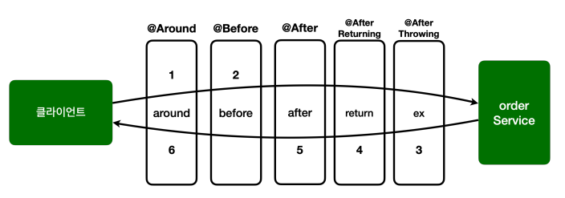

# 어드바이스 종류

- `@Around` 어드바이스를 사용하면 `@Before`, `@AfterReturning`, `@AfterThrowing`, `@After`의 모든 기능을 수행할 수 있습니다.

## 종류

### @Around

- 메서드 호출 전후에 수행 가능한 가장 강력한 어드바이스 입니다.
- 조인 포인트 실행 여부 선택, 반환 값 변환, 예외 변환 등이 가능합니다.

```java
@Slf4j
@Aspect
public class AspectAdvice {
    @Around("com.example.aop.order.aop.Pointcuts.orderAndService()")
    public Object doTransaction(ProceedingJoinPoint joinPoint) throws Throwable {
        try {
            // @Before 
            log.info("[around][트랜잭션 시작] {}", joinPoint.getSignature());
            
            Object result = joinPoint.proceed();
            
            // @AfterReturning
            log.info("[around][트랜잭션 커밋] {}", joinPoint.getSignature());
            return result;
        } catch (Exception e) {
            // @AfterThrowing
            log.info("[around][트랜잭션 롤백] {}", joinPoint.getSignature());
            throw e;
        } finally {
            // @After
            log.info("[around][리소스 릴리즈] {}", joinPoint.getSignature());
        }
    }
}
```

### @Before

- 조인 포인트 실행 이전에 실행
- `@Around`는 ProceedingJoinPoint.proceed()를 호출해야 다음 대상이 호출된다. 그러나 `@Before`는 자동으로 다음 타겟이 호출된다. (예외 제외)
- `@Around`가 가장 넓은 기능을 제공하지만 실수할 가능성이 있어서 `@Before`같이 제약을 두어 실수를 미연에 방지할 수 있습니다. (좋은 설계는 제약이 있는 것)

```java
@Slf4j
@Aspect
public class AspectAdvice {
    @Before("com.example.aop.order.aop.Pointcuts.orderAndService()")
    public void doBefore(JoinPoint joinPoint) {
        log.info("[before] {}", joinPoint.getSignature());
    }
}
```

### @AfterReturning

- 메서드 실행이 정상적으로 반환될 때 실행됩니다.
- returning 속성에 사용된 이름은 어드바이스 메서드의 매개변수 이름과 일치해야 합니다.
- returning 절에 지정된 타입의 값을 반환하는 메서드만 대상으로 실행합니다.

```java
@Slf4j
@Aspect
public class AspectAdvice {
    @AfterReturning(value = "hello.aop.order.aop.Pointcuts.orderAndService()", returning = "result")
    public void doReturn(JoinPoint joinPoint, Object result) {
        log.info("[return] {} return={}", joinPoint.getSignature(), result);
    }
}
```

### @AfterThrowing

- 메서드 실행이 예외를 던져서 종료될 때 실행됩니다.
- throwing 속성에 사용된 이름은 어드바이스 메서드의 매개변수 이름과 일치해야 합니다. 
- throwing 절에 지정된 타입과 맞는 예외를 대상으로 실행합니다.

```java
@Slf4j
@Aspect
public class AspectAdvice {
    @AfterThrowing(value = "hello.aop.order.aop.Pointcuts.orderAndService()", throwing = "ex")
    public void doThrowing(JoinPoint joinPoint, Exception ex) {
        log.info("[ex] {} message={}", joinPoint.getSignature(), ex.getMessage());
    }
}
```

### @After

- 메서드 실행이 종료되면 실행됩니다.
- 일반적으로 리소스를 해제하는 데 사용됩니다.

<br>

## 순서

- 동일한 @Aspect 안에서 조인포인트 우선 순위는 `@Around` , `@Before` , `@After` , `@AfterReturning` , `@AfterThrowing` 순 입니다.
- 어드바이스가 적용되는 순서는 이렇게 적용되지만 리턴 순서는 당연히 반대입니다.
- 당연히 @Aspect 안에 동일한 종류의 어드바이스가 2개 있으면 순서가 보장되지 않습니다. (클래스 분리후 @Order)



