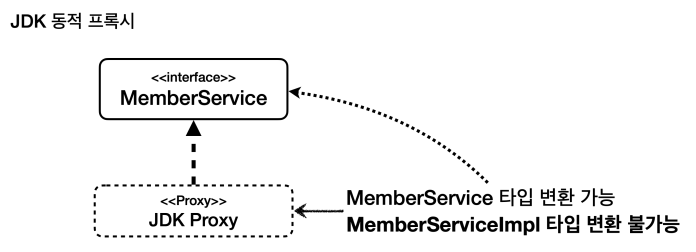
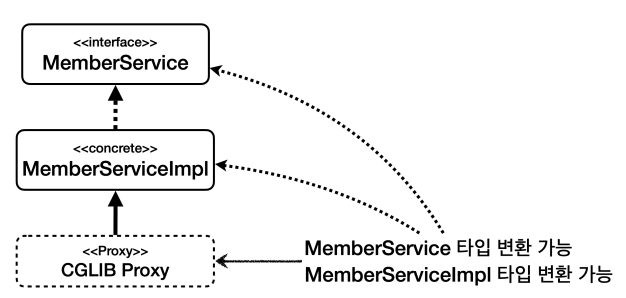

# 실무 주의사항

## 1. 프록시와 내부 호출 문제

AOP를 적용하려면 항상 프록시를 통해서 대상 객체(target)을 호출해야 합니다.

스프링에서 대상 객체 대신 프록시를 빈으로 등록하기 때문에 의존관계 주입이나 일반적인 상황에서 대상 객체를 직접 호출하는 문제는 발생하지 않습니다.

하지만 대상 객체의 내부에서 메서드 호출이 발생하면 프록시를 거치지 않고 대상 대상 객체를 직접 호출하는 문제가 발생합니다.

### 예시를 통한 설명

예시는 `internalcall` 패키지를 참고해주세요.


callServiceV0.external() 을 호출하면 AOP가 적용되지만 그 이후에 메서드 안에서 internal() 메서드가 호출될 때는 AOP가 적용되지 않습니다.

자바에서는 메서드 앞에 별도의 참조가 없으면 this 라는 뜻으로 자기 자신의 인스턴스를 가리키게 되고 여기서 this는 실제 대상 객체(target)의 인스턴스를 뜻합니다.

따라서 this.internal()은 프록시를 거치지 않고 AOP가 적용되지 않습니다.

### 해결 방법 1 - 자기 자신 주입

- 자기 자신을 주입받아서 호출하여 해결할 수 있습니다.
- 생성자로는 자기 자신을 주입받을 수 없습니다. (생성하는 단계 이후인 setter 주입을 통해 자기 자신을 주입받아야 합니다.)
- 스프링 2.6부터는 순환 참조가 기본적으로 금지되어 있어서 설정으로 허용해야 사용이 가능합니다.
- `CallServiceV1` 참조


### 해결 방법 2 - 지연 조회

- 스프링 빈 조회를 지연하여 문제를 해결할 수 있습니다.
- `ApplicaitonContext`, `ObjectProvider`를 사용하여 지연 조회를 할 수 있습니다.
- `CallServiceV2` 참조

### 해결 방법 3 - 구조 변경 (권장)

- 내부 호출을 하지 않는 구조로 변경하여 문제를 해결할 수 있습니다. (외부 호출로 구조 변경)
- `CallServiceV3`, `InternalSevice` 참조


### 정리

AOP는 주로 트랜잭션 적용이나 주요 컴포넌트의 로그 출력 기능에 사용됩니다 
즉, 인터페이스에 메서드가 나올 정도의 규모에 AOP를 적용하는 것이 적절합니다.

또한 private 메서드처럼 작은 단위에는 AOP를 적용하지 않고, 
AOP 적용을 위해 private 메서드를 외부 클래스로 변경하고 public으로 변경하는 일은 거의 없습니다.

로직상 public 메서드에서 public 메서드를 호출하는 경우가 있을 수 있습니다. 이럴 때는 내부 호출로 인해 문제가 발생할 수 있습니다.

만약 AOP가 잘 적용되지 않으면 내부 호출을 의심해보는 것이 좋습니다.

<br>

## 2. 의존관계 주입 문제 (타입 캐스팅)

### 프록시 기술과 한계 - 타입 캐스팅

인터페이스 기반으로 프록시를 생성하는 JDK 동적 프록시는 구체 클래스로 타입 캐스팅이 불가능한 한계가 있습니다.

JDK 동적 프록시는 인터페이스를 구현하여 프록시를 생성하기 때문에 인터페이스로 타입 캐스팅은 가능하지만 구체 클래스로 타입 캐스팅이 불가능합니다.



반면에 CGLIB는 구체 클래스를 상속받아 프록시를 생성하기 때문에 구체 클래스로 타입 캐스팅이 가능합니다. 

또한, 인터페이스가 있는 경우 해당 인터페이스로도 타입 캐스팅이 가능합니다. (프록시는 구현체를 상속받아서 만든 것이라서 부모 타입으로 캐스팅이 가능합니다.) 



자세한 코드는 `ProxyCastingTest` 테스트를 참조해주세요.

> 스프링이 프록시를 만들 때 제공하는 `ProxyFactory`에 proxyTargetClass 옵션에 따라 동적 프록시를 사용할지, CGLIB를 사용할지 선택할 수 있습니다.
>
> 값이 false면 JDK 동적 프록시를 사용하고, true면 CGLIB를 사용합니다. 옵션과 무관하게 인터페이스가 없으면 CGLIB를 사용합니다.

### JDK 동적 프록시를 사용할 때 의존관계 주입시 발생하는 문제

- JDK 동적 프록시를 사용할 때 의존 관계 주입시 구체 클래스로 주입하면 타입 캐스팅 문제가 발생합니다.
- JDK 동적 프록시는 인터페이스를 기반으로 만들어지기 때문에 구체 클래스를 전혀 모르게 되고 해당 타입에 주입이 불가능합니다.
- `ProxyDITest` 테스트 참조

### 정리

DI로 클라이언트 코드의 변경 없이 구현 클래스를 변경하려면 인터페이스를 기반으로 의존관계를 주입 받아야 합니다. 
이렇게 잘 설계된 어플리케이션이라면 JDK 동적 프록시 의존관계 주입 문제는 잘 발생하지 않습니다.

그러나 테스트나 여러가지 이유로 AOP 프록시가 적용된 구체 클래스를 직접 의존관계 주입을 받아야 하는 경우 CGLIB을 사용해서 AOP를 적용하면 문제가 발생하지 않습니다.

스프링 부트 2.0부터는 CGLIB을 기본으로 사용하도록 변경함으로써 구체 클래스 타입으로 의존관계를 주입하는 문제를 해결하였습니다.

## 3. CGLIB의 단점

CGLIB는 구체 클래스를 상속 받기 때문에 밑에 문제들이 발생합니다.

### 발생하는 문제

1. 대상 클래스에 기본 생성자 필수

    - 자식 클래스의 생성자를 호출할 때 자식 클래스의 생성자에서 부모 클래스의 생성자도 호출해야 한다. (생략되어 있다면 자식 클래스의 생성자 첫줄에 부모 클래스의 기본 생성자를 호출하는 super() 가 자동으로 들어갑니다)
    - CGLIB은 대상 클래스를 상속 받고, 생성자에서 대상 클래스의 기본 생성자를 호출합니다. (대상 클래스에 기본 생성자가 없으면 에러가 발생합니다.)

2. 생성자 2번 호출 문제
    
    - 실제 target 객체를 생성할 때 한번, 프록시 객체를 생성할 때 상속받고 부모 인스턴스 생성자를 호출하면서 두번 호출됩니다.
   
3. final 키워드 클래스, 메서드 사용 불가
    
    - final 키워드가 사용된 클래스나 메서드는 상속이 불가능합니다.

### 스프링의 해결책

1. 기본 생성자 필수 문제를 objenesis 라이브러리를 사용하여 해결합니다. (기본 생성자 없이 객체 생성이 가능)

   - `StdInstantiatorStrategy`은 JVM 환경에서 클래스의 새 인스턴스를 생성자 호출없이 생성하기 위한 전략을 제공합니다.

```java
public class Test {
    public static void main(String[] args) throws Exception {
        // new ExampleClass(); 기본 생성자 없어서 에러
        ExampleClass exampleClass = ObjenesisHelper.newInstance(ExampleClass.class); // 객체 생성
        exampleClass.print();
    }

   private static class ExampleClass {
      private int value;

      public ExampleClass(int value) {
         this.value = value;
      }

      public void print() {
         System.out.println("Hi");
      }
   }
}
```

2. objenesis 라이브러리를 사용하여 생성자 2번 호출 문제를 해결할 수 있습니다.

3. final 키워드는 애플리케이션에서 자주 사용되지 않습니다.

### 