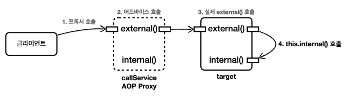

# 실무 주의사항

## 1. 프록시와 내부 호출 문제

AOP를 적용하려면 항상 프록시를 통해서 대상 객체(target)을 호출해야 합니다.

스프링에서 대상 객체 대신 프록시를 빈으로 등록하기 때문에 의존관계 주입이나 일반적인 상황에서 대상 객체를 직접 호출하는 문제는 발생하지 않습니다.

하지만 대상 객체의 내부에서 메서드 호출이 발생하면 프록시를 거치지 않고 대상 대상 객체를 직접 호출하는 문제가 발생합니다.

### 예시를 통한 설명

예시는 `internalcall` 패키지를 참고해주세요.

callServiceV0.external() 을 호출하면 AOP가 적용되지만 그 이후에 메서드 안에서 internal() 메서드가 호출될 때는 AOP가 적용되지 않습니다.

자바에서는 메서드 앞에 별도의 참조가 없으면 this 라는 뜻으로 자기 자신의 인스턴스를 가리키게 되고 여기서 this는 실제 대상 객체(target)의 인스턴스를 뜻합니다.

따라서 this.internal()은 프록시를 거치지 않고 AOP가 적용되지 않습니다.

### 해결 방법 1 - 자기 자신 주입

- 자기 자신을 주입받아서 호출하여 해결할 수 있습니다.
- 생성자로는 자기 자신을 주입받을 수 없습니다. (생성하는 단계 이후인 setter 주입을 통해 자기 자신을 주입받아야 합니다.)
- 스프링 2.6부터는 순환 참조가 기본적으로 금지되어 있어서 설정으로 허용해야 사용이 가능합니다.
- `CallServiceV1` 참조

### 해결 방법 2 - 지연 조회

- 스프링 빈 조회를 지연하여 문제를 해결할 수 있습니다.
- `ApplicaitonContext`, `ObjectProvider`를 사용하여 지연 조회를 할 수 있습니다.
- `CallServiceV2` 참조

### 해결 방법 3 - 구조 변경 (권장)

- 내부 호출을 하지 않는 구조로 변경하여 문제를 해결할 수 있습니다. (외부 호출로 구조 변경)
- `CallServiceV3`, `InternalSevice` 참조

### 정리

AOP는 주로 트랜잭션 적용이나 주요 컴포넌트의 로그 출력 기능에 사용됩니다 
즉, 인터페이스에 메서드가 나올 정도의 규모에 AOP를 적용하는 것이 적절합니다.

또한 private 메서드처럼 작은 단위에는 AOP를 적용하지 않고, 
AOP 적용을 위해 private 메서드를 외부 클래스로 변경하고 public으로 변경하는 일은 거의 없습니다.

로직상 public 메서드에서 public 메서드를 호출하는 경우가 있을 수 있습니다. 이럴 때는 내부 호출로 인해 문제가 발생할 수 있습니다.

만약 AOP가 잘 적용되지 않으면 내부 호출을 의심해보는 것이 좋습니다.