# 프록시

## 요구 사항

- 원본 코드를 전혀 수정하지 않고 로그 추적기 기능을 적용해보겠습니다.
- 특정 메서드는 로그를 출력하지 않도록 해야합니다.
- 인터페이스가 있는 구현 클래스, 인터페이스가 없는 구체 클래스, 컴포넌트 스캔 대상 등 다양한 케이스에 다 적용할 수 있어야합니다.

이 문제를 해결하려면 프록시(Proxy) 개념을 먼저 이해해야합니다. 프록시에 대한 자세한 이해는 [프록시 개념](#프록시-개념)를 참고해주세요.

## 버전별 프록시 적용

- 모든 요구사항에 맞게 로그 추적기를 적용해보겠습니다.

### V1 인터페이스 기반 환경에 프록시 적용

**기본**

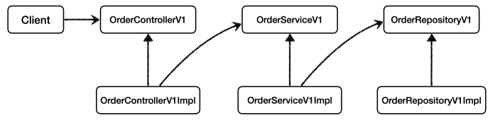

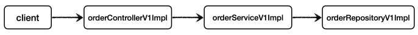

**로그 추적기용 프록시 추가**

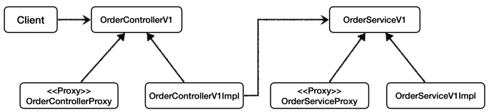

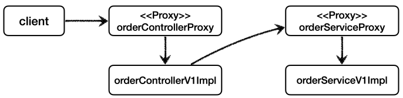

**방법**

1. 각 레이어의 인터페이스를 구현한 프록시를 추가합니다. (e.g. OrderControllerV1 인터페이스를 바탕으로 OrderControllerV1Proxy 추가)
2. 빈 설정 파일에서 실제 객체를 반환하지 않고 프록시를 반환하도록 변경합니다. (프록시를 실제 스프링 빈 대신 등록하고 실제 객체는 스프링 빈으로 등록하지 않는다.)
   ```java
   @Configuration
   public class AppV1Config {
       @Bean
       public OrderControllerV1 orderController(LogTrace logTrace) {
           OrderControllerV1Impl controllerImpl = new OrderControllerV1Impl(orderService(logTrace));
           return new OrderControllerInterfaceProxy(controllerImpl, logTrace); // 프록시가 등록
       }
       // ... 
   }
   ```

실제 객체가 스프링 빈으로 등록되지 않는다고 해서 사라지는 것은 아니다. 

프록시 객체가 실제 객체를 참조하기 때문에 프록시를 통해서 실제 객체를 호출할 수 있습니다. (프록시 안에 실제 객체가 있는 것)

프록시 객체는 스프링 컨테이너가 관리하고 자바 힙 메모리에도 올라간다. 반면에 실제 객체는 자바 힙 메모리에는 올라가지만 스프링 컨테이너가 관리하지는 않는다.

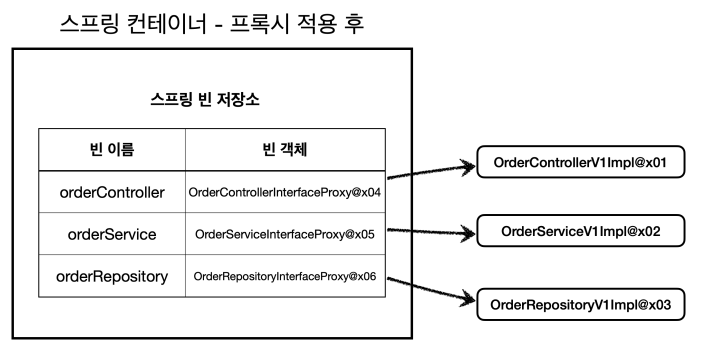

### V2 구체 클래스 기반 환경에 프록시 적용

- 구체 클래스의 변경 없이 로그 추적기를 적용하려면 구체 클래스를 상속받은 프록시를 추가해서 다형성을 활용해서 구체 클래스 대신 프록시를 사용하도록 변경하면 됩니다.

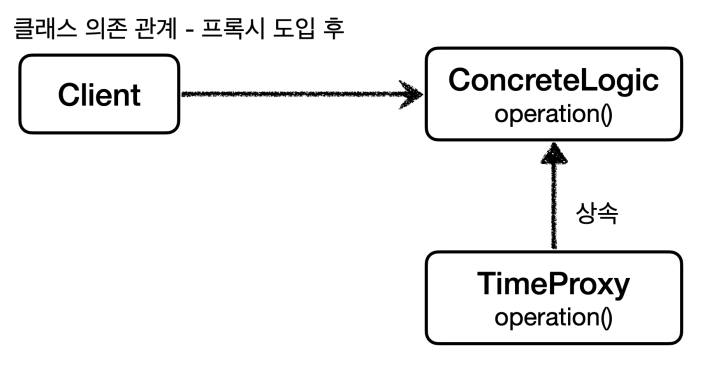

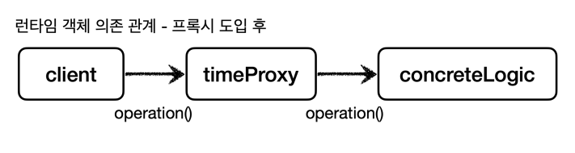

### 단점

비슷한 프록시 클래스를 너무 많이 만들어야 한다는 단점이 존재합니다. 적용 대상 클래스가 100개라면 프록시 클래스도 100개가 필요합니다.

이를 해결할 방법으로 프록시 클래스를 하나만 만들어서 모든 곳에 적용하는 동적 프록시 기술이 있습니다.


## 동적 프록시

기존 프록시 기술을 사용하면 기존 코드를 변경하지 않고 기능을 추가할 수 있으나 대상 클래스 수만큼 비슷한 유형의 프록시 클래스를 만들어야 하는 단점이 존재합니다.

자바가 기본 제공하는 JDK 동적 프록시나 CGLIB의 프록시 생성 오픈소스 기술을 활용하면 프록시 객체를 동적으로 런타임에 만들어낼 수 있습니다. (프록시를 적용할 코드를 하나만 만들어놓고 프록시 객체를 찍어낼 수 있습니다.)

- JDK 동적 프록시는 인터페이스 기반으로 프록시를 동적으로 만들어주기 때문에 인터페이스가 필수라서 V1에만 적용할 수 있습니다. (V1에만 적용, v2_dynamic_proxy)
- 특정 클래스에는 적용되지 않도록 필터를 적용할 수 있습니다. (DynamicFilterConfig)
- JDK 동적 프록시를 이해하기 위해 사전 지식인 [리플렉션](#리플렉션)에 대해 먼저 알아야 합니다.

### 한계

- JDK 동적 프록시는 인터페이스가 필수라 인터페이스가 없는 클래스에는 적용할 수 없습니다. (CGLIB이라는 바이트코드 조작 라이브러리 사용시 해결가능)

### 코드 예시

```java
public interface AInterface {
   String call();
}

@Slf4j
public class AImpl implements AInterface {
    @Override
    public String call() {
        log.info("AImpl.call() is called");
        return "a";
    }
}

// A인터페이스와 구현체와 비슷한 B유형도 생성...

/**
 * JDK 동적 프록시에 적용할 로직은 InvocationHandler 인터페이스를 구현해서 작성하면 됩니다.
 * - 동적 프록시가 없으면 A와 B에 대한 프록시를 각각 만들어야 합니다.
 * - 이를 통해 동적 프록시에 적용할 공통 로직을 개발할 수 있습니다.
 */
@Slf4j
public class TypeInvocationHandler implements InvocationHandler {

   private final Object target;

   public TypeInvocationHandler(Object target) {
      this.target = target;
   }
    
   // 파라미터: 프록시 객체, 호출한 메서드, 호출한 메서드의 파라미터
   @Override
   public Object invoke(Object proxy, Method method, Object[] args) throws Throwable {
      log.info("TimeProxy 실행");
      long startTime = System.currentTimeMillis();

      Object result = method.invoke(target, args);

      long endTime = System.currentTimeMillis();
      long resultTime = endTime - startTime;
      log.info("TimeProxy 종료 resultTime={}", resultTime);
      return result;
   }
}

@Slf4j
public class JdkDynamicTest {

    @Test
    void dynamicA() {
        AInterface target = new AImpl();
        TypeInvocationHandler handler = new TypeInvocationHandler(target);
        
        AInterface proxy = (AInterface) Proxy.newProxyInstance(
                AInterface.class.getClassLoader(), 
                new Class[]{AInterface.class}, 
                handler
        );
        
        proxy.call();
        log.info("targetClass={}", target.getClass()); // class hello.proxy.AImpl
        log.info("proxyClass={}", proxy.getClass()); // class jdk.proxy3.$Proxy11, 우리가 만든 클래스가 아닌 동적 프록시가 동적으로 만든 프록시
    }
}
```

- 프록시를 만들 때 첫번째 인자는 AInterface 인터페이스를 로드하는 데 사용된 클래스 로더를 참조하여, 동적 프록시 클래스를 JVM에 로드할 때 동일한 방식을 사용하라는 의미입니다.
- 사용된 클래스 로더는 ClassLoaders$AppClassLoader@4e25154 입니다.

> **AppClassLoader(애플리케이션 클래스로더)** 
> 
> Java에서 애플리케이션 클래스 로더(Application Class Loader)를 사용한다는 것은, 애플리케이션에서 정의한 클래스와 자바 API 클래스 외의 클래스를 로드할 때 사용되는 기본 클래스 로더를 의미합니다.  
> Java의 클래스 로더 계층 구조에서 애플리케이션 클래스 로더는 시스템 클래스 로더(System Class Loader) 바로 아래에 위치하며, 사용자가 정의한 클래스들을 로드하는 주된 클래스 로더입니다.

- 두번째 인자는 어떤 인터페이스를 기반으로 프록시를 만들지, 세번째 인자는 프록시에 사용되는 로직입니다.

### 정리

JDK 동적 프록시 덕분에 적용 대상 만큼 프록시 객체를 만들지 않아도 됩니다. 그리고 같은 부가 기능 로직을 한번만 개발하면 공통으로 적용할 수 있습니다.

**실행 순서**

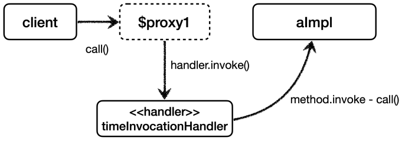

**JDK 동적 프록시 도입 전**

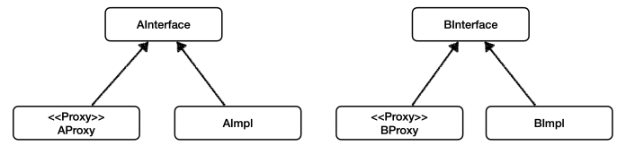

**JDK 동적 프록시 도입 후**

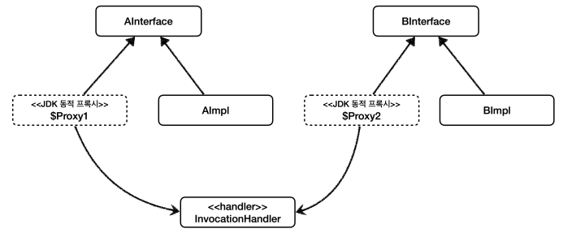


## CGLIB(Code Generation Library)

- CGLIB는 바이트코드를 조작해서 동적으로 클래스를 생성하는 기술을 제공하는 라이브러리입니다.
- 인터페이스가 없어도 구체 클래스만 가지고 동적 프록시를 만들어 낼 수 있습니다.
- 스프링 프레임워크에 들어와서 별도로 추가할 필요가 없습니다.
- 우리가 직접 CGLIB을 사용하는 경우는 없고 스프링의 ProxyFactory 기술이 CGLIB을 편리하게 사용할 수 있도록 도와줍니다.

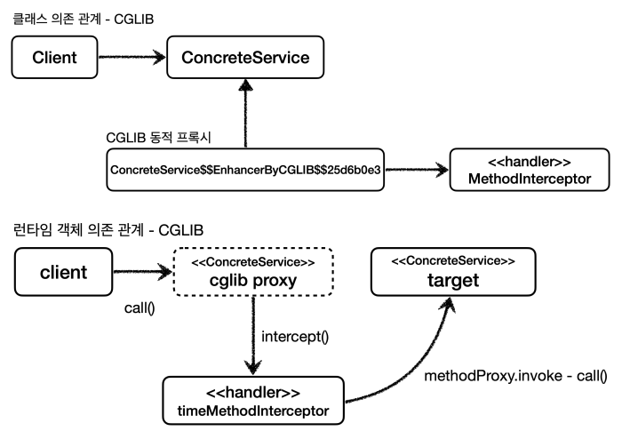

### 코드 예시

```java
// 구체 클래스
@Slf4j
public class ConcreteService {
    public void call() {
        log.info("ConcreteService 호출");
    }
}

@Slf4j
public class TimeMethodInterceptor implements MethodInterceptor {

   private final Object target;

   public TimeMethodInterceptor(Object target) {
      this.target = target;
   }

   /**
    * TimeMethodInterceptor 는 MethodInterceptor 인터페이스를 구현해서 CGLIB 프록시의 실행 로직을 정의한다 (JDK 동적 프록시의 InvocationHandler 와 비슷)
    * @param obj - CGLIB가 적용된 객체
    * @param method - 호출된 메서드
    * @param args - 메서드를 호출하면서 전달된 인수
    * @param proxy - 메서드 호출에 사용 (권장)
    */
   @Override
   public Object intercept(Object obj, Method method, Object[] args, MethodProxy proxy) throws Throwable {
      log.info("TimeProxy 실행");
      long startTime = System.currentTimeMillis();

      // 메서드를 사용해도되지만 CGLIB에서는 proxy를 사용을 권장함 (조금 더 빠름)
      // Object result = method.invoke(target, args);
      Object result = proxy.invoke(target, args);

      long endTime = System.currentTimeMillis();
      long resultTime = endTime - startTime;
      log.info("TimeProxy 종료 resultTime={}", resultTime);
      return result;
   }
}

@Slf4j
public class CglibTest {
   @Test
   void cglib() {
      ConcreteService target = new ConcreteService();
      // Enhancer 는 CGLIB의 핵심 클래스로서 프록시 객체를 생성하는 역할을 한다
      Enhancer enhancer = new Enhancer();
      enhancer.setSuperclass(ConcreteService.class);// 어떤 구체 클래스를 상속 받을지 설정
      enhancer.setCallback(new TimeMethodInterceptor(target)); // MethodInterceptor가 Callback 인터페이스를 구현하고 있음
      ConcreteService proxy = (ConcreteService) enhancer.create();

      log.info("target={}", target.getClass()); // class hello.proxy.ConcreteService
      log.info("proxy={}", proxy.getClass()); // class hello.proxy.ConcreteService$$EnhancerByCGLIB$$3d5c645b

      proxy.call();
   }
}
```

### 제약

- 부모 클래스의 생성자를 체크해야 합니다. -> CGLIB는 자식 클래스를 동적으로 생성하기 때문에 기본 생성자가 필요합니다.
- final 클래스, final 메서드는 사용이 불가능합니다. -> final 클래스는 예외가 발생하고 final 메서드는 프록시 로직이 동작하지 않습니다.

기본 생성자를 추가하고 의존관계를 setter를 사용해서 주입하면 CGLIB을 적용할 수 있으나 ProxyFactory를 사용하면 이런 제약을 해결할 수 있습니다.

인터페이스가 있으면 JDK 동적 프록시를 사용하고 인터페이스가 없으면 CGLIB을 사용하는 방식이 스프링의 ProxyFactory가 사용하는 방식입니다.


## 프록시 개념

클라이언트(요청하는 객체)가 직접 서버(요청을 처리하는 객체)에 요청하는 것이 아닌 대리자를 통해 간접적으로 요청할 때 대리자를 프록시(Proxy)라고 합니다.

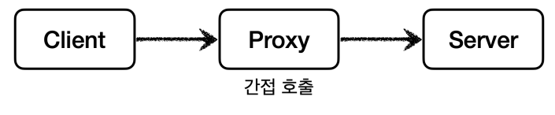

## 프록시 장점

직접 호출이 아닌 대리자를 통해 간접 호출시 대리자가 중간에서 여러가지 일을 할 수 있습니다.

1. 데이터 요청시 이미 캐시에 데이터가 있는 경우 서버에 요청하지 않고 캐시에 있는 데이터를 반환할 수 있습니다.(접근 제어, 캐싱)

2. 데이터 요청시 클라이언트가 기대한 것 외에 추가적인 기능을 제공할 수 있습니다.(부가 기능 추가)

3. 대리자가 또 다른 대리자를 부를 수도 있습니다. 클라이언트는 대리자를 통해 요청했는데 그 이후는 모릅니다. (프록시 체인)

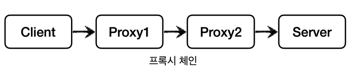

## 대체 가능

클라이언트는 서버에게 요청한 것인지 프록시에게 요청한 것인지 모릅니다. 

서버와 프록시는 같은 인터페이스를 사용해야하며 DI를 통해 클라이언트 코드 변경없이 주입할 수 있습니다.

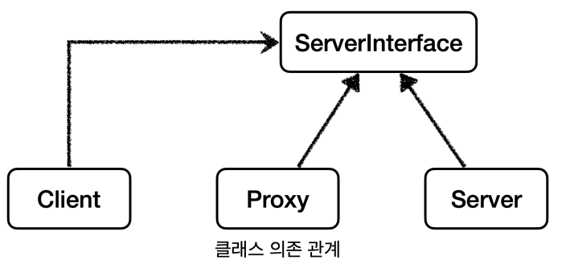

## 프록시 주요 기능

1. 접근 제어
    - 권한에 따른 접근
    - 캐싱
    - 지연 로딩


2. 부가 기능 추가
    - 요청 값이나 응답 값을 중간에 변형
    - 추가 로그 출력

## 프록시 사용 방식에 따른 분류

둘다 프록시를 사용하는 방식이지만 의도에 따라 프록시 패턴과 데코레이터 패턴으로 구분합니다.

- 프록시 패턴: 접근 제어가 목적
- 데코레이터 패턴: 부가 기능 추가가 목적

## 프록시 패턴

- 코드를 변경없이 프록시를 도입해서 접근 제어를 하는 패턴입니다.
- 프록시 패턴은 프록시를 사용하는 여러 패턴 중 하나일 뿐 입니다.
- 클라이언트는 프록시 객체가 주입되었는지 실제 객체가 주입되었는지 모릅니다.
- 다른 개체에 대한 접근을 제어하기 위해 대리자를 제공합니다.

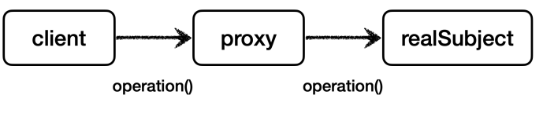

### 프록시 패턴 적용 전

- 클라이언트가 서버(RealSubject)에 직접 요청합니다.

```java
public interface Subject {
    String operation();
}

// 실제 객체
@Slf4j
public class RealSubject implements Subject {

   @Override
   public String operation() {
      log.info("실제 객체 호출");
      sleep(1000); // 데이터 조회에 1초 걸림을 가정
      return "data";
   }

   private void sleep(int millis) {
      try {
         Thread.sleep(millis);
      } catch (InterruptedException e) {
         e.printStackTrace();
      }
   }
}

// 클라이언트
public class ProxyPatternClient {

   private Subject subject;

   public ProxyPatternClient(Subject subject) {
      this.subject = subject;
   }

   public void execute() {
      subject.operation();
   }
}

public class ProxyPatternTest {
    /**
     * operation 반환 값이 변하지 않는 데이터인데 어딘가 보관해두고 사용하면 성능상 좋습니다. (캐시)
     * client -> realSubject
     */
    @Test
    void noProxyTest() {
        Subject subject = new RealSubject();
        ProxyPatternClient client = new ProxyPatternClient(subject);

        client.execute(); // 1초
        client.execute(); // 1초
        client.execute(); // 1초
    }
}
```

**프록시 패턴 적용 후**

- 코드를 변경하지 않고 프록시 객체를 주입하여 접근 제어 중 하나인 캐싱을 적용합니다.

```java
@Slf4j
public class CacheProxy implements Subject {

    private Subject target; // 실제 객체에 접근할 수 있어야 합니다.
    private String cacheValue;

    public CacheProxy(Subject target) {
        this.target = target;
    }

    @Override
    public String operation() {
        log.info("프록시 호출");
        if(cacheValue == null) {
            cacheValue = target.operation();
        }
        return cacheValue;
    }
}

public class ProxyPatternTest {
    /**
     * 코드를 전혀 수정하지 않고 프록시 객체를 통해서 캐시를 적용할 수 있습니다.
     * client -> proxy -> realSubject
     */
    @Test
    void proxyTest() {
        Subject subject = new RealSubject(); // 실제 객체
        Subject proxy = new CacheProxy(subject); // 프록시
        ProxyPatternClient client = new ProxyPatternClient(proxy);

        client.execute(); // 캐시가 없어서 realSubject.operation() 호출 -> 캐시 저장 (1초)
        client.execute(); // 캐시가 있어서 realSubject.operation() 호출하지 않고 캐시 반환 (0초)
        client.execute(); // 캐시가 있어서 realSubject.operation() 호출하지 않고 캐시 반환 (0초)
    }
}
```

## 데코레이터 패턴

- 코드를 변경하지 않고 프록시를 도입해서 부가 기능을 추가하는 패턴입니다.
- 실제 객체가 있고 이를 데코레이터로 감싸서 부가 기능을 추가합니다.
- 객체에 추가 책임(기능)을 동적으로 추가하고 기능 확장을 위한 유연한 대안을 제공합니다.

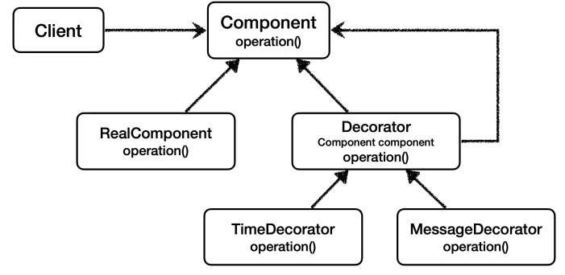

### 사용 목적

기존 코드를 변경하지 않고도 객체의 기능을 확장할 수 있어, 기능 추가와 관련된 복잡성과 클래스 수의 증가 문제를 해결할 수 있습니다.

### 코드

**기본 기능**

```java
public interface Component {
    String operation();
}

@Slf4j
public class RealComponent implements Component {
   @Override
   public String operation() {
      log.info("RealComponent 실행");
      return "data";
   }
}

@Slf4j
public class DecoratorClient {

   private Component component;

   public DecoratorClient(Component component) {
      this.component = component;
   }

   public String execute() {
      log.info("DecoratorClient 실행");
      return component.operation();
   }
}

public class DecoratorPatternTest {
    @Test
    public void noDecoratorPatternTest() {
        Component component = new RealComponent();
        DecoratorClient client = new DecoratorClient(component);

        client.execute();
    }
}
```

**코드 변경없이 기능 추가**

```java
public abstract class Decorator implements Component {
    protected Component component;

    public Decorator(Component component) {
        this.component = component;
    }
}

public class MessageDecorator extends Decorator {

   public MessageDecorator(Component component) {
      super(component);
   }

   @Override
   public String operation() {
      log.info("MessageDecorator 실행");

      String result = component.operation();
      String decoResult = "****" + result + "****";

      log.info("적용전 : {}, 적용후 : {}", result, decoResult);

      return decoResult;
   }
}

@Slf4j
public class TimeDecorator extends Decorator {

   public MessageDecorator(Component component) {
      super(component);
   }

   @Override
   public String operation() {
      log.info("TimeDecorator 실행");
      long start = System.currentTimeMillis();

      String result = component.operation();

      long end = System.currentTimeMillis();
      log.info("실행시간 : {}", end - start);

      return result;
   }
}

public class DecoratorPatternTest {
    @Test
    public void decoratorPatternTest2() {
        Component component = new RealComponent();
        Component messageDecorator = new MessageDecorator(component);
        Component timeDecorator = new TimeDecorator(messageDecorator);
        DecoratorClient client = new DecoratorClient(timeDecorator); // Client 코드를 전혀 수정하지 않음
       
        String result = client.execute();
        
        System.out.println(result);
    }
}
```

## 리플렉션

리플렉션은 구체적인 클래스 타입을 알지 못하더라도 그 클래스의 메서드, 타입, 변수들에 접근할 수 있도록 해주는 자바 API를 말하며, 
컴파일 시간이 아닌 실행 시간에 동적으로 특정 클래스의 정보를 추출할 수 있는 기법을 말합니다.

### 사용 목적

- 런타임 시점에서 어떤 클래스를 실행 해야할지 가져와 실행해야하는 경우 필요합니다.
- 프레임워크나 IDE에서 이런 동적 바인딩을 이용한 기능을 제공합니다.

### 리플렉션을 사용해서 가져올 수 있는 정보

- Class
- Constructor
- Method
- Field

### 사용 예시

- IntelliJ의 자동완성 기능
- 스프링 어노테이션

### 코드 예시

**리플렉션 사용 전**

```java
public class ReflectionTest {

    @Test
    void noReflection() {
        Hello target = new Hello();
        
        // 공통 로직1시작
        System.out.println("start");
        String result = target.callA(); // 호출하는 메서드만 다르고 다 똑같음
        System.out.println("result = " + result);
        // 공통 로직1끝
       
        // 공통 로직2시작
        System.out.println("start");
        String result2 = target.callB(); // 호출하는 메서드만 다르고 다 똑같음
        System.out.println("result2 = " + result2);
        // 공통 로직2끝
    }
}
```

**리플렉션 사용 후**

```java
public class ReflectionTest {
   @Test
   void reflection1() throws Exception {
      Class classHello = Class.forName("hello.proxy.dynamic.ReflectionTest$Hello"); // 클래스 정보
      Hello target = new Hello();
      
      Method methodCallA = classHello.getMethod("callA"); // callA 메서드 정보
      dynamicCall(methodCallA, target); // 획득한 메서드 메타정보로 실제 인스턴스의 메서드를 호출한다
      
      Method methodCallB = classHello.getMethod("callB"); // callB 메서드 정보
      dynamicCall(methodCallB, target); // 획득한 메서드 메타정보로 실제 인스턴스의 메서드를 호출한다
   }
   
    private void dynamicCall(Method method, Object target) throws Exception {
        System.out.println("start");

        Object result = method.invoke(target);

        System.out.println("result = " + result);
    }
}
```

### 주의 사항

- 리플렉션은 가급적이면 안써야합니다.
- 리플렉션을 사용하면 클래스와 메타정보를 사용해서 동적으로 유연하게 만들 수 있으나 런타임에 동작하기 때문에 컴파일 시점에 오류를 잡을 수 없습니다.
- 리플렉션은 프레임워크 개발이나 또는 매우 일반적인 공통 처리가 필요할 때 부분적으로 주의해서 사용해야 한다.