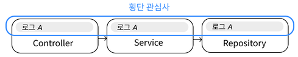
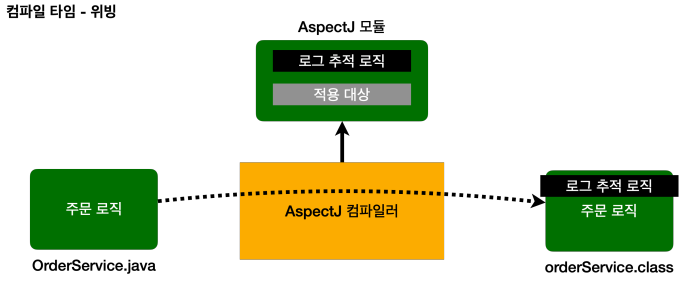
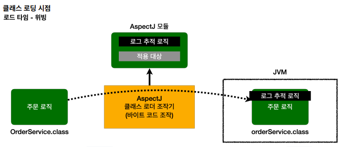
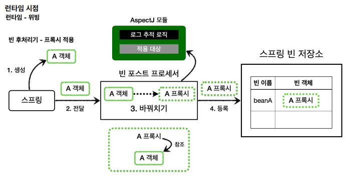

# AOP(Aspect Oriented Programming)

## 등장 배경

### 핵심 기능과 부가 기능

애플리케이션은 `핵심 기능`(주문, 결제, 배송 등)과 `부가 기능`(로깅, 트랜잭션 등)으로 나눌 수 있습니다.

부가 기능은 핵심 기능을 보조하기 때문에 여러 클래스에 걸쳐서 사용되는 경우가 대부분 입니다.

로그를 찍을 때도 컨트롤러, 서비스, 리포지토리 등 여러 클래스에 걸쳐서 사용됩니다. 이런 부가 기능을 `횡단 관심사(cross-cutting concern)`라고 합니다.

### 부가 기능 적용 문제

1. 부가 기능 적용시 많은 `반복`이 발생 합니다. 적용 클래스가 100개라면 100개에 동일한 코드를 추가해야 합니다.
2. 유틸 클래스를 만들어도 `호출`이 필요 하고 에러 처리 로직만 들어가도 매우 `복잡`해집니다.  
3. 변경 시 `많은 수정`이 필요 합니다. (변경 지점은 하나가 될 수 있도록 모듈화 하는 것이 중요합니다.)

이런 부가 기능을 애플리케이션 전반에 적용하는 문제는 일반적인 OOP로는 해결이 불가능해서 AOP가 등장하게 되었습니다. 

 

## AOP 소개

### 애스펙트(aspect) 개념

- 애스펙트(aspect)는 부가 기능을 핵심 기능에서 분리해서 한 곳에서 관리하고 어디에 적용할지 선택하는 모듈입니다.
- `@Aspect`, 스프링이 제공하는 `어드바이저`(`어드바이스`(부가 기능) + `포인트컷`(적용 대상))도 개념상 하나의 애스펙트입니다.

애스펙트는 관점이라는 뜻인데 애플리케이션을 바라보는 관점을 하나하나의 기능에서 횡단 관심사(cross-cutting concerns) 관점으로 달리 보는 것이다.

그리고 이러한 애스펙트를 사용한 프로그래밍 방식을 `관점 지향 프로그래밍 AOP(Aspect-Oriented Programming)`라고 합니다.

ps. AOP는 OOP를 대체하는 것이 아닌 **횡단 관심사를 깔끔하게 처리하기 어려운 OOP의 부족한 부분을 보조**하기 위해 탄생되었습니다.

## AOP 적용 방식

- AOP의 구현으로는 `AspectJ`와 `스프링 AOP`가 있고 이 중 `스프링 AOP`는 AspectJ의 문법을 차용하고 일부 기능만 제공합니다.

- AOP를 사용하면 핵심 기능과 부가 기능 코드가 완전히 분리되는 데 3가지 방법으로 부가 기능을 실제 로직에 추가할 수 있습니다.

### 1. 컴파일 시점에 코드에 추가 (AspectJ)

- 컴파일러가 클래스 파일을 만드는 시점에 `AspectJ`가 제공하는 특별한 컴파일러를 사용해 부가 기능 로직을 추가하는 방법입니다.
- 단점으로는 컴파일 시점에 부가 기능을 적용하려면 특별한 컴파일러도 필요하고 복잡합니다.

### 2. 클래스 로딩 시점에 코드에 추가 (AspectJ)

- 자바는 클래스 파일을 JVM 내부의 클래스 로더에 보관하는 데 이때 클래스 파일을 JVM에 저장하기 전에 조작할 수 있는 기능을 제공합니다. (`java Instrumentation`)
- 수 많은 모니터링 툴들이 이 방식을 사용합니다.
- 특별한 옵션을 통해 클래스 로더 조작기를 지정해야 하는데 번거롭고 운영하기 어렵습니다.

### 3. 런타임 시점에 코드에 추가 (스프링 AOP)

- 스프링 컨테이너, 프록시, DI, 빈 포스트 프로세서 등의 기능을 사용해 스프링 빈에 부가 기능을 적용하는 방법입니다.
- 스프링만 있으면 AOP를 적용할 수 있고 복잡한 옵션이나 클래스 로더 조작기를 설정할 필요가 없습니다.
- 프록시를 사용하기 때문에 AOP 기능에 일부 제약이 있고 스프링 빈에만 적용할 수 있습니다.

## AspectJ와 스프링 AOP

- AOP를 적용할 수 있는 지점을 `조인 포인트(Join point)`라고 합니다.

**AspectJ**

- 적용시점에 바이트코드를 조작하기 때문에 모든 지점(생성자, 필드 값 접근, static 메서드 접근, 메서드 실행 등)에 적용할 수 있습니다.

**스프링 AOP**

- 메서드 실행 위치만 적용할 수 있습니다.
- 스프링 빈에만 적용할 수 있습니다.
- AspectJ의 문법을 차용하지만 AspectJ를 직접 사용하는 것이 아니기 때문에 일부 기능만 제공합니다.

### 무엇을 사용해야 할까?

Aspect가 다양한 기능을 사용할 수 있지만 특별한 컴파일러, 실행 옵션 등 복잡합니다. 

반면 스프링 AOP는 별도의 추가 자바 설정 없이 스프링만 있으면 편리하게 AOP를 사용할 수 있습니다.

실무에서는 스프링 AOP만으로 대부분의 문제를 해결할 수 있습니다. 

따라서 먼저 스프링 AOP가 제공하는 기능을 학습하는 것에 집중하는 것이 좋습니다.

## 용어 정리

### 조인 포인트(Join point)

- AOP를 적용할 수 있는 모든 지점을 의미합니다.
- AspectJ를 사용하면 생성자, 필드 값 접근, static 메서드 접근, 메서드 실행 등이 조인 포인트가 될 수 있습니다.
- 스프링 AOP는 메소드 실행 지점에만 AOP를 적용할 수 있습니다.

### 포인트컷(Pointcut)

- 조인 포인트 중에서 어드바이스가 적용될 위치를 선별하는 기능을 말합니다. (주로 `AspectJ 표현식` 사용합니다.)
- 스프링 AOP는 메서드 실행 지점만 포인트컷으로 지정할 수 있습니다.

### 타겟(Target)

- 어드바이스를 받는 객체를 의미합니다.

### 어드바이스(Advice)

- 부가 기능을 의미합니다.
- Around(주변), Before(전), After(후)와 같은 다양한 종류가 있습니다.

### 애스펙트(Aspect)

- 어드바이스와 포인트컷을 모듈화 한 것입니다. (`@Aspect`)
- 하나의 애스펙트에 여러 어드바이스와 포인트 컷이 존재할 수 있습니다.

### 어드바이저(Advisor)

- 하나의 어드바이스와 하나의 포인트 컷으로 구성됩니다.
- 스프링 AOP에서만 사용되는 특별한 용어입니다.

### 위빙(Weaving)

- 포인트컷으로 결정한 타켓에 어드바이스를 적용하는 것을 말합니다.
- 위빙을 통해 핵심 기능 코드에 영향을 주지 않고 부가 기능을 추가 할 수 있습니다.
- AOP 적용을 위해 애스펙트를 객체에 연결한 상태를 말합니다. (컴파일 시점, 클래스 로딩 시점, 런타임 시점)
  원본 로직에 부가 기능 로직이 추가되는 것을 위빙(Weaving)이라 한다.

### AOP 프록시

- AOP 기능을 구현하기 위해 만든 프록시 객체를 의미합니다. (`JDK 동적 프록시`, `CGLIB 프록시`)