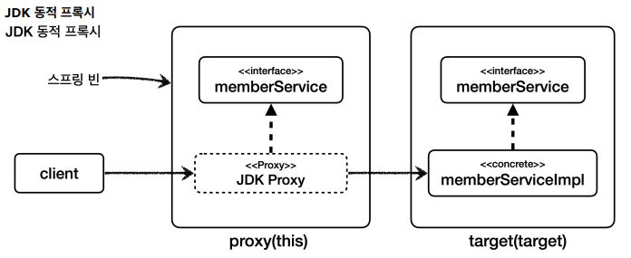
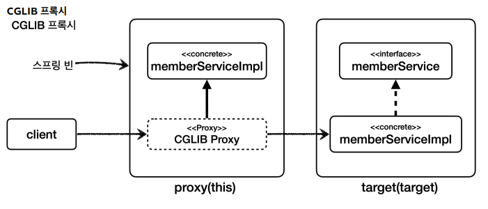

# 포인트컷 지시자

## 개념

포인트컷 지시자는 어드바이스를 적용할 조인포인트를 선별하는 기준을 정의합니다.

## 포인트컷 지시자의 종류

### 1. execution

- 메소드 실행 조인 포인트를 선별합니다.
- `execution(접근제어자? 반환타입 선언타입?메서드이름(파라미터) 예외?)`
- `?`는 생략가능, `*` 같은 패턴 사용 가능
- `.`: 정확하게 해당 위치의 패키지, `..`: 해당 위치의 패키지와 그 하위 패키지도 포함
- test 디렉토리의 `ExecutionTest` 참조

### 2. within

- 타입을 기반으로 조인 포인트를 선별합니다.
- 해당 타입이 매칭되면 그 안에 메소드(조인 포인트)들이 자동으로 매칭합니다.
- `within(패키지명.타입명)`
- 주의사항: within 사용시 표현식에 부모 타입을 지정하면 안됩니다. (execution과 다른점)
- test 디렉토리의 `WithinTest` 참조

### 3. args

- 메소드의 파라미터 타입을 기반으로 조인 포인트를 선별합니다.
- `args(파라미터타입)`
- test 디렉토리의 `ArgsTest` 참조

**차이점**

1. `execution`은 파라미터 타입이 정확하게 일치해야 하지만, `args`는 파라미터 타입이 부모 타입이어도 매칭됩니다.

2. 정적 vs 동적

   - `execution(* *(java.io.Serializable))`: 메서드의 시그니처로 판단 (정적)
   - `args(java.io.Serializable)`: 런타임에 전달된 인수로 판단 즉, 실제 객체 인스턴스가 넘어올 때 보고 판단 (동적)
   
> Serializable은 String의 부모 타입이므로 args를 사용하면 String 타입의 파라미터를 받는 메서드도 매칭됩니다.

### 4. @target, @within

- 객체나 클래스에 달린 특정 애노테이션의 여부로 조인 포인트를 선별합니다.
- test 디렉토리의 `AtTargetAtWithinTest` 참조

**예시** 

```java
@Aspect
class At {
    @Pointcut("@target(com.example.aop.member.annotation.ClassAop)")
    public void target() {}
   
    @Pointcut("@within(com.example.aop.member.annotation.ClassAop)")
    public void within() {}
}

@ClassAop
class Target {}
```

**차이점**

- `@target`: 자식 클래스에 걸면 부모 클래스에도 적용됩니다. (부모 o)
- `@within`: 자식 클래스에 걸면 자식 클래스만 적용됩니다. (부모 x)

**주의 사항**

`args`, `@args`, `@target` 포인트컷 지시자는 단독으로 사용하면 안됩니다. 예시에서도 `execution`을 통해 적용 대상을 줄이고 사용했습니다.

해당 포인트컷들은 실제 객체 인스턴스가 생성되고 실행될 때 어드바이스 적용 여부를 확인할 수 있습니다. 그러나 스프링 컨테이너가 프록시를 생성하는 시점은 스프링 컨테이너가 만들어지는 애플리케이션 로딩 시점이기 때문에 스프링은 모든 스프링 빈을 AOP에 적용하게 됩니다.

모든 스프링에 AOP를 적용하려고하면 final이 붙은 빈 때문에 오류가 발생할 수 있습니다.

따라서 위 포인트컷을 사용하는 경우 프록시 적용 대상을 축소하는 표현식과 함께 사용해야 합니다.

```java
class A {
    @Around("execution(* com.example.aop..*(..)) && @target(com.example.aop.member.annotation.ClassAop)")
    public Object test(ProceedingJoinPoint joinPoint) throws Throwable {}
}
```

### @annotation

- 메소드에 특정 애노테이션이 적용된 경우 해당 메소드를 포인트컷 조건에 맞는 조인 포인트로 선별합니다.
- test 디렉토리의 `AtAnnotationTest` 참조

### @args

- 인수에 특정 애노테이션이 적용된 경우 조인 포인트로 선별합니다.

**예시**

- `@args(test.Check)`: 전달된 인수의 런타임 타입에 @Check 애노테이션이 적용된 경우 조인 포인트로 선별합니다.

### bean

- 스프링 빈의 이름으로 조인 포인트를 선별합니다.
- `bean(빈이름)`
- * 과 같은 패턴을 사용 가능
- test 디렉토리의 `BeanTest` 참조

## this, target

- `this`는 스프링 빈으로 등록되어 있는 프록시 객체를 대상으로 조인 포인트를 선별합니다.
- `target`은 타겟 객체를 대상으로 조인 포인트를 선별합니다.
- `this`와 `target`은 적용 타입 하나를 정확하게 지정해야 합니다.
- `this`와 `target` 둘다 부모 타입을 허용합니다.
- test 디렉토리의 `ThisTargetJdkDynamicTest`, `ThisTargetCglibTest` 참조

`this(com.example.aop.member.MemberService)`, `target(com.example.aop.member.MemberService)`

### JDK 동적 프록시 적용



**MemberService 인터페이스 지정**

- `this(com.example.aop.member.MemberService)`
    - proxy를 보고 판단. 
    - this는 부모 타입을 허용하기 때문에 AOP가 적용됩니다.

- `target(com.example.aop.member.MemberService)`
    - target을 보고 판단. 
    - target은 부모 타입을 허용하기 때문에 AOP가 적용됩니다.

> this와 target은 모두 AOP 적용 대상이 됩니다.

**MemberServiceImpl 구체 클래스 지정**

- `this(com.example.aop.member.MemberServiceImpl)`
    - proxy를 보고 판단. 
    - JDK 동적 프록시로 만들어진 proxy 객체는 MemberService 인터페이스를 기반으로 구현된 새로운 클래스
    - 따라서 MemberServiceImpl를 전혀 모르기 때문에 **AOP 적용 대상이 아닙니다.**

- `target(com.example.aop.member.MemberServiceImpl)`
    - target을 보고 판단. 
    - target 객체가 MemberServiceImpl이므로 AOP 적용 대상이 됩니다.

> this는 AOP 적용 대상이 아닙니다.

### CGLIB 프록시 적용



**MemberService 인터페이스 지정**

- `this(com.example.aop.member.MemberService)`
    - proxy를 보고 판단. 
    - this는 부모 타입을 허용하기 때문에 AOP가 적용됩니다.

- `target(com.example.aop.member.MemberService)`
    - target을 보고 판단. 
    - target은 부모 타입을 허용하기 때문에 AOP가 적용됩니다.

> this와 target은 모두 AOP 적용 대상이 됩니다.

**MemberServiceImpl 구체 클래스 지정**

- `this(com.example.aop.member.MemberServiceImpl)`
    - proxy를 보고 판단. 
    - CGLIB로 만들어진 proxy 객체는 MemberServiceImpl를 상속받아서 만들었기 때문에 AOP 적용 대상이 됩니다.

- `target(com.example.aop.member.MemberServiceImpl)`
    - target을 보고 판단. 
    - target 객체가 MemberServiceImpl이므로 AOP 적용 대상이 됩니다.

> this와 target은 모두 AOP 적용 대상이 됩니다.

**정리**

- 프록시를 대상으로 하는 this의 경우 구체 클래스를 지정하면 프록시 생성 전략에 따라 다른 결과가 나올 수 있습니다.
- this, target 지시자는 단독으로 사용되기 보다는 파라미터 바인딩(매개변수를 어드바이스 전달 파트)에서 주로 사용됩니다.

<br>

## 매개변수를 어드바이스에 전달

- 포인트컷 표현식을 사용해서 어드바이스에 매개변수를 전달할 수 있습니다.
- 대상: `this`, `target`, `args`, `@args`, `@target`, `@within`, `@annotation`
- test 디렉토리의 `ParameterTest` 참조

### 예시

- 포인트컷의 이름과 매개변수의 이름을 맞추어야 합니다. 
  - e.g. `arg` 
- 타입이 메소드에 지정한 타입으로 제한됩니다. 
  - e.g. 메서드 타입이 String이므로 arg(String,..) 으로 생각하면 됩니다.

```java
class A {
    @Before("allMember() && args(arg,..)")
    public void logArgs3(String arg) {
        log.info("[logArgs3] arg={}", arg);
    }
}
```

