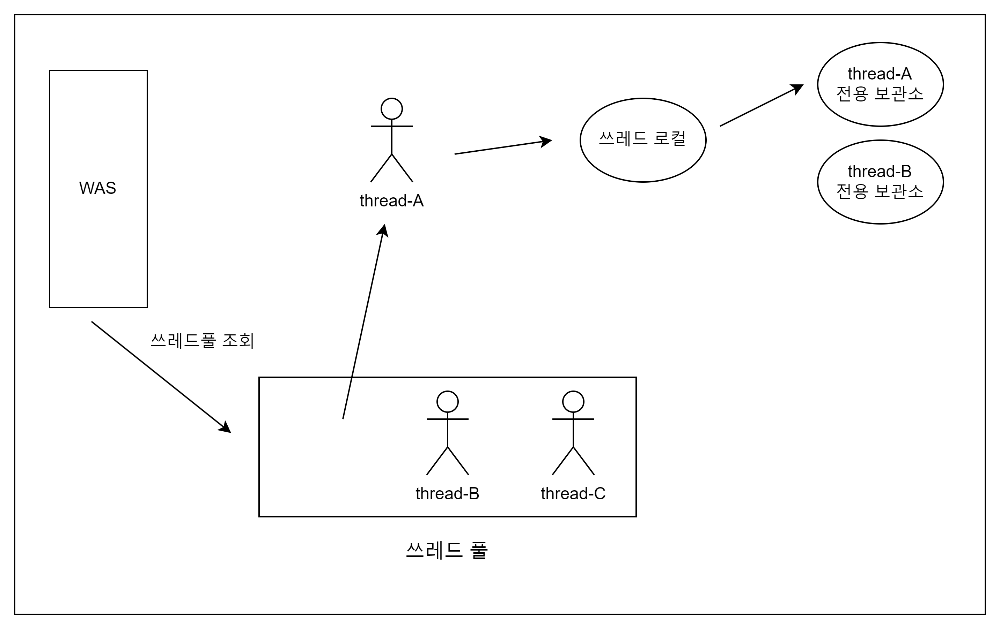

# 쓰레드 로컬(ThreadLocal)

## 개념

각 스레드가 자신만의 독립적인 데이터를 보유할 수 있게 해주는 메커니즘입니다.

스레드가 데이터를 저장하고 접근할 수 있는 고유한 "접근 방법"을 제공하는 것이지 저장소 자체가 아닙니다.

한 스레드 내에서 설정된 데이터는 해당 스레드에서만 접근 가능하며, 다른 스레드와는 데이터가 공유되지 않습니다.

## 사용 방법

get() 메서드로 데이터를 읽고 set() 메서드로 데이터를 저장, remove() 메서드로 데이터를 삭제할 수 있습니다.

```java
public class ThreadLocalService {

    private ThreadLocal<String> threadLocal = new ThreadLocal<>();

    public String logic(String name) {
        threadLocal.set(name); // 쓰레드 로컬에 저장
        // logic ...
        return threadLocal.get(); // 쓰레드 로컬에서 읽기
    }
}
```



## 주의 사항

쓰레드 로컬을 모두 사용한 후에는 반드시 remove() 메서드로 데이터를 삭제해야합니다.

만약 ThreadLocal에 저장된 데이터를 제거하지 않고 쓰레드를 쓰레드 풀에 반환하게 되면, 그 쓰레드가 다음 번에 다른 작업을 할당받았을 때 ThreadLocal에 이전 작업에서 사용된 데이터가 남아있게 되고 문제가 발생할 수 있습니다.

예를 들어, 사용자 A의 요청을 처리하는 동안 사용자 A의 개인 정보를 ThreadLocal에 저장했다고 가정해봅시다.
작업 완료 후 이 데이터를 제거하지 않고 쓰레드를 쓰레드 풀에 반환하면, 이 쓰레드가 다음 요청을 처리하게 될 때 ThreadLocal에 남아있는 사용자 A의 정보가 사용자 B에게 노출될 가능성이 있습니다.

이러한 문제를 방지하기 위해, ThreadLocal을 사용한 후에는 반드시 ThreadLocal.remove() 메서드를 호출하여 저장된 데이터를 제거해야 합니다.
