# 로그 추적기 (프록시)

## 주요 목차

[[ 프록시 ]](#프록시)

[[ 리플렉션, 동적 프록시, CGLIB ]](#동적-프록시-적용)

[[임시]]()

[[ 임시2 ]]()

<br>
<br>

## 소개

원본 코드를 전혀 수정하지 않고 로그 추적 기능을 추가하고 특정 메서드에는 기능이 적용되지 않도록 설정했습니다.

다양한 케이스(인터페이스가 있는 구현 클래스, 인터페이스가 없는 구체 클래스, 컴포넌트 스캔 대상 등)에 적용하였습니다.

<br>

## 프록시

[[ 프록시 개념 살펴보기 ]](https://github.com/woosungkim0123/spring-jpa-deep-dive/tree/master/spring_aop/proxy/notion/proxy_notion)

[[ 프록시 패턴 살펴보기 ]](https://github.com/woosungkim0123/spring-jpa-deep-dive/tree/master/spring_aop/proxy/notion/proxy_pattern)

[[ 데코레이터 패턴 살펴보기 ]](https://github.com/woosungkim0123/spring-jpa-deep-dive/tree/master/spring_aop/proxy/notion/decorator_pattern)

<br>

## 인터페이스 기반 환경에 프록시 적용

각 레이어의 인터페이스를 구현한 프록시를 추가한 후 (e.g. OrderControllerV1 인터페이스를 바탕으로 OrderControllerV1Proxy 추가)
빈 설정 파일에서 실제 객체를 반환하지 않고 프록시를 반환하도록 변경합니다. (프록시를 빈으로 대신 등록하고 실제 객체는 빈으로 등록하지 않습니다.)

프록시 객체 안에서 실제 객체를 참조함으로써 실제 객체를 호출할 수 있습니다. 

|      | 스프링 컨테이너 | 자바 힙 메모리     |
|------|------------|--------------|
| 프록시 객체 | 관리 O       | 메모리에 올라감 (o) |
| 실제 객체 | 관리 X       | 메모리에 올라감 (o) |

`config/v1_proxy/InterfaceProxyConfig`, `config/v1_proxy/interface_proxy` 참조

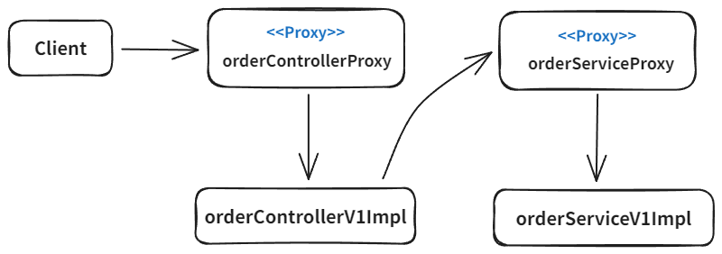

<br>

## 구체 클래스 기반 환경에 프록시 적용

구체 클래스를 상속받은 프록시를 추가해서 다형성을 활용해서 구체 클래스 대신 프록시를 사용하도록 변경합니다.

`config/v1_proxy/ConcreteProxyConfig`, `config/v1_proxy/concrete_proxy` 참조

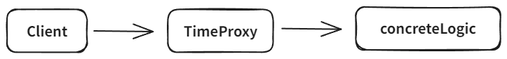

### 단점

비슷한 프록시 클래스를 너무 많이 만들어야 한다는 단점이 존재합니다. 적용 대상 클래스가 100개라면 프록시 클래스도 100개가 필요합니다.

이를 해결할 방법으로 프록시 클래스를 하나만 만들어서 모든 곳에 적용하는 동적 프록시 기술이 있습니다.

<br>

## 동적 프록시 적용

JDK 동적 프록시를 이용하여 적용 대상 만큼 프록시 객체를 만들지 않아도 되도록 변경하였습니다.

이로 인해 같은 부가 기능 로직을 한번만 개발하면 공통으로 적용할 수 있습니다.

동적 프록시는 클래스 기반의 프록시를 지원하지 않아서 대안으로 CGLIB 같은 바이트코드 조작 라이브러리를 사용합니다.

`config/v2_dynamic_proxy` 패키지 참조

[[ 리플렉션 (동적 프록시 필수 개념) 살펴보기 ]](https://github.com/woosungkim0123/spring-jpa-deep-dive/tree/master/spring_aop/proxy/notion/reflection)

[[ 동적 프록시 살펴보기 ]](https://github.com/woosungkim0123/spring-jpa-deep-dive/tree/master/spring_aop/proxy/notion/dynamic_proxy)

[[ CGLIB 살펴보기 ]](https://github.com/woosungkim0123/spring-jpa-deep-dive/tree/master/spring_aop/proxy/notion/cglib)


<br>

# 여기서부터 수정 필요

## ProxyFactory

- 인터페이스가 있는 경우 JDK 동적 프록시를 사용하고 인터페이스가 없는 경우 CGLIB을 사용하는 방식입니다. (이런 설정도 변경 가능)

   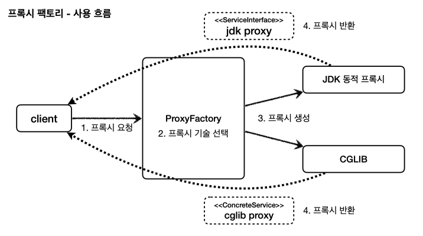

- JDK 동적프록시가 제공하는 InvocationHandler와 CGLIB이 제공하는 MethodInterceptor가 Advice를 호출하게 해서 사용자는 Advice만 만들면 됩니다.

   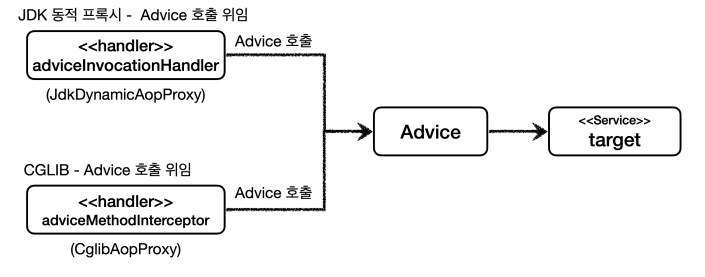

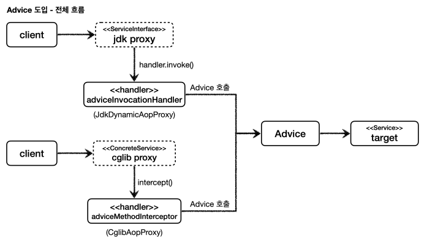

### 코드 예시

**Advice**

- Advice는 프록시에 적용하는 부가 기능 로직 입니다.
- JDK 동적 프록시의 InvocationHandler와 CGLIB의 MethodInterceptor가 Advice를 호출하게 해서 사용자는 Advice만 만들면 됩니다.
- 다른 proxy 사용과 달리 실제 객체(target)을 안 넣어줘도 됩니다. (이미 프록시 팩토리를 만들 때 MethodInvocation invocation 안에 모두 포함되어 있습니다.)
- MethodInterceptor 내부에는 다음 메서드를 호출하는 방법, 현재 프록시 객체 인스턴스, args, 메서드 정보등이 포함되어 있습니다. (기존 파라미터들이 안으로 들어옴)
- 상속받은 부모의 부모가 Advice 인터페이스 입니다. (MethodInterceptor -> Interceptor -> Advice)
- MethodInterceptor는 스프링 AOP 모듈(org.aopalliance.intercept)을 사용해야합니다. (CGLIB MethodInterceptor와 다르니 주의)

```java
@Slf4j
public class TimeAdvice implements MethodInterceptor {
    
    @Override
    public Object invoke(MethodInvocation invocation) throws Throwable {
        log.info("TimeProxy 실행");
        long startTime = System.currentTimeMillis();

        Object result = invocation.proceed();

        long endTime = System.currentTimeMillis();
        long resultTime = endTime - startTime;
        log.info("TimeProxy 종료 resultTime={}ms", resultTime);
        return result;
    }
}
```

**인터페이스 기반 프록시 팩토리**

```java
@Slf4j
public class ProxyFactoryTest {
    
    @Test
    public void interfaceTest() {
        ServiceInterface target = new Service();
        ProxyFactory proxyFactory = new ProxyFactory(target); // 이때 프록시 팩토리에 타겟 정보를 넣음 - Advice에서 넣어줄 필요가 없습니다.
        proxyFactory.addAdvice(new TimeAdvice()); // Advice를 추가해준다.
        ServiceInterface proxy = (ServiceInterface) proxyFactory.getProxy();

        log.info("target = {}", target.getClass()); // class hello.proxy.Service
        log.info("proxy = {}", proxy.getClass()); // class jdk.proxy3.$Proxy11

        proxy.save();

        // 프록시가 적용되었나 확인 (프록시 팩토리를 사용할 때만 가능, 다른 방법으로 프록시를 만들면 확인 불가)
        assertThat(AopUtils.isAopProxy(proxy)).isTrue();
        assertThat(AopUtils.isJdkDynamicProxy(proxy)).isTrue();
        assertThat(AopUtils.isCglibProxy(proxy)).isFalse();
    }
}
```

**구체 클래스 기반 프록시 팩토리**

```java
@Slf4j
public class ProxyFactoryTest {

    @Test
    public void lassTest() {
        ConcreteService target = new ConcreteService();
        ProxyFactory proxyFactory = new ProxyFactory(target);
        proxyFactory.addAdvice(new TimeAdvice());
        ConcreteService proxy = (ConcreteService) proxyFactory.getProxy();

        log.info("target = {}", target.getClass()); // class hello.proxy.ConcreteService
        log.info("proxy = {}", proxy.getClass()); // class hello.proxy.ConcreteService$$SpringCGLIB$$

        proxy.call();
        
        assertThat(AopUtils.isAopProxy(proxy)).isTrue();
        assertThat(AopUtils.isJdkDynamicProxy(proxy)).isFalse();
        assertThat(AopUtils.isCglibProxy(proxy)).isTrue();
    }
}
```

**ProxyTargetClass 옵션을 사용하여 강제로 CGLIB을 사용하도록 변경**

- ProxyTargetClass 옵션을 사용하면 인터페이스가 있어도 강제로 CGLIB 프록시를 사용하게 할 수 있습니다.
- 예시에서는 Service를 상속받아서 CGLIB으로 프록시를 만들게 됩니다.

```java
@Slf4j
public class ProxyFactoryTest {
    
    @Test
    public void proxyTargetClass() {
        ServiceInterface target = new Service();
        ProxyFactory proxyFactory = new ProxyFactory(target);

        proxyFactory.setProxyTargetClass(true); // 강제로 CGLIB 프록시를 사용하게 한다.

        proxyFactory.addAdvice(new TimeAdvice());
        ServiceInterface proxy = (ServiceInterface) proxyFactory.getProxy();

        log.info("target = {}", target.getClass()); // class hello.proxy.Service
        log.info("proxy = {}", proxy.getClass()); // class hello.proxy.Service$$SpringCGLIB$$0

        proxy.save();
        
        assertThat(AopUtils.isAopProxy(proxy)).isTrue();
        assertThat(AopUtils.isJdkDynamicProxy(proxy)).isFalse();
        assertThat(AopUtils.isCglibProxy(proxy)).isTrue();
    }
}
```

## 포인트컷, 어드바이스, 어드바이저

### 포인트컷 (Pointcut)

- 어디에 부가 기능을 적용할지, 안할지를 판단하는 필터링 역할입니다.
- 주로 클래스와 메소드 이름으로 필터링을 합니다.
- 어떤 포인트(Point)에 기능을 적용할지 안할지 잘라서(cut) 구분하는 것입니다.

### 어드바이스(Advice)

- 프록시가 호출하는 부가 기능을 말합니다. 단순하게 프록시 로직이라고 생각하면 됩니다.

### 어드바이저(Advisor)

- 하나의 포인트컷과 하나의 어드바이스를 합친 것을 말합니다.

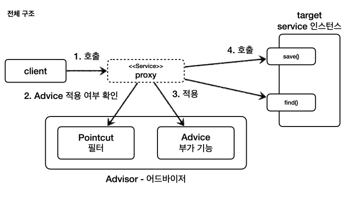

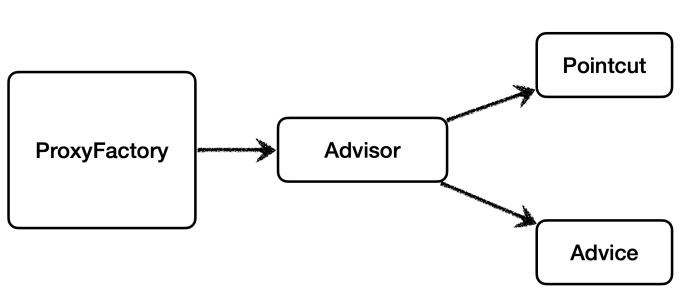

### 코드 예시

**기본적인 어드바이저 사용**

- DefaultPointcutAdvisor는 Advisor 인터페이스의 가장 일반적인 구현체입니다. (하나의 포인트컷과 하나의 어드바이스를 가지고 있습니다.)
- Advisor는 내부에 포인트컷과 어드바이스를 모두 가지고 있습니다. 어떤 부가 기능을 적용할지 어디에 적용할지 알 수 있습니다. (프록시 팩토리를 사용할 때 어드바이저는 필수입니다.)
- 이전 proxyFactory.addAdvice(new TimeAdvice())를 사용할 떄도 내부적으로 지금과 같은 방식으로 어드바이저가 추가됩니다.

```java
@Slf4j
public class AdvisorTest {

    @Test
    void advisorTest() {
        ServiceInterface target = new Service();
        ProxyFactory proxyFactory = new ProxyFactory(target);
        DefaultPointcutAdvisor advisor = new DefaultPointcutAdvisor(
                Pointcut.TRUE, // 항상 true 를 반환하는 포인트컷이다
                new TimeAdvice() // Advisor 인터페이스의 가장 일반적인 구현체이다.
        );
        proxyFactory.addAdvisor(advisor); // 프록시 팩토리에 적용할 어드바이저를 지정합니다.

        ServiceInterface proxy = (ServiceInterface) proxyFactory.getProxy();
        proxy.save();
        proxy.find();
    }
}
```

**필터링 적용 (포인트 컷 직접 구현)**

- 기존에는 필터링을 Advice에 if문으로 구현했지만 단일 책임 원칙에 따라서 분리하는 것이 좋습니다.
- 포인트 컷은 크게 ClassFilter 와 MethodMatcher 둘로 이루어집니다.
- ClassFilter는 어떤 클래스에 적용할지, MethodMatcher는 어떤 메서드에 적용할지를 결정합니다. (둘다 true를 반환해야 어드바이스가 적용됩니다.)
- 일반적으로 스프링이 구현해놓은 포인트 컷을 사용하면 되지만 여기서는 직접 구현해보겠습니다.

```java
class MyPointcut implements Pointcut {
    @Override
    public ClassFilter getClassFilter() {
        return ClassFilter.TRUE;
    }

    @Override
    public MethodMatcher getMethodMatcher() {
        return new MyMethodMatcher();
    }
}
```

- save 메서드에만 어드바이스를 적용하겠습니다.
- isRuntime은 값이 true면 matches(... args) 메서드가 대신 호출됩니다. (동적으로 넘어오는 매개변수를 판단 로직으로 사용할 수 있습니다.)
- isRuntime 값이 false면 클래스의 정적 정보만 사용하기 때문에 스프링이 내부에서 캐싱을 통해 성능 향상이 가능합니다.
- isRuntime 값이 true면 매개변수가 동적으로 변경된다고 가정하기 때문에 캐싱을 하지 않습니다.

```java
class MyMethodMatcher implements MethodMatcher {
    private String matchName = "save";

    @Override
    public boolean matches(Method method, Class<?> targetClass) {
        boolean result = method.getName().equals(matchName);
        log.info("포인트컷 호출 method={}, targetClass={}", method.getName(), targetClass);
        log.info("포인트컷 결과 result={}", result);
        return result;
    }

    @Override
    public boolean isRuntime() {
        return false;
    }
    
    // isRuntime이 true일 때 호출
    @Override
    public boolean matches(Method method, Class<?> targetClass, Object... args) {
        return false;
    }
}
```

```java
@Slf4j
public class AdvisorTest {
    @Test
    void advisorTest2() {
        ServiceInterface target = new Service();
        ProxyFactory proxyFactory = new ProxyFactory(target);
        DefaultPointcutAdvisor advisor = new DefaultPointcutAdvisor(
                new MyPointcut(), // 직접 구현한 포인트컷을 사용
                new TimeAdvice()
        );
        proxyFactory.addAdvisor(advisor);

        ServiceInterface proxy = (ServiceInterface) proxyFactory.getProxy();

        proxy.save(); // 어드바이스가 적용된다.
        proxy.find(); // 어드바이스가 적용되지 않는다.
    }
}
```

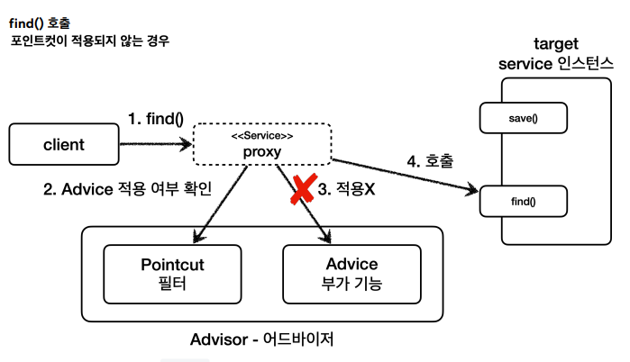

**필터링 적용 (스프링이 제공하는 포인트컷 `NameMatchMethodPointcut` 사용)**

- 스프링은 무수히 많은 포인트 컷을 제공합니다.
  - NameMatchMethodPointcut: 메서드 이름 기반으로 매칭 (내부적으로 PatternMatchUtils 사용)
  - JdkRegexpMethodPointcut: JDK 정규 표현식 기반으로 매칭
  - TruePointcut: 항상 true를 반환하는 포인트컷
  - AnnotationMatchingPointcut: 어노테이션 기반으로 매칭
  - AspectJExpressionPointcut: AspectJ 표현식 기반으로 매칭 (가장 중요)

```java
@Slf4j
public class AdvisorTest {
    @Test
    void advisorTest3() {
        ServiceInterface target = new Service();
        ProxyFactory proxyFactory = new ProxyFactory(target);
        
        NameMatchMethodPointcut pointcut = new NameMatchMethodPointcut(); // 메서드 이름 기반으로 매칭
        pointcut.setMappedNames("save"); 
        
        DefaultPointcutAdvisor advisor = new DefaultPointcutAdvisor(
                pointcut,
                new TimeAdvice()
        );
        proxyFactory.addAdvisor(advisor);
        ServiceInterface proxy = (ServiceInterface) proxyFactory.getProxy();
        
        proxy.save(); // 어드바이스가 적용된다.
        proxy.find(); // 어드바이스가 적용되지 않는다.
    }
}
```

**여러 어드바이저를 하나의 타겟에 적용**

- 여러 프록시를 사용하는 방법이 있는데 적용해야 하는 어드바이저가 10개라면 10개의 프록시를 만들어야 합니다.

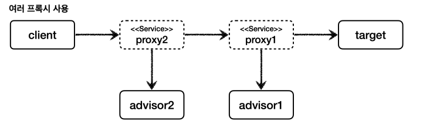

```java
//client -> proxy2(advisor2) -> proxy1(advisor1) -> target
public class MultiAdvisorTest {
    @Test
    void multiAdvisorTest1() {
        //프록시1 생성
        ServiceInterface target = new ServiceImpl();
        ProxyFactory proxyFactory1 = new ProxyFactory(target);
        DefaultPointcutAdvisor advisor1 = new
                DefaultPointcutAdvisor(Pointcut.TRUE, new Advice1()); // 어드바이저 1
        proxyFactory1.addAdvisor(advisor1);
        ServiceInterface proxy1 = (ServiceInterface) proxyFactory1.getProxy();
        
        //프록시2 생성, target -> proxy1 입력
        ProxyFactory proxyFactory2 = new ProxyFactory(proxy1);
        DefaultPointcutAdvisor advisor2 = new
                DefaultPointcutAdvisor(Pointcut.TRUE, new Advice2()); // 어드바이저 2
        proxyFactory2.addAdvisor(advisor2);
        ServiceInterface proxy2 = (ServiceInterface) proxyFactory2.getProxy();
        
        //실행
        proxy2.save();
    }
}
```

- 스프링은 이러한 문제를 해결하기 위해 하나의 프록시에 여러 어드바이저를 적용할 수 있게 해줍니다.

**프록시 팩토리 - 여러 어드바이저를 적용**

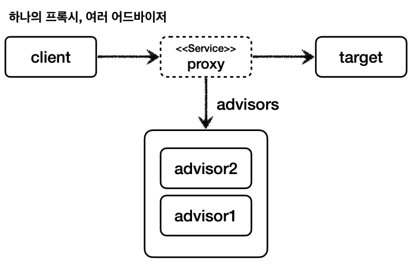

```java
// proxy -> advisor2 -> advisor1 -> target
public class MultiAdvisorTest {
    @Test
    void multiAdvisorTest2() {
        DefaultPointcutAdvisor advisor2 = new DefaultPointcutAdvisor(Pointcut.TRUE, new Advice2());
        DefaultPointcutAdvisor advisor1 = new DefaultPointcutAdvisor(Pointcut.TRUE, new Advice1());

        // 프록시는 하나만 생성
        ServiceInterface target = new Service();
        ProxyFactory proxyFactory = new ProxyFactory(target);
        proxyFactory.addAdvisor(advisor2); // 순서 주의
        proxyFactory.addAdvisor(advisor1);
        ServiceInterface proxy = (ServiceInterface) proxyFactory.getProxy();

        // 실행
        proxy.save();
    }
}
```

### 주의 사항

스프링은 AOP를 적용할 때 최적화를 진행해서 지금처럼 프록시는 하나만 만들고 하나의 프록시에 여러 어드바이저를 적용합니다. (자주 헷갈리는 부분)

즉, 하나의 타겟에 여러 AOP가 동시에 적용되어도, 스프링 AOP는 타겟마다 하나의 프록시만 생성합니다.

### 정리

**문제1 너무 많은 설정**

지금은 숫자가 적지만 스프링 빈이 100개 있다면 프록시를 통해 부가 기능을 적용하려면 100개의 동적 프록시 생성 코드를 만들어야 합니다.

**문제2 컴포넌트 스캔**

V3처럼 컴포넌트 스캔을 사용하는 경우 지금의 방식으로는 프록시 적용이 불가능합니다. (컴포넌트 스캔이 이미 스프링 빈으로 다 등록해버린 상태)

이러한 문제를 한번에 해결하는 것이 빈 후처리기 입니다.

<br>
<br>

## 빈 후처리기

- Bean을 빈 저장소에 등록하기 직전에 조작하고 싶다면 빈 후처리기를 사용할 수 있습니다. (`BeanPostProcessor`)
- 빈 후처리기를 사용해 V3 컴포넌트 스캔에 프록시를 적용할 수 있고 설정 코드를 줄일 수 있습니다.

### 과정

1. 빈 대상이 되는 객체를 생성합니다.(`@Bean`, 컴포넌트 스캔)
2. 생성된 객체를 빈 후처리기에 전달합니다.
3. 빈 후처리기에서 스프링 빈 객체를 조작하거나 다른 객체로 바꿔치기 할 수 있습니다.
4. 빈 후처리기가 빈을 그대로 반환하면 해당 빈이 등록되고 바꿔치기 하면 다른 객체가 빈 저장소에 등록됩니다.

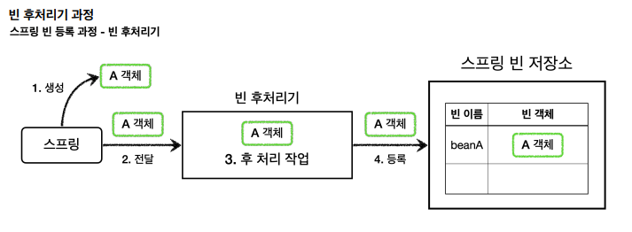

### 코드

**빈 후처리기를 사용X**

```java
public class BasicTest {

    // 스프링 컨테이너에는 A빈만 등록된 상태
    @Test
    void basicConfig() {
        ApplicationContext context = new AnnotationConfigApplicationContext(BasicConfig.class); // 스프링 컨테이너
        A beanA = context.getBean("beanA", A.class);
        beanA.helloA();

        // B는 빈으로 등록되지 않는다.
        assertThatThrownBy(() -> context.getBean("beanB", B.class))
                    .isInstanceOf(NoSuchBeanDefinitionException.class); // true
    }
}
```

**빈 후처리기 사용**

빈 객체 생성 이후에 오출되는 BeanPostProcessor 인터페이스의 메소드입니다.

- postProcessBeforeInitialization : 객체 생성 이후에 @PostConstruct 같은 초기화가 발생하기 전에 호출되는 포스트 프로세서이다.
- postProcessAfterInitialization : 객체 생성 이후에 @PostConstruct 같은 초기화가 발생한 다음에 호출되는 포스트 프로세서이다.

```java
@Configuration
class BeanPostProcessorConfig {
    @Bean(name ="beanA")
    public A a() {
        return new A();
    }
    // 후처리기를 빈으로 등록하면 인식하고 동작합니다.
    @Bean
    public AToBPostProcess helloBeanPostProcessor() {
        return new AToBPostProcess();
    }
}

// 빈 후처리기
@Slf4j
class AToBPostProcess implements BeanPostProcessor {
    @Override
    public Object postProcessAfterInitialization(Object bean, String beanName) {
        log.info("bean={}, beanName={}", bean, beanName);
        if (bean instanceof A) {
            return new B(); // A를 B로 대체
        }
        return bean;
    }
}

public class BasicTest {
    @Test
    void postProcessor() {
        ApplicationContext context = new AnnotationConfigApplicationContext(BeanPostProcessorConfig.class);
        B b = context.getBean("beanA", B.class); // A가 B로 대체되어 등록된다.
        b.helloB();
        
        assertThatThrownBy(() -> context.getBean(A.class))
                .isInstanceOf(NoSuchBeanDefinitionException.class); // true
    }
}
```

### 정리

- 빈 후처리기는 빈을 조작하고 변경 할 수 있는 후킹 포인트 입니다.
- 인터페이스인 BeanPostProcessor를 구현하고 스프링 빈으로 등록하면 스프링 컨테이너가 빈 후처리기로 인식하고 동작합니다.
- 빈 후처리기를 등록하면 스프링 컨텍스트에 등록되는 모든 빈의 생성과 초기화 과정에서 해당 후처리기를 거치게 됩니다.
- 일반적으로는 컴포넌트 스캔으로 등록하는 빈들은 중간에 조작할 방법이 없는데 빈 후처리기를 사용하면 조작할 수 있습니다. (프록시로 교체도 가능)
- @PostConstruct는 스프링 빈 생성 이후에 빈 초기화 역할을 하는데 내부를 보면 CommonAnnotationBeanPostProcessor이라는 빈 후처리기가 등록되어 있고 이 처리기가 @PostConstruct 애노테이션이 붙은 메서드를 호출하는 것을 볼 수 있습니다.

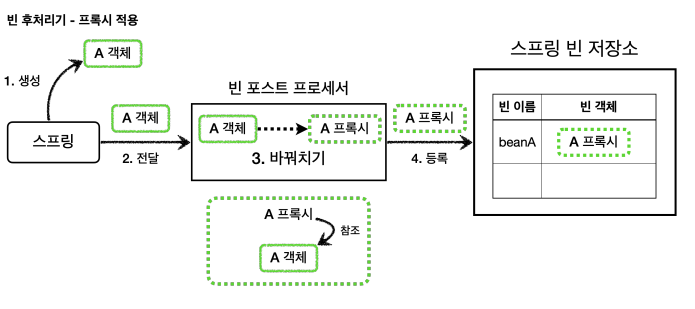

### 개선

빈 후처리기에서 프록시를 적용할지 여부를 판단했지만 이 방식보다 포인트컷을 사용하는 것이 더 좋습니다.

포인트 컷은 이미 클래스, 메서드 단위의 필터 기능을 가지고 있기 때문에 프록시 적용 대상 여부를 정밀하게 설정할 수 있습니다. (어드바이저를 통해 포인트 컷 확인가능)

**포인트컷 두가지 사용용도**

1. 프록시 적용 대상 여부를 체크해서 필요한 곳에만 프록시 적용 (빈 후처리기 - 자동 프록시 생성)
    - 객체 안에 메서드가 10개인데 하나도 어드바이스를 적용할 필요가 없으면 프록시로 만들 필요가 없습니다.
    - 이런 것을 포인트컷으로 판단하여 결정합니다. (1번 포인트컷)
2. 프록시의 어떤 메서드가 호출 되었을 때 어드바이스를 적용할 지 판단 (프록시 내부)
    - 객체 안에 메서드가 10개인데 그 중 한개를 어드바이스를 적용해야 한다면 일단 프록시를 만듭니다.(객체 단위로 되기 때문) 
    - 어떤 메서드에 어드바이스를 적용할지는 포인트컷이 결정합니다. (2번 포인트컷)

<br>
<br>

## 스프링이 제공하는 빈 후처리기

- v5_autoproxy 참조

```gradle
// aspectjweaver, aspectJ 관련 라이브러리 등록 및 스프링 부트가 AOP 관련 클래스를 자동으로 스프링 빈으로 등록
implementation 'org.springframework.boot:spring-boot-starter-aop'
```

- 자동 프록시 생성기(AutoProxyCreator)를 자동으로 스프링 빈에 등록해줍니다. (`AnnotationAwareAspectJAutoProxyCreator`)
- 자동 프록시 생성기는 자동으로 프록시를 생성해주는 빈 후처리기 입니다.
- 이 빈 후처리기는 스프링 빈으로 등록된 Advisor들을 자동으로 찾아서 프록시가 필요한 곳에 자동으로 프록시를 적용해줍니다.(안에 포인트컷과 어드바이스를 사용해서)

### 과정

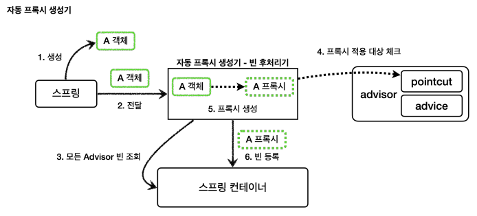

1. 스프링이 스프링 빈 객체를 생성하고 이를 빈 후처리기에 전달합니다.
2. 빈 후처리기(자동 프록시 생성기)는 스프링 컨테이너에 있는 모든 Advisor를 조회합니다.
3. Advisor에 포함되어 있는 포인트컷을 사용해서 해당 객체가 프록시를 적용할 대상인지 아닌지 판단합니다.
    - 객체 클래스 정보, 객체 모든 메서드를 포인트컷에 하나하나 모두 매칭해보고 조건이 하나라도 만족하면 프록시 적용 대상이 됩니다.
    - 10개의 메서드 중 하나만 포인트 컷 조건에 만족해도 프록시 적용 대상이 됩니다.
4. 프록시 적용 대상이면 프록시를 생성하고 반환해서 프록시를 스프링 빈으로 등록됩니다.

### 포인트컷 2가지 사용

1. 프록시 적용 여부 판단 - 생성 단계

    - 자동 프록시 생성기는 포인트컷을 사용해서 해당 빈이 프록시를 생성할 필요가 있는지 없는지 판단합니다. (클래스 + 메서드 조건 비교)
    - 예시로 request()와 noLog()가 있는데 request가 조건에 맞으므로 프록시를 생성합니다.
    - 조건에 맞지 않으면 프록시를 생성하지 않습니다.
    - 프록시를 모든 곳에 생성하는 것은 비용 낭비라서 포인트컷으로 한번 필터링해서 어드바이스가 사용될 곳에 프록시를 생성합니다.

2. 어드바이스 적용 여부 판단 - 사용 단계

    - 프록시가 호출되었 을때 부가 기능인 어드바이스를 적용할지 말지를 포인트 컷을 보고 판단합니다.
    - 예시로 request()는 조건에 만족하므로 어드바이스를 먼저 호출하고 target을 호출하지만 noLog()는 조건에 만족하지 않으므로 target만 호출합니다.

### AspectJExpressionPointcut

- `"request*", "order*", "save*"` 이런식으로 포인트컷을 설정하면 기대하지 않은 빈들이 프록시로 만들어지고 어드바이스가 적용됩니다.
- 패키지에 메서드 이름까지 함께 지정할 수 있는 매우 정밀한 포인트컷이 필요합니다.
- `AspectJExpressionPointcut`는 AOP에 특화된 포인트컷 표현식(AsepctJ)을 적용할 수 있습니다. (실무에선 이것을 사용합니다.)
- `AutoProxyConfig` advisor2, advisor3 참조

### 하나의 프록시에 여러 Advisor 적용

- 스프링 빈이 advisor1, advisor2가 제공하는 포인트컷의 조건을 모두 만족하면 프록시는 하나만 생성합니다.
- 프록시 팩토리가 생성하는 프록시는 내부에 여러 어드바이저를 포함할 수 있기 때문입니다.

### 정리

- 자동 프록시 생성기 덕분에 Advisor만 스프링 빈으로 등록하면 프록시가 자동으로 생성되고 어드바이스가 적용됩니다.
- @Aspect 애노테이션을 사용해서 더 편리하게 포인트컷과 어드바이스를 만들고 프록시를 적용할 수 있습니다.

<br>
<br>

## @Aspect

- @Aspect 애노테이션으로 편리하게 어드바지어 생성 기능을 지원합니다.

### 설명

자동 프록시 생성기는 Advisor를 자동으로 찾아서 필요한 곳에 프록시를 생성하고 적용해줍니다.

추가로 한가지 역할을 있는데 @Aspect를 찾아서 Advisor로 만들어줍니다.

### 과정

1. 스프링 애플리케이션 로딩 시점에 자동 프록시 생성기를 호출하고 @Aspect 애노테이션이 붙은 빈을 모두 찾습니다.
2. @Aspect 어드바이저 빌더를 통해 @Aspect 정보를 기반으로 어드바이저를 생성합니다.
3. 생성한 어드바이저를 @Aspect 어드바이저 빌더 내부에 저장합니다.

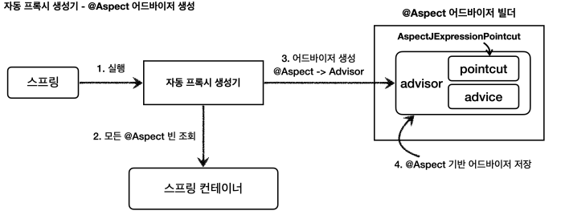

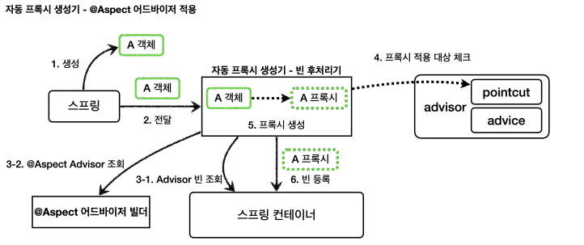

<br>
<br>


