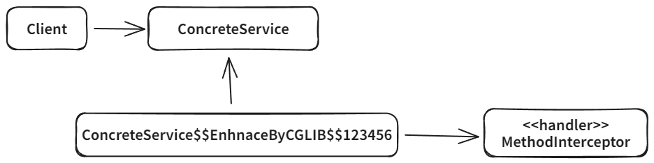

# CGLIB(Code Generation Library)

## 개념

CGLIB는 바이트코드를 조작해서 동적으로 클래스를 생성하는 기술을 제공하는 라이브러리입니다.

인터페이스가 없어도 구체 클래스만 가지고 동적 프록시를 만들어 낼 수 있습니다.

스프링 프레임워크에 들어와서 별도로 추가할 필요가 없습니다.

우리가 직접 CGLIB을 사용하는 경우는 없고 스프링의 ProxyFactory 기술이 CGLIB을 편리하게 사용할 수 있도록 도와줍니다.



<br>

## 코드 예시

```java
// 구체 클래스
@Slf4j
public class ConcreteService {
    public void call() {
        log.info("ConcreteService 호출");
    }
}

@Slf4j
public class TimeMethodInterceptor implements MethodInterceptor {

   private final Object target;

   public TimeMethodInterceptor(Object target) {
      this.target = target;
   }

   /**
    * TimeMethodInterceptor는 MethodInterceptor 인터페이스를 구현해서 CGLIB 프록시의 실행 로직을 정의합니다 (JDK 동적 프록시의 InvocationHandler 와 비슷)
    * @param obj - CGLIB가 적용된 객체
    * @param method - 호출된 메서드
    * @param args - 메서드를 호출하면서 전달된 인수
    * @param proxy - 메서드 호출에 사용 (권장)
    */
   @Override
   public Object intercept(Object obj, Method method, Object[] args, MethodProxy proxy) throws Throwable {
      log.info("TimeProxy 실행");
      long startTime = System.currentTimeMillis();

      // 메서드를 사용해도되지만 CGLIB에서는 proxy를 사용을 권장함 (조금 더 빠름)
      // Object result = method.invoke(target, args);
      Object result = proxy.invoke(target, args);

      long endTime = System.currentTimeMillis();
      long resultTime = endTime - startTime;
      log.info("TimeProxy 종료 resultTime={}", resultTime);
      return result;
   }
}

@Slf4j
public class CglibTest {
   @Test
   void cglib() {
      ConcreteService target = new ConcreteService();
      // Enhancer 는 CGLIB의 핵심 클래스로서 프록시 객체를 생성하는 역할을 한다
      Enhancer enhancer = new Enhancer();
      enhancer.setSuperclass(ConcreteService.class);// 어떤 구체 클래스를 상속 받을지 설정
      enhancer.setCallback(new TimeMethodInterceptor(target)); // MethodInterceptor가 Callback 인터페이스를 구현하고 있음
      ConcreteService proxy = (ConcreteService) enhancer.create();

      log.info("target={}", target.getClass()); // class hello.proxy.ConcreteService
      log.info("proxy={}", proxy.getClass()); // class hello.proxy.ConcreteService$$EnhancerByCGLIB$$3d5c645b

      proxy.call();
   }
}
```

<br>

## 제약

CGLIB는 자식 클래스를 동적으로 생성하기 때문에 기본 생성자가 필요합니다. 따라서 부모 클래스의 생성자를 체크해야 합니다.

final 클래스, final 메서드는 사용이 불가능합니다. final 클래스는 예외가 발생하고 final 메서드는 프록시 로직이 동작하지 않습니다.

기본 생성자를 추가하고 의존관계를 setter를 사용해서 주입하면 CGLIB을 적용할 수 있으나 ProxyFactory를 사용하면 이런 제약을 해결할 수 있습니다. 
인터페이스가 있으면 JDK 동적 프록시를 사용하고 인터페이스가 없으면 CGLIB을 사용하는 방식이 스프링의 ProxyFactory가 사용하는 방식입니다.
