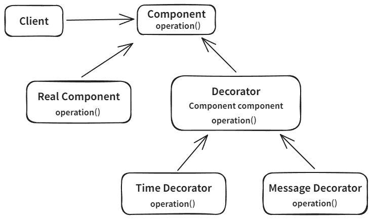

# 데코레이터 패턴

## 개념

- 코드를 변경하지 않고 프록시를 도입해서 부가 기능을 추가하는 패턴입니다.
- 실제 객체가 있고 이를 데코레이터로 감싸서 부가 기능을 추가합니다.
- 객체에 추가 책임(기능)을 동적으로 추가하고 기능 확장을 위한 유연한 대안을 제공합니다.



<br>

## 사용 목적

기존 코드를 변경하지 않고도 객체의 기능을 확장할 수 있어, 기능 추가와 관련된 복잡성과 클래스 수의 증가 문제를 해결할 수 있습니다.

<br>

## 코드

### 기본 코드

```java
public interface Component {
    String operation();
}

@Slf4j
public class RealComponent implements Component {
   @Override
   public String operation() {
      log.info("RealComponent 실행");
      return "data";
   }
}

@Slf4j
public class DecoratorClient {

   private Component component;

   public DecoratorClient(Component component) {
      this.component = component;
   }

   public String execute() {
      log.info("DecoratorClient 실행");
      return component.operation();
   }
}

public class DecoratorPatternTest {
    @Test
    public void noDecoratorPatternTest() {
        Component component = new RealComponent();
        DecoratorClient client = new DecoratorClient(component);

        client.execute();
    }
}
```

### 코드 변경없이 기능 추가

```java
public abstract class Decorator implements Component {
    protected Component component;

    public Decorator(Component component) {
        this.component = component;
    }
}

public class MessageDecorator extends Decorator {

   public MessageDecorator(Component component) {
      super(component);
   }

   @Override
   public String operation() {
      log.info("MessageDecorator 실행");

      String result = component.operation();
      String decoResult = "****" + result + "****";

      log.info("적용전 : {}, 적용후 : {}", result, decoResult);

      return decoResult;
   }
}

@Slf4j
public class TimeDecorator extends Decorator {

   public MessageDecorator(Component component) {
      super(component);
   }

   @Override
   public String operation() {
      log.info("TimeDecorator 실행");
      long start = System.currentTimeMillis();

      String result = component.operation();

      long end = System.currentTimeMillis();
      log.info("실행시간 : {}", end - start);

      return result;
   }
}

public class DecoratorPatternTest {
    @Test
    public void decoratorPatternTest2() {
        Component component = new RealComponent();
        Component messageDecorator = new MessageDecorator(component);
        Component timeDecorator = new TimeDecorator(messageDecorator);
        DecoratorClient client = new DecoratorClient(timeDecorator); // Client 코드를 전혀 수정하지 않음
       
        String result = client.execute();
        
        System.out.println(result);
    }
}
```
