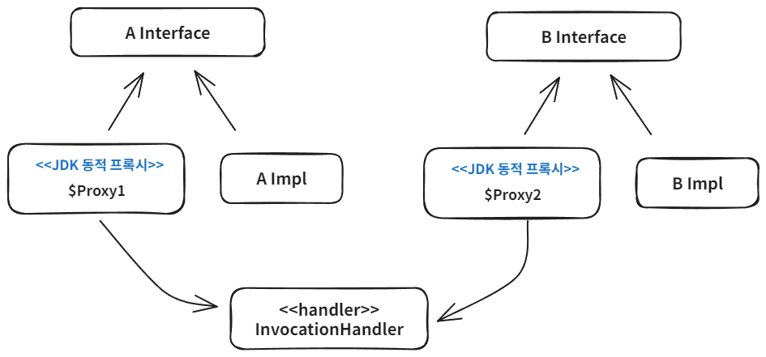

# 동적 프록시

## 개념

기존 프록시 기술은 기존 코드를 변경하지 않고 기능을 추가할 수 있으나 대상 클래스 수만큼 비슷한 유형의 프록시 클래스를 만들어야 하는 단점이 존재합니다.

자바가 기본 제공하는 JDK 동적 프록시나 CGLIB의 프록시 생성 오픈소스 기술을 활용하면 프록시 객체를 동적으로 런타임에 만들어낼 수 있습니다. 
(프록시를 적용할 코드를 하나만 만들어놓고 프록시 객체를 찍어낼 수 있습니다.)

JDK 동적 프록시는 인터페이스를 기반으로 프록시를 만들어주기 때문에 인터페이스가 필수입니다. 

<br>

## 기능

- 프록시 객체를 동적으로 만들어낼 수 있습니다.
- 특정 클래스에는 적용되지 않도록 필터를 적용할 수 있습니다.

<br>

## 한계

- JDK 동적 프록시는 인터페이스가 필수라 인터페이스가 없는 클래스에는 적용할 수 없습니다. (바이코드 조작 라이브러리인 CGLIB을 사용하면 해결 가능)

<br>

## 코드 예시

### 기본 코드

- A, B 유형의 인터페이스와 구현체를 만듭니다.

```java
public interface AInterface {
   String call();
}

@Slf4j
public class AImpl implements AInterface {
    @Override
    public String call() {
        log.info("AImpl.call() is called");
        return "a";
    }
}

public interface BInterface {
    String call();
}

@Slf4j
public class BImpl implements BInterface {
    @Override
    public String call() {
        log.info("BImpl.call() is called");
        return "b";
    }
}
```

### 동적 프록시 적용

- 동적 프록시가 없으면 A와 B에 대한 프록시를 각각 만들어야 합니다.
- JDK 동적 프록시를 적용하려면 InvocationHandler 인터페이스를 구현한 클래스를 만들어야 합니다.
- invoke 메소드는 프록시 객체, 호출한 메서드, 호출한 메서드의 파라미터를 받습니다.

```java
@Slf4j
public class TypeInvocationHandler implements InvocationHandler {

   private final Object target;

   public TypeInvocationHandler(Object target) {
      this.target = target;
   }
    
   // 파라미터: 프록시 객체, 호출한 메서드, 호출한 메서드의 파라미터
   @Override
   public Object invoke(Object proxy, Method method, Object[] args) throws Throwable {
      log.info("TimeProxy 실행");
      long startTime = System.currentTimeMillis();

      Object result = method.invoke(target, args);

      long endTime = System.currentTimeMillis();
      long resultTime = endTime - startTime;
      log.info("TimeProxy 종료 resultTime={}", resultTime);
      return result;
   }
}

@Slf4j
public class JdkDynamicTest {

    @Test
    void dynamicA() {
        AInterface target = new AImpl();
        TypeInvocationHandler handler = new TypeInvocationHandler(target);
        
        AInterface proxy = (AInterface) Proxy.newProxyInstance(
                AInterface.class.getClassLoader(), 
                new Class[]{AInterface.class}, 
                handler
        );
        
        proxy.call();
        log.info("targetClass={}", target.getClass()); // class hello.proxy.AImpl
        log.info("proxyClass={}", proxy.getClass()); // class jdk.proxy3.$Proxy11 (우리가 만든 클래스가 아닌 동적으로 만든 프록시)
    }
}
```

첫번째 인자에는 클래스 로더가 들어갑니다.

먼저 `AInterface.class.getClassLoader()`는 `AInterface`인터페이스를 로딩하는 데 사용된 클래스 로더를 찾습니다.

찾은 클래스 로더를 사용하여 동적 프록시 클래스를 JVM에 로드합니다. (같은 클래스 로더를 사용하기 위해)

여기서는 `AppClassLoader`를 사용합니다.

[[ 클래스 로더 살펴보기 ]](https://github.com/woosungkim0123/spring-jpa-deep-dive/tree/master/spring_aop/proxy/notion/class_loader)

두번째 인자는 어떤 인터페이스를 기반으로 프록시를 만들지, 세번째 인자는 프록시에 사용되는 로직입니다.

