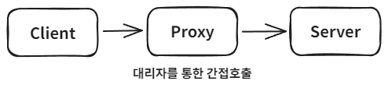
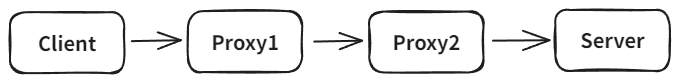

# 프록시 

## 개념

클라이언트가 직접 서버에 요청하는 것이 아닌 대리자를 통해 간접적으로 요청할 때 대리자를 프록시(Proxy)라고 합니다.

서버와 프록시를 같은 인터페이스로 구현하고 DI를 통해 클라이언트 코드 변경없이 주입할 수 있습니다.

 

## 장점

대리자가 중간에서 여러가지 일을 할 수 있습니다.

1. 캐시에 데이터가 있는 경우 서버에 요청없이 캐시에 있는 데이터를 반환 (접근 제어, 캐싱)
2. 클라이언트가 기대한 것 이외 추가적인 기능 제공 (부가 기능 추가)
3. 대리자가 또 다른 대지라를 부를 수 있음. (프록시 체인)

 

## 프록시 주요 기능

**접근제어**

- 권한에 따른 접근
- 캐싱
- 지연 로딩

**부가기능 추가**

- 요청 값이나 응답 값을 중간에 변형
- 로그 출력

 

## 프록시 사용 방식에 따른 분류

둘다 프록시를 사용하는 방식이지만 의도에 따라 프록시 패턴과 데코레이터 패턴으로 구분합니다.

- 프록시 패턴: 접근 제어가 목적
- 데코레이터 패턴: 부가 기능 추가가 목적
