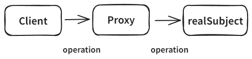

# 프록시 패턴

## 개념

- 코드를 변경없이 프록시를 도입해서 접근 제어를 하는 패턴입니다.
- 프록시 패턴은 프록시를 사용하는 여러 패턴 중 하나일 뿐 입니다.
- 클라이언트는 프록시 객체가 주입되었는지 실제 객체가 주입되었는지 모릅니다.
- 다른 개체에 대한 접근을 제어하기 위해 대리자를 제공합니다.



## 예시 코드

### 프록시 패턴 적용 전

- 클라이언트가 서버(`RealSubject`)에 직접 요청합니다.
- operation 반환 값이 변하지 않는 데이터지만 매번 요청을 해서 가져와야 합니다.

```java
public interface Subject {
    String operation();
}

// 실제 객체
@Slf4j
public class RealSubject implements Subject {

   @Override
   public String operation() {
      log.info("실제 객체 호출");
      sleep(1000); // 데이터 조회에 1초 걸림을 가정
      return "data";
   }

   private void sleep(int millis) {
      try {
         Thread.sleep(millis);
      } catch (InterruptedException e) {
         e.printStackTrace();
      }
   }
}

// 클라이언트
public class ProxyPatternClient {

   private Subject subject;

   public ProxyPatternClient(Subject subject) {
      this.subject = subject;
   }

   public void execute() {
      subject.operation();
   }
}

public class ProxyPatternTest {
    /**
     * 데 어딘가 보관해두고 사용하면 성능상 좋습니다. (캐시)
     * client -> realSubject
     */
    @Test
    void noProxyTest() {
        Subject subject = new RealSubject();
        ProxyPatternClient client = new ProxyPatternClient(subject);

        client.execute(); // 1초
        client.execute(); // 1초
        client.execute(); // 1초
    }
}
```

### 프록시 패턴 적용 후

- 코드를 변경하지 않고 프록시 객체를 주입하여 접근 제어 중 하나인 캐싱을 적용합니다.

```java
@Slf4j
public class CacheProxy implements Subject {

    private Subject target; // 실제 객체에 접근할 수 있어야 합니다.
    private String cacheValue;

    public CacheProxy(Subject target) {
        this.target = target;
    }

    @Override
    public String operation() {
        log.info("프록시 호출");
        if(cacheValue == null) {
            cacheValue = target.operation();
        }
        return cacheValue;
    }
}

public class ProxyPatternTest {
    /**
     * client -> proxy -> realSubject
     */
    @Test
    void proxyTest() {
        Subject subject = new RealSubject(); // 실제 객체
        Subject proxy = new CacheProxy(subject); // 프록시
        ProxyPatternClient client = new ProxyPatternClient(proxy);

        client.execute(); // 캐시가 없어서 realSubject.operation() 호출 -> 캐시 저장 (1초)
        client.execute(); // 캐시가 있어서 realSubject.operation() 호출하지 않고 캐시 반환 (0초)
        client.execute(); // 캐시가 있어서 realSubject.operation() 호출하지 않고 캐시 반환 (0초)
    }
}
```