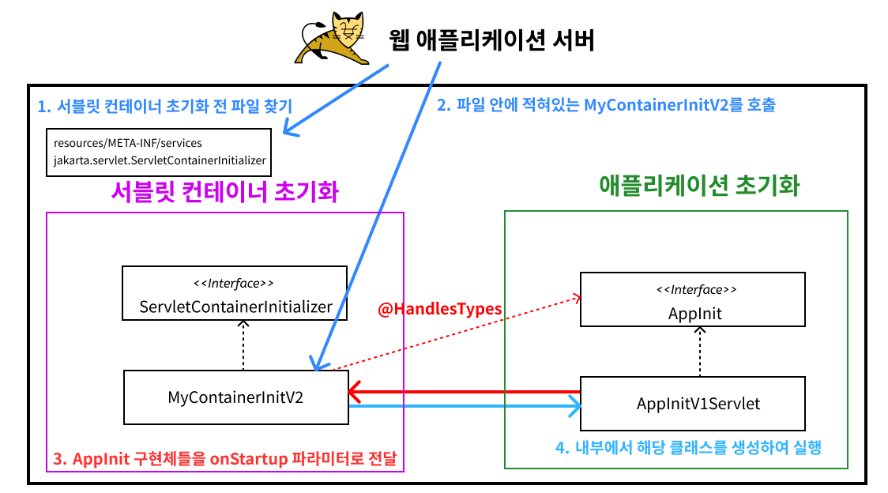

# 서블릿 방식

## 서블릿 컨테이너 초기화

WAS를 실행하는 시점에 서비스에 필요한 필터와 서블릿을 등록해야하는데 이때 WAS에서 제공하는 초기화 기능을 사용할 수 있습니다. 
이 기능을 사용하면 WAS 실행 시점에 초기화 과정을 진행할 수 있습니다.

### 서블릿 컨테이너 초기화 개발

- 서블릿 컨테이너가 실행 시점에 `ServletContainerInitializer`의 `onStartup` 메서드를 호출합니다. 이를 구현해서 필요한 기능을 초기화 하거나 등록할 수 있습니다.
- 만약 스프링을 사용한다면 스프링 컨테이너를 만들고 서블릿과 스프링을 연결한는 디스페처 서블릿도 등록해야합니다.
- 예전에는 `web.xml`을 사용해서 초기화했지만 현재는 서블릿 스펙에서 자바 코드를 사용해 초기화할 수 있습니다.
- `resources/META-INF/services/javax.servlet.ServletContainerInitializer` 파일을 생성하고
  그 파일에 `hello.container.MyContainerInitV1`를 작성하면 톰캣이 실행할 때 해당 파일을 보고 호출합니다.
- `MyContainerInitV1` 참조

 

## 애플리케이션 초기화

서블릿을 생성하고 등록할 때 서블릿 컨테이너는 조금 더 유연한 초기화 기능을 지원합니다.

### 서블릿 등록 방법

서블릿 등록 방식에는 크게 두가지가 있습니다.

**1. `@WebServlet`**

- 애노테이션 하나로 서블릿을 편리하게 등록할 수 있습니다.
- `TestServlet` 참조

**2. 프로그래밍 방식**

- `HelloServlet` 참조

**프로그래밍 방식 사용 이유**

`@WebServlet`을 사용하면 편리하게 서블릿을 등록할 수 있지만 유연하게 변경하는 것이 어렵습니다. (하드코딩처럼 동작)

반면 프로그래밍 방식은 불편하지만 무한한 유연성을 제공합니다.

- 특정 경로를 상황에 따라 바꾸거나 외부 설정을 읽어서 등록할 수 있습니다. 
- 서블릿 자체도 특정 조건에 따라 if 문으로 분기해서 등록하거나 뺄 수 있습니다.
- 서블릿을 직접 생성하기 때문에 생성자에 필요한 정보를 넘길 수 있습니다.

### 애플리케이션 초기화 과정

1. 톰캣에서 서블릿 컨테이너를 초기화 하기 전 `META-INF/services/javax.servlet.ServletContainerInitializer` 파일을 찾습니다. (서비스 로더 메커니즘)
    > 서비스 로더 메커니즘: 구현체를 런타임에 동적으로 로드할 수 있게 해주는 메커니즘
2. 해당 파일을 보고 `MyContainerInitV2`를 호출합니다.
3. `MyContainerInitV2` 클래스에 `@HandleTypes(AppInit.class)`를 지정했기 때문에 `AppInit` 인터페이스를 구현한 클래스를 찾아서 onStartup 메서드의 파라미터로 전달합니다.
4. 내부에서 파라미터로 전달된 클래스 정보를 리플렉션을 사용해서 객체(애플리케이션 초기화)를 생성합니다.
5. 생성된 객체를 통해 애플리케이션 초기화 코드를 직접 실행합니다.

### 서블릿 컨테이너 초기화만 사용하지 않고 왜 애플리케이션 초기화 개념을 추가했을까?

1. 편리함

서블릿 컨테이너를 초기화 하려면 `ServletContainerInitializer` 인터페이스를 구현한 코드를 만들고 `META-INF/services/jakarta.servlet.ServletContainerInitializer` 파일에 해당 코드를 직접 지정해주어야 합니다.

그러나 애플리케이션 초기화는 특정 인터페이스(여기서는 `AppInit`)만 구현하면 됩니다.

2. 의존성

애플리케이션 초기화는 서블릿 컨테이너에 상관없이 원하는 모양으로 인터페이스를 만들 수 있습니다. 이를 통해 애플리케이션 초기화 코드가 서블릿 컨테이너에 대한 의존을 줄일 수 있습니다. 

특히 `ServletContext ctx`가 필요없는 애플리케이션 초기화 코드라면 의존을 완전히 제거할 수도 있습니다.
