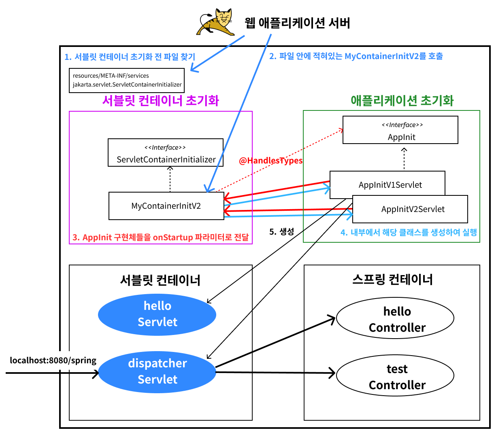
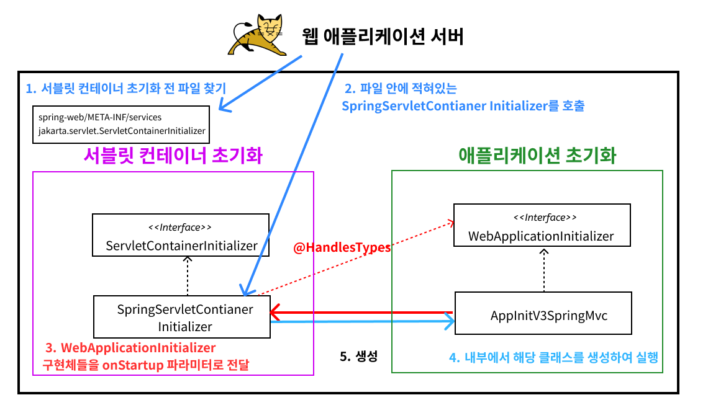

# WAS와 스프링 통합

## 통합전 셋팅

- 스프링 MVC 추가
    ```gradle
    implementation 'org.springframework:spring-webmvc:6.0.4'
    ```
- Controller를 만들고 빈으로 직접 등록 (컴포넌트 스캔 사용 안함)

## 스프링 컨테이너 등록 과정

1. 서블릿 컨테이너 초기화 될 때 `MyContainerInitV2`가 호출되고 메서드의 파라미터로 `AppInitV2Spring`이 전달됩니다.
2. `MyContainerInitV2`에서 `AppInitV2Spring`가 생성되고 실행 됩니다.
3. `AppInitV2Spring`안에서는 스프링 컨테이너를 만들고 설정 후, 이를 디스페처 서블릿과 연결합니다.(생성하면서 연결)
4. 그리고 디스페처 서블릿을 서블릿 컨테이너에 등록합니다.

`AppInitV2Spring` 참조



<br>

## 스프링 MVC 서블릿 컨테이너 초기화 지원

기존에 서블릿 컨테이너를 초기화할 때는 `ServletContainerInitializer`를 구현하고 `@HandlesTypes`를 적용하는 등 번거로운 작업이 필요했습니다. 

스프링 MVC에서는 서블릿 컨테이너 초기화 작업을 미리 구현해두고, 이를 사용할 수 있도록 지원합니다. 개발자는 애플리케이션 초기화 코드만 작성하면 됩니다.

`AppInitV3SpringMvc` 참조

### 어떻게 동작하는가?

`WebApplicationInitializer` 인터페이스 하나로 애플리케이션 초기화가 가능한데 사실 스프링도 결국 서블릿 컨테이너에서 요구하는 부분을 모두 구현해야합니다.

**구현 부분**

- spring-web 라이브러리에 `/META-INF/services/jakarta.servlet.ServletContainerInitializer` 파일에 `SpringServletContainerInitializer`가 등록되어 있습니다.
- 서블릿 컨테이너 초기화 코드가 미리 작성되어 있습니다.
- `@HandlesTypes`의 대상이 `WebApplicationInitializer`입니다.

사용자는 `WebApplicationInitializer`를 구현하기만 하면 애플리케이션 초기화가 가능합니다.



<br>

## 정리

지금까지 알아본 것들은 모두 서블릿 컨테이너 위에서 동작하는 방법입니다. 따라서 항상 톰캣 같은 서블릿 컨테이너에 배포를 해야만 동작하는 방식입니다.

과거에는 서블릿 컨테이너 위에서 모든 것이 동작했지만, 스프링 부트와 내장 톰캣을 사용하면서 이런 부분들이 많이 바뀌기 시작했습니다.
