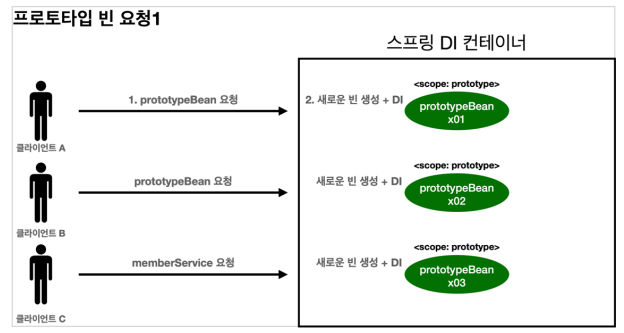

# 스프링 빈

스프링 빈의 등록 방식은 싱글톤이 기본이지만 싱글톤 방식이 아닌 빈 등록 방식도 지원합니다.

## @Configuration과 바이트 조작

`@Configuration`은 싱글톤을 위해 사용되는 어노테이션입니다.

```java
@Configuration
public class AppConfig {
    @Bean 
    public MemberService memberService() {
        return new MemberServiceImpl(memberRepository());
    }
    
    @Bean 
    public OrderService orderService() {
        return new OrderServiceImpl(
                memberRepository(), 
                discountPolicy());
    }
    
    @Bean 
    public MemberRepository memberRepository() {
        return new MemoryMemberRepository();
    }
}
```

`AppConfig`를 확인해보면 각기 다른 `MemoryMemberRepository`가 생성될 것 같은데 어떻게 싱글톤을 유지하는 걸까?

AnnotationConfigApplicationContext에 파라미터로 넘긴 값은 스프링 빈으로 등록되는데 `AppConfig`도 스프링 빈으로 등록되어 있습니다.

`bean.getClass()`를 통해 확인해보면 내가 만든 클래스가 아니라 스프링이 CGLIB(바이코드 조작 라이브러리)를 사용해서 AppConfig를 상속받은 임의의 클래스를 만들고 그걸 스프링 빈으로 등록한 것입니다.

그 임의의 다른 클래스가 싱글톤을 보장하는 것입니다.

```java
// 예상 코드
public class AppConfig$$EnhancerBySpringCGLIB$$f3f3e3d extends AppConfig {
    
    @Override
    public MemberRepository memberRepository() {
        if (isExistMemberRepository) { // 스프링 컨테이너 등록되어 있으면
            return SpringContainer.getBean(MemberRepository.class);
        } else { // 스프링 컨테이너에 없으면
            MemberRepository memberRepository = new MemoryMemberRepository();
            SpringContainer.registerBean(MemberRepository.class, memberRepository);
            return memberRepository;
        }
    }
}
```

만약 `@Configuration`을 사용하지 않고 `@Bean`만 사용하면 CGILB를 사용하지 않아서 싱글톤을 보장하지 못하지만 빈으로 등록되는 것은 동일합니다.

<br>

## 컴포넌트 스캔과 의존관계 자동 주입

### 컴포넌트 스캔

스프링은 설정 정보가 없어도 자동으로 스프링 빈을 등록하는 컴포넌트 스캔이라는 기능을 제공합니다.

`@ComponentScan`은 `@Component`을 포함하는 모든 클래스를 스캔하여 스프링 빈으로 등록합니다. (e.g. `@Controller`, `@Service`, `@Repository`)

기본적으로 `@ComponentScan`이 붙은 설정 정보 클래스의 패키지가 시작 위치가 됩니다.

> @Repository
>
> 스프링 데이터 접근 계층으로 인식하고, 데이터 계층의 예외를 스프링 예외로 변환 해줍니다.
> DB에서 예외가 터지면 서비스 계층까지 올라오는데 이때 DB를 변경하면 예외 자체가 바뀌는 문제가 있습니다. 이를 해결하기 위해 스프링이 예외를 추상화해서 반환해줍니다. (@Repository)

### 의존관계 자동 주입

컴포넌트 스캔을 사용하면 빈이 자동으로 등록되기 때문에 의존관계를 클래스 안에서 해결해야 합니다.

`@Autowired`를 사용하면 스프링 컨테이너가 관리하는 스프링 빈을 찾아서 주입합니다.

`@Autowired`는 타입을 기준으로 의존관계를 주입합니다.

생성자가 하나만 있으면 `@Autowired`를 생략해도 자동으로 주입됩니다. (스프링 빈에만 해당)

<br>

## 조회 빈이 두 개 이상일 때 (Qualifier, Primary)

`@Autowired`는 타입으로 매칭하고 결과가 2개 이상이면 필드명, 파라미터 명으로 빈 이름을 매칭합니다.

### @Qualifier

`@Qualifier`로 추가 구분자를 붙여 주입할 빈을 선택할 수 있습니다.

```java
@Component
@Qualifier("mainDiscountPolicy") // 빈 등록시 추가 구분자를 붙여준다.
public class RateDiscountPolicy implements DiscountPolicy {}


public class OrderServiceImpl implements OrderService {
    private final DiscountPolicy discountPolicy;
    
    @Autowired
    public OrderServiceImpl(MemberRepository memberRepository, 
                            @Qualifier("mainDiscountPolicy") DiscountPolicy discountPolicy // 추가 구분자를 붙여준다.
    ) {
        this.memberRepository = memberRepository;
        this.discountPolicy = discountPolicy;
    }
}
```

### @Primary

`@Primary`를 사용하면 우선순위를 정할 수 있습니다. 여러 빈이 매칭되면 `@Primary`가 우선권을 가집니다.

```java
@Component
@Primary
public class MainDiscountPolicy implements DiscountPolicy {}
```

### @Primary, @Qualifier 활용

코드에서 자주 사용하는 스프링 빈은 `@Primary`를 사용하고, 특별한 기능으로 가끔 사용하는 스프링 빈은 `@Qualifier`를 지정해서 명시적으로 획득하는 방식으로 사용하면 코드를 깔끔하게 유지할 수 있습니다.

우선 순위는 `@Primary`보다 `@Qualifier`가 우선권이 더 높습니다.

### Qualifier 전용 어노테이션 직접 만들기

`@Qualifier("mainDiscountPolicy")`를 사용하면 문자를 적기 때문에 컴파일시 타입 체크가 안됩니다.

이런 문제를 어노테이션을 만들어 해결할 수 있습니다.

```java
@Target({ElementType.FIELD, ElementType.METHOD, ElementType.PARAMETER, ElementType.TYPE, ElementType.ANNOTATION_TYPE})
@Retention(RetentionPolicy.RUNTIME)
@Documented
@Qualifier("mainDiscountPolicy")
public @interface MainDiscountPolicy {
}


public class OrderServiceImpl implements OrderService {
    private final DiscountPolicy discountPolicy;
    
    @Autowired
    public OrderServiceImpl(MemberRepository memberRepository, 
                            @MainDiscountPolicy DiscountPolicy discountPolicy // 추가 구분자를 붙여준다.
    ) {
        this.memberRepository = memberRepository;
        this.discountPolicy = discountPolicy;
    }
}
```

### 다중 빈이 필요할 때

의도적으로 여러 빈을 모두 주입받아야 할 때가 있습니다.

예를 들어서 할인 서비스를 제공하는데, 클라이언트가 할인의 종류(rate, fix)를 선택할 수 있다고 가정해보겠습니다. 

스프링을 사용하면 이런 전략 패턴을 매우 간단하게 구현할 수 있습니다.

받을 때 `Map<String, DiscountPolicy>`나 `List<DiscountPolicy>`로 받으면 됩니다. 만약 해당하는 타입이 없으면 빈 컬렉션이나 Map을 주입합니다. (Map의 키는 빈 이름)

<br>

## 실무 수동 빈 사용 팁

애플리케이션은 크게 업무 로직과 기술 지원 로직으로 나눌 수 있습니다.

업무 로직은 보통 컨트롤러, 서비스, 리포지토리 등 비즈니스 요구사항을 개발할 때 추가되거나 변경됩니다.

기술 지원 로직은 데이터베이스 연결이나 공통 로그 처리처럼 업무 로직을 지원하기 위한 하부 기술이나 공통 기술들입니다. (AOP)

업무 로직에서는 자동을 사용하고, 기술 지원 로직에서는 수동을 사용하는 것이 좋습니다. (수동 빈으로 등록해서 명확하게 드러내는 것이 유지보수하기 좋습니다.

또, 비지니스 로직 중에서 다형성을 적극 활용할 때는 수동 빈으로 등록하는 것이 좋습니다.

`Map<String, DiscountPolicy>`로 여러 개의 빈을 주입 받는 상황을 생각 해보겠습니다. 어떤 빈들이 주입될지 코드만 보고 한번에 파악하기 어렵습니다.

이럴 때는 수동 빈으로 등록하여 특정 패키지에 같이 묶어두면 한눈에 파악하기 쉽습니다.

```java
@Configuration
public class DiscountPolicyConfig {
 
    @Bean
    public DiscountPolicy rateDiscountPolicy() {
        return new RateDiscountPolicy();
    }
    
    @Bean
    public DiscountPolicy fixDiscountPolicy() {
        return new FixDiscountPolicy();
    }
}
```

<br>

## 빈 생명주기 콜백

스프링 빈은 객체를 생성하고 의존 관계 주입이 다 끝난 다음에 초기화 작업을 진행해야 합니다. 이를 위해 스프링은 의존관계 주입이 완료되면 스프링 빈에게 콜백 메서드를 통해서 초기화 시점을 알려주는 다양한 기능을 제공합니다.

또한 스프링은 스프링 컨테이너가 종료되기 직전에 소멸 콜백을 줌으로써 안전하게 종료 작업을 진행할 수 있게 해주빈다.

### 스프링 빈의 이벤트 라이프사이클

스프링 컨테이너 생성 -> 스프링 빈 생성 -> 의존관계 주입 -> 초기화 콜백 -> 사용 -> 소멸전 콜백 -> 스프링 종료

### 빈 등록 초기화, 소멸 메서드 지정으로 생명주기 콜백

설정 정보에 `@Bean(initMethod = "init", destroyMethod = "close")`를 사용하면 초기화, 소멸 메서드를 지정할 수 있습니다.

메서드 이름은 자유롭게 지정할 수 있고 스프링 빈이 스프링 코드에 의존하지 않습니다.

코드가 아니라 설정 정보를 사용하기 때문에 코드를 고칠 수 없는 외부 라이브러리에도 초기화, 종료 메서드를 적용할 수 있습니다.

`@Bean`의 `destroyMethod`는 추론기능이 있어서 close, shutdown 이름의 메서드를 자동으로 호출해줍니다. (추론 기능을 사용하지 않으려면 `destroyMethod = ""`로 지정하면 됩니다.)

```java
@Configuration
public class AppConfig {
    
    @Bean(initMethod = "init", destroyMethod = "close")
    public MemberService memberService() {
        NetworkClient networkClient = new NetworkClient();
        networkClient.setUrl("http://hello-spring.dev");
        return networkClient;
    }
}

public class NetworkClient {
    private String url;
    
    public void setUrl(String url) {
        this.url = url;
    }
    
    // ...
    
    public void init() {
        System.out.println("NetworkClient.init");
        connect();
        call("초기화 연결 메시지");
    }
    
    public void close() {
        System.out.println("NetworkClient.close");
        disconnect();
    }
}
```

### @PostConstruct, @PreDestroy로 생명 주기 콜백

`@PostConstruct`는 초기화 메서드에, `@PreDestroy`는 소멸 메서드에 사용합니다.

자바 표준으로 스프링이 아닌 다른 컨테이너에서도 동작합니다. 

단점은 외부 라이브러리에 적용하지 못한다는 것인데 이럴 때는 `@Bean(initMethod = "init", destroyMethod = "close")`를 사용하면 됩니다.

```java
public class NetworkClient {
    private String url;
    
    public void setUrl(String url) {
        this.url = url;
    }
    
    // ...
    
    @PostConstruct
    public void init() {
        System.out.println("NetworkClient.init");
        connect();
        call("초기화 연결 메시지");
    }
    
    @PreDestroy
    public void close() {
        System.out.println("NetworkClient.close");
        disconnect();
    }
}
```

<br>

## 빈 스코프

### 개념

빈 스코프는 빈이 존재할 수 있는 범위를 의미합니다.

스프링 빈은 기본적으로 스프링 컨테이너의 시작과 함께 생성되어서 스프링 컨테이너가 종료될 때까지 유지됩니다. 

이는 스프링 빈이 기본적으로 싱글톤 스코프로 생성되기 때문입니다.

### 다양한 스코프 지원

스프링에서는 다양한 스코프를 지원합니다.

- 싱글톤: 기본 스코프, 스프링 컨테이너 시작과 종료까지 유지되는 가장 넓은 범위의 스코프입니다.
- 프로토타입: 스프링 컨테이너는 프로토타입 빈의 생성과 의존관계 주입까지만 관여하고 더는 관리하지 않는 매우 짧은 범위의 스코프입니다.
- 웹 관련 스코프
  - request: 웹 요청이 들어오고 나갈 때 까지 유지되는 스코프입니다. (각각의 HTTP 요청마다 별도의 빈 인스턴스가 생성되고 관리됩니다.)
  - session: 웹 세션이 생성되고 종료될 때 까지 유지되는 스코프입니다.
  - application: 웹의 서블릿 컨텍스트와 같은 범위로 유지되는 스코프입니다.

### 프로토타입 스코프

싱글톤 빈을 조회하면 스프링 컨테이너는 항상 같은 인스턴스의 스프링 빈을 반환하지만 
프로토타입 빈을 조회하면 스프링 컨테이너는 항상 새로운 인스턴스를 생성해서 반환합니다.

프로토 타입 빈을 요청하면 스프링 컨테이너는 이 시점에 프로토타입 빈을 생성하고, 프로토타입 빈에 필요한 의존관계 주입합니다. 
이후 스프링 컨테이너는 해당 빈을 관리하지 않습니다. (preDestroy 메서드 호출이 안됩니다.)



**싱글톤 빈과 프로토타입 빈을 함께 사용할 때 문제점**

싱글톤 빈 안에 프로토타입 빈을 주입받아 사용할 때 문제가 발생합니다.

싱글톤 빈은 생성 시점에만 의존관계 주입을 받기 때문에 프로토타입 빈이 생성 시점에만 주입됩니다. 그 이후는 싱글톤과 같이 유지되어 변경되지 않습니다.

**ObjectProvider**

`ObjectProvider`는 지정한 빈을 컨테이너에서 대신 찾아주는  의존관계 탐색(DL, dependency lookup) 기능을 제공합니다.

`ObjectProvider`를 사용하면 프로토타입 빈을 컨테이너에서 대신 찾아주기 때문에 프로토타입 빈을 여러 번 생성할 수 있습니다.

```java
@RequiredArgsConstructor
@Component
public class SingletonBean {
    
    private final ObjectProvider<PrototypeBean> prototypeBeanProvider;
    
    public int logic() {
        PrototypeBean prototypeBean = prototypeBeanProvider.getObject();
        prototypeBean.addCount();
        return prototypeBean.getCount();
    }
}
```

`ObjectProvider`의 `getObject()`를 호출하면 내부에서 스프링 컨테이너를 통해 해당 빈을 찾아서 반환합니다. (여기서 해당 빈이 프로토타입 빈이면 매번 새로운 인스턴스를 생성해서 반환합니다.)

`JSR-330 Provider`를 사용해도 동일한 기능을 사용할 수 있습니다.

보통 실무에서는 싱글톤 빈으로 모든 문제를 해결할 수 있기 때문에 프로토타입 빈을 직접 사용하는 일은 드뭅니다.

### 웹 스코프

웹 스코프는 웹 환경에서만 동작합니다.

**request 스코프**

```java
@Component
@Scope(value = "request")
public class MyLogger {
private String uuid;
    private String requestURL;
    
    public void setRequestURL(String requestURL) {
        this.requestURL = requestURL;
    }
    
    public void log(String message) {
        System.out.println("[" + uuid + "][" + requestURL + "] " + message);
    }
    
    @PostConstruct
    public void init() {
        uuid = UUID.randomUUID().toString();
        System.out.println("[" + uuid + "] request scope bean create: " + this);
    }
    
    @PreDestroy
    public void close() {
        System.out.println("[" + uuid + "] request scope bean close: " + this);
    }
}

@RequiredArgsConstructor
@Controller
public class LogDemoController {
    
    private final MyLogger myLogger;
    
    @RequestMapping("log-demo")
    @ResponseBody
    public String logDemo(HttpServletRequest request) {
        String requestURL = request.getRequestURL().toString();
        myLogger.setRequestURL(requestURL);
        
        myLogger.log("controller test");
        return "OK";
    }
}
```

이 빈은 HTTP 요청 당 하나씩 생성되고, HTTP 요청이 끝나는 시점에 소멸됩니다. HTTP 요청 당 각각 구분되므로 다른 HTTP 요청 때문에 값이 섞이는 일은 없습니다.

스프링이 실행하는 시점에 싱글톤 빈은 생성해서 주입이 가능하지만 request 빈은 요청이와야 생성되기 때문에 주입이 불가능합니다.

이러한 문제를 해결하기 위해 가짜 프록시 객체를 만들어서 주입하는 방법이 있습니다.

```java
@Component
@Scope(value = "request", proxyMode = ScopedProxyMode.TARGET_CLASS) // 클래스면 TARGET_CLASS, 인터페이스면 INTERFACES
public class MyLogger {
    // ...
}
```

CGLIB을 사용해서 클래스를 상속 받은 가짜 프록시 객체를 만들어 주입하여 문제를 해결합니다.

가짜 프록시 객체는 요청이 오면 그때 내부에서 진짜 빈을 요청하는 위임 로직이 들어있습니다.

즉, 껍데기를 주입해놓고 실제 호출할 때 진짜를 찾아서 동작하게 되는 것입니다.

> requestURL을 MyLogger에 저장하는 부분은 컨트롤러보다는 공통처리가 가능한 인터셉터에서 처리하는 것이 좋습니다. (예제 단순화)

나머지 웹 스코프도 범위만 다르지 동작 방식은 비슷합니다.

특별한 스코프는 최소화해서 사용하는 것이 중요합니다. 무분별하게 사용하면 유지보수가 어려워집니다.
