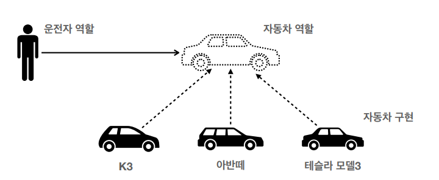
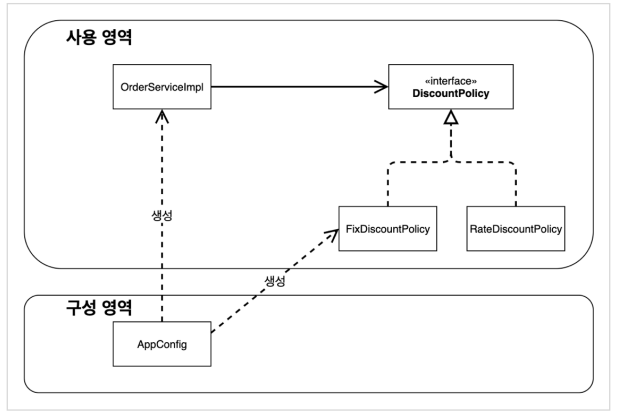

# 객체 지향 프로그래밍

## 객체 지향 프로그래밍 개념

컴퓨터 프로그래램을 명령어 목록에서 보는 시각에서 벗어나 여러개의 독립 단위인 "객체"들의 모임으로 파악하는 것입니다.

각각의 객체는 메세지를 주고 받으며 데이터를 처리할 수 있습니다.(협력)

객체 지향 프로그래밍은 프로그램을 유연하고 변경이 용이하게 만들어줍니다.(레고 블럭 조립하듯이)

### 운전자 - 자동차

자동차가 바뀌어도 운전자는 운전하는 방법을 바꾸지 않습니다.



### 역할과 구현을 분리

역할과 구현으로 구분하면 세상이 단순해지고, 유연해지며 변경도 편리해집니다.

- 클라이언트는 대상의 역할(인터페이스)만 알면 되고 내부 구조는 몰라도 됩니다.
- 클라이언트는 구현 대상의 내부 구조가 변경되어도 영향을 받지 않습니다.
- 클라이언트는 구현 대상 자체를 변경해도 영향을 받지 않습니다.

자바 언어의 다형성을 활용하여 역할(인터페이스)과 구현(구체 클래스)을 분리할 수 있습니다. 

<br>

## 좋은 객체 지향 설계의 5가지 원칙 (SOLID)

### SRP (단일 책임 원칙, Single Responsibility Principle)

한 클래스는 하나의 책임만 가져야 합니다.

중요한 기준은 변경입니다. 변경이 있을 때 파급 효과가 적으면 단일 책임 원칙을 잘 따른 것입니다.

### OCP (개방-폐쇄 원칙, Open/Closed Principle)

소프트웨어는 확장에는 열려 있으나 변경에는 닫혀 있어야 합니다.

**문제**

구현 객체를 변경하려면 클라이언트 코드를 변경해야하는 문제가 있는데 이는 OCP를 위반하는 것입니다.

객체를 생성하고 연관관계를 맺어주는 별도의 조립, 설정자가 필요합니다.

> 인터페이스를 구현하여 새로운 클래스를 만드는 것은 기존 코드를 변경하지 않고 확장하는 것입니다.

### LSP (리스코프 치환 원칙, Liskov Substitution Principle)

프로그램의 객체는 프로그램의 정확성을 깨트리지 않으면서 하위 타입의 인스턴스로 바꿀 수 있어야 합니다.

쉽게 말하면 부모 객체를 호출하는 동작에서 자식 객체가 부모 객체를 완전히 대체할 수 있어야 한다는 것입니다.

만약 자동차 인터페이스에서 엑셀은 앞으로 가라는 기능이지만 전기차에서는 뒤로 가게 변경한다면 LSP를 위반하는 것입니다.

### ISP (인터페이스 분리 원칙, Interface Segregation Principle)

특정 클라이언트를 위한 인터페이스 여러 개가 범용 인터페이스 하나보다 낫다는 원칙입니다.

인터페이스를 사용에 맞게 끔 각기 분리하여 사용하는 것이 좋습니다.

### DIP (의존관계 역전 원칙, Dependency Inversion Principle)

프로그래머는 추상화에 의존해야지 구체화에 의존하면 안됩니다.

구현 클래스에 의존하지 말고 인터페이스에 의존하라는 것입니다.

**문제**

MemberService 인터페이스에 의존하지만 구현 클래스도 함께 의존하고 있습니다. (DIP 위반)

```java
public class MemberServiceImpl implements MemberService {
    
    private final MemberRepository memberRepository = new MemoryMemberRepository();
    // ... 
}
```

<br>

## OCP, DIP 위반

다형성 만으로는 OCP와 DIP를 지킬 수 없습니다. 이 원칙들을 지키기 위한 방법을 알아보겠습니다.

### 관심사 분리 전

```java
public class MemberServiceImpl implements MemberService {
    
    private final MemberRepository memberRepository = new MemoryMemberRepository();
    // ... 
}
```

MemoryMemberRepository를 다른 구현체로 변경하고 싶다면 클라이언트인 MemberService의 코드를 변경해야 합니다. 이는 OCP를 위반하는 것입니다.

실제 코드에 MemoryMemberRepository를 직접 생성하고 있기 때문에 DIP를 위반하는 것입니다.

### 관심사 분리 후

구현 객체를 생성하고 연결하는 책임을 가지는 별도의 설정 클래스를 만들어서 관심사를 분리합니다.

클라이언트인 MemberServiceImpl 입장에서 보면 마치 외부에서 주입해주는 것 같다고 해서 의존관계 주입(DI, Dependency Injection) 이라고 합니다.

```java
public class MemberServiceImpl implements MemberService {
    
    private final MemberRepository memberRepository;
    
    // DI
    public MemberServiceImpl(MemberRepository memberRepository) {
        this.memberRepository = memberRepository;
    }
}

public class AppConfig {
    public MemberService memberService() {
        return new MemberServiceImpl(memberRepository());
    }
    
    public MemberRepository memberRepository() {
        return new MemoryMemberRepository();
    }
}
```

### 영역 분리

`AppConfig`의 등장으로 애플리케이션이 사용 영역과 객체를 생성하고 구성(Configuration)하는 영역으로 분리되었습니다.



<br>

## 좋은 객체 지향 설계의 원칙 적용

### SRP (단일 책임 원칙)

한 클래스는 하나의 책임만 가져야 합니다.

구현 객체를 생성하고 연결하는 책임은 `AppConfig`가 담당하고 클라이언트 객체는 실행하는 책임만 담당함으로써 단일 책임 원칙을 잘 지켰습니다.

### DIP (의존관계 역전 원칙)

프로그래머는 추상화에 의존해야지 구체화에 의존하면 안됩니다. 의존성 주입은 이 원칙을 따르는 방법 중 하나입니다.

`AppConfig`가 클라이언트 코드 대신 구체 클래스를 생성해서 의존관계를 주입함으로써 DIP를 잘 지켰습니다.

### OCP (개방-폐쇄 원칙)

소프트웨어는 확장에는 열려 있으나 변경에는 닫혀 있어야 합니다.

다형성을 사용하고 클라이언트가 DIP를 지키면 OCP가 적용될 가능성이 높아집니다.

애플리케이션을 사용 영역과 구성 영역으로 나눔으로써 `AppConfig`가 의존관계를 A에서 B로 변경해서 클라이언트 코드에 주입하므로 클라이언트 코드는 변경하지 않아도 됩니다. 이것이 OCP를 잘 지켰다고 할 수 있습니다.

**소프트웨어 요소를 새롭게 확장해도 사용 영역의 변경은 닫혀 있습니다.**

<br>

## IoC, DI, 그리고 컨테이너

### 제어의 역전 Ioc(Inversion of Control)

`AppConfig`가 등장한 이후로 구현 객체는 자신의 로직을 실행하는 역할만 담당하고 프로그램의 제어 흐름은 `AppConfig`가 가져가게 됩니다.

`OrderServiceImple`은 어떤 구현 객체들이 실행될지 모르게 됩니다.

이처럼 프로그램의 제어 흐름을 직접 제어하는 것이 아니라 외부에서 관리하는 것을 `제어의 역전(IoC)`이라고 합니다. (제어권이 뒤바뀌는 것을 의미합니다.)

`AppConfig`처럼 객체를 생성하고 관리하면서 의존관계를 연결해 주는 것을 `IoC 컨테이너` 또는 `DI 컨테이너` 라고 합니다.

### 프레임워크 vs 라이브러리

내가 작성한 코드를 제어하고 대신 실행하면 `프레임워크` 입니다. (JUnit)

내가 작성한 코드를 직접 제어한다면 `라이브러리` 입니다. (Jackson)

테스트 코드를 작성할 때 로직만 개발하면 실행과 제어는 JUnit이 알아서 해줍니다.

그러나 Java 객체를 Json으로 바꿀 때 Jackson을 우리가 직접 호출하여 사용해야 합니다.

### 의존관계 주입 DI(Dependency Injection)

의존관계는 정적인 의존과 실행 시점에 결정되는 동적인 의존이 있습니다.

정적인 의존 관계는 애플리케이션을 실행하지 않아도 분석할 수 있지만 동적인 의존 관계는 코드만으로는 확인할 수 없고 실행해봐야 알 수 있습니다.

