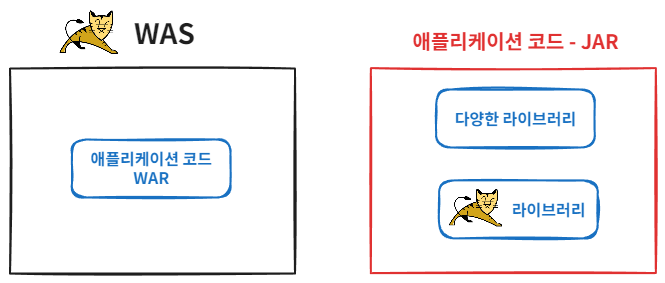

# 내장 톰캣

## WAR 배포의 단점

- 톰캣 같은 WAS를 별도로 설치해야 합니다.
- WAS를 실행하고 WAR와 연동하기 위한 설정이 필요합니다.
- WAR 파일을 만들고 WAS에 전달하는 과정이 번거롭습니다.
- 톰캣의 버전을 변경하려면 톰캣을 재설치해야 합니다.

 

## 해결 방법

자바 main 메서드만 실행하면 웹 서버도 같이 실행되도록 하기 위해 톰캣을 라이브러리로 내장하여 사용하는 방법이 등장했습니다. (내장 톰캣, Embedded Tomcat)

`embed` 패키지 참고

 

## 배포

buildJar를 통해서 jar파일을 생성해서 `java -jar jar파일명`으로 실행하면 `NoClassDefFoundError` 에러가 뜨게 되는데, jar 파일 안을 살펴보면 라이브러리가 없는 것을 확인할 수 있습니다.

jar파일은 war와 달리 jar파일을 포함할 수 없습니다. 즉, 내부에 라이브러리 역할을 하는 jar 파일을 포함할 수 없기 때문에 에러가 발생한 것 입니다.

### 해결 방법

Fat Jar 또는 uber jar 라고 불리는 방법을 사용하면 됩니다.

jar 안에는 jar는 포함할 수 없지만 class 파일은 포함할 수 있기 때문에 class들을 뽑아서 새로 만드는 jar에 포함하면 문제를 해결할 수 있습니다.

수 많은 라이브러리에서 나오는 class 때문에 뚱뚱한(fat) jar라고 불리게 되었습니다.

### Fat Jar의 단점

첫째로 어떤 라이브러리가 포함되어 있는지 확인하기 어렵습니다.
 
둘째는 파일명 중복을 해결할 수 없습니다. 

예를 들어 A 라이브러리와 B 라이브러리에서 둘다 `jakarta.servlet.ServletContainerInitializer`를 포함하고 있는 상황에서 
Fat Jar로 만들게 되면 둘 중 하나의 파일만 선택이 되고 나머지는 포함되지 않습니다. 이로 인해 정상 동작하지 않을 수 있습니다.

 

## 편리한 부트 클래스

내장 톰캣 실행, 스프링 컨테이너 생성, 디스패처 서블릿 등록의 모든 과정을 편리하게 처리해주는 클래스를 만들어서 그것을 라이브러리로 배포하면 그것이 바로 스프링 부트입니다.

`boot` 패키지, `MySpringBootMain` 참고
