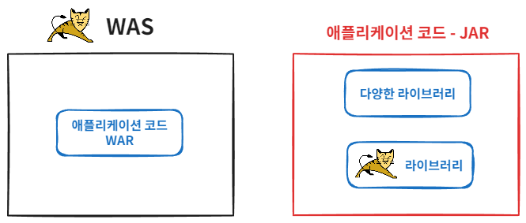

# 내장 톰캣

## WAR 배포의 단점

- 톰캣 같은 WAS를 별도로 설치해야 합니다.
- WAS를 실행하고 WAR와 연동하기 위한 설정이 필요합니다.
- WAR 파일을 만들고 WAS에 전달하는 과정이 번거롭습니다.
- 톰캣의 버전을 변경하려면 톰캣을 재설치해야 합니다.

## 해결 방법

자바 main 메서드만 실행하면 웹 서버도 같이 실행되도록 하기 위해 톰캣을 라이브러리로 내장하여 사용하는 방법이 등장했습니다. (내장 톰캣, Embedded Tomcat)

## 