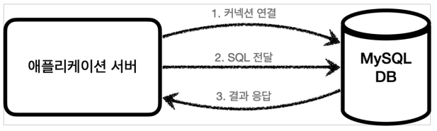
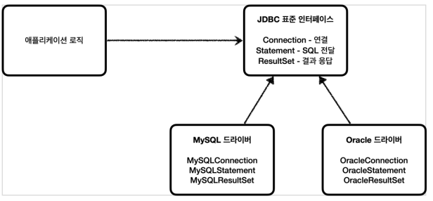
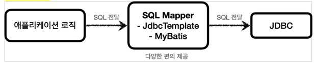
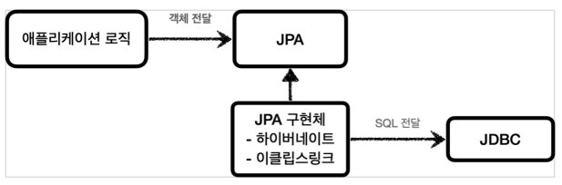
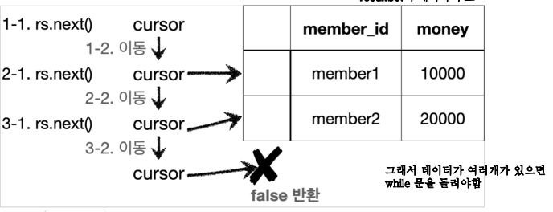
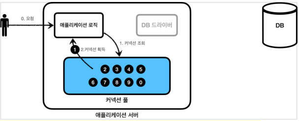
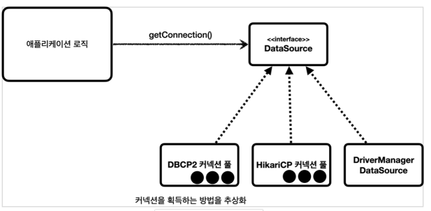

# JDBC 이해

## JDBC 이전의 데이터베이스 연동 방식

TCP/IP로 커넥션을 연결하여 SQL을 전달하고 결과를 응답 받는 방식입니다.

문제는 각각 DB마다 커넥션을 연결하는 법과 SQL을 전달하는 방법, 결과를 받는 방법이 다르다는 것입니다.

이를 해결하기 위해 JDBC라는 자바 표준이 등장 했습니다.

 

## JDBC란?

JDBC(Java Database Connectivity)는 자바에서 데이터베이스에 접속할 수 있도록 하는 자바 API입니다.

대표적으로 연결, SQL 전달, 결과 받기 등의 기능을 제공합니다.

JDBC 인터페이스를 각각의 DB 벤더에서 DB에 맞도록 구현해서 라이브러리로 제공하는데 이를 JDBC 드라이버라고 합니다.

이를 통해 연결 SQL 전달, 결과 받기 등의 기능을 표준화 할 수 있습니다. (SQL은 DB마다 달라서 표준화 X - 추후 JPA가 등장)

 

## 최신 데이터 접근 기술

최근에는 JDBC를 직접 사용하기 보다는 SQL Mapper, ORM등이 JDBC를 편리하게 사용할 수 있도록 도와줍니다.

참고로 내부적으로 모두 JDBC를 사용합니다.

### SQL Mapper

JDBC를 편리하게 사용할 수 있도록 도와줍니다. SQL 응답 결과를 객체로 매핑해주거나 JDBC 반복 코드를 줄여줍니다.

단점으로는 SQL을 직접 작성해야하는 번거로움이 있습니다.

대표적으로는 Spring JdbcTemplate, MyBatis 등이 있습니다.

### ORM

ORM은 객체를 테이블에 매핑해주는 기술로써 개발자 대신 SQL을 동적으로 생성해서 실행해줍니다.

대표적으로는 Hibernate, JPA 등이 있습니다.

 

## DriverManager

JDBC는 `Connection`이라는 표준 커넥션 인터페이스를 정의하고 있습니다.

이러한 `Connection` 인터페이스를 구현한 클래스를 각각의 DB 벤더에서 제공합니다.

### DriverManager 동작

JDBC가 제공하는 `DriverManager`는 라이브러리에 등록된 DB 드라이버를 관리하고 커넥션을 획득하는 기능을 제공합니다.

1. 로직에서 커넥션이 필요하면 `DriverManager.getConnection()`를 호출합니다.
2. `DriverManager`는 등록된 DB 드라이버 목록을 자동으로 인식하고 순서대로 정보를 넘겨서 커넥션을 획득할 수 있는지 확인합니다.
3. 찾은 커넥션 구현체가 클라이언트에게 반환됩니다.

`getConnection`, `MemberRepositoryV0` 참조 

**ResultSet 커서**

최초의 커서는 데이터를 가리키지 않습니다. `next()`를 호출해야 데이터를 가리킵니다.

 

## 커넥션 풀

데이터베이스에서 커넥션을 획득하는 것은 매우 비싼 작업입니다.

TCP/IP를 통해 연결을 맺고 ID와 PW 및 기타 부가정보를 DB에 전달하여 인증을 진행합니다. 이후 내부에서 DB 세션을 생성하고 커넥션 생성 완료 응답을 보냅니다.

고객이 애플리케이션을 사용할 때, SQL을 실행하는 시간 뿐만 아니라 커넥션을 새로 만드는 시간이 추가되기 때문에 응답 속도에 영향을 줍니다.

이러한 문제를 해결하기 위해 커넥션 풀이 등장했습니다.

스프링 부트 사용시 기본적으로 `HikariCP`를 사용합니다.

### 커넥션 풀 동작

커넥션을 미리 생성해두고 커넥션을 가져가고 반납하는 방식으로 동작합니다.

애플리케이션 시작 시점에 커넥션 풀은 필요한 만큼 커넥션을 미리 확보해서 풀에 보관합니다. (기본값은 10개)

커넥션 풀에 들어 있는 커넥션은 TCP/IP로 DB와 커넥션이 연결되어 있는 상태이기 때문에 즉시 SQL을 DB에 전달할 수 있습니다.

커넥션을 모두 사용하고 나면 커넥션을 종료하는 것이 아닌 풀에 반환합니다.

### 적절한 커넥션 수

적절한 커넥션 풀 숫자는 서비스의 특징과 애플리케이션 서버 스펙, DB 서버 스펙에 따라 다르기 때문에 성능 테스트를 통해서 정해야 합니다.

커넥션 풀은 서버당 최대 커넥션 수를 제한할 수 있습니다. 따라서 DB에 무한정 연결이 생성되는 것을 막아주어서 DB를 보호하는 효과도 있습니다.

 

## DataSource

커넥션을 얻는 방법에는 `DriverManager`를 직접 사용하는 방법과 커넥션 풀을 사용하는 방법이 존재합니다.

`DriverManager`를 사용하다가 커넥션 풀로 변경하게 되면 애플리케이션 코드도 함께 변경해야 합니다.

이런 문제를 해결하기 위해 커넥션을 획득하는 방법을 추상화 한 것이 `DataSource`입니다.

이 인터 페이스의 핵심 기능은 커넥션 조회 하나 입니다.

`MemberRepositoryV1` 참조

### DataSource 장점

**설정과 사용의 분리**

`DriverManger`는 커넥션을 획득할 때마다 계정 정보를 넘겨야하지만 
`DataSource`는 처음 객체를 생성할 때만 필요한 파라미터를 넘겨두고 호출만 하면 됩니다.

설정과 사용하는 부분을 좀 더 명확하게 분리할 수 있습니다. (단일 책임 원칙)

**인터페이스에만 의존**

클라이언트가 `DataSource` 인터페이스에만 의존하면 커넥션 풀을 변경해도 클라이언트 코드를 변경할 필요가 없습니다. (DI + OCP)
