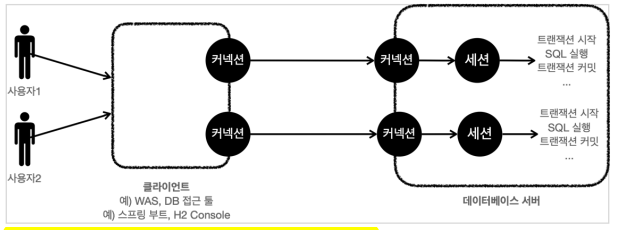

# 트랜잭션 이해

## 트랜잭션(Transaction)이란?

트랜잭션은 하나의 거래를 안전하게 처리하도록 보장해주는 것을 의미합니다.

계좌이체에서 A계좌에서 100만원을 출금하고 B계좌로 100만원을 입금하는 경우, 이 두 작업은 하나의 거래로 묶여야 합니다.

A계좌에서 100만원을 출금하고 B계좌에 입금하는 과정이 실패가 나면 A계좌에서만 돈이 빠져나가는 문제가 발생할 수 있습니다.

트랜잭션을 적용하면 모든 작업이 성공해야 작업이 완료(Commit, 커밋)되고, 하나라도 실패하면 모든 작업이 취소(Rollback, 롤백)됩니다.

<br>

## 트랜잭션 ACID

### 원자성(Automicity)

트랜잭션 내에서 실행한 작업들은 마치 하나의 작업인 것처럼 모두 성공 하거나 모두 실패해야 합니다.

### 일관성(Consistency)

모든 트랜잭션은 일관성 있는 데이터베이스 상태를 유지해야 합니다.

### 격리성(Isolation)

트랜잭션은 다른 트랜잭션에 영향을 받지 않고 독립적으로 실행되어야 합니다. 동시에 실행되는 트랜잭션들은 서로 영향을 주지 않아야 합니다.

동시성과 관련된 성능 이슈로 인해 트랜잭션 격리 수준을 설정할 수 있습니다.

### 지속성(Durability)

트랜잭션을 성공적으로 완료하면 그 결과는 영구적으로 반영되어야 합니다. 시스템에 문제가 발생해도 데이터베이스 로그를 사용해서 성공한 트랜잭션 내용을 복구할 수 있어야 합니다.

<br>

## 트랜잭션 격리 수준(Isolation Level)

트랜잭션 간에 격리성을 완벽히 보장하려면 트랜잭션을 거의 순차적으로 실행해야 하기 때문에 동시 처리 성능이 매우 나빠집니다.

이런 문제로 인해 ANSI 표준은 트랜잭션의 격리 수준을 4단계로 나누어 정의했습니다.

여러 트랜잭션이 동시에 처리될 때, 특정 트랜잭션이 다른 트랜잭션에서 변경하거나 조회하는 데이터를 볼 수 있게 허용할지 여부를 결정하는 것을 의미합

### SERIALIZABLE(직렬화)

가장 엄격한 격리 수준으로, 트랜잭션은 순차적으로 실행됩니다.

여러 트랜잭션이 동일한 레코드에 동시 접근할 수 없으므로 데이터 부정합문제는 발생하지 않지만, 성능이 매우 나빠집니다.

일반적으로 SELECT 명령어는 잠금 없는 일관된 읽기(Non-locking consistent read)를 사용하지만, SERIALIZABLE에서는 SELECT 작업 조차도 대상 데이터에 `넥스트 키 락`이라는 읽가 잠금(공유락)을 걸어 다른 트랜잭션이 해당 레코드를 변경하지 못하게 합니다.

가장 안전하지만 성능이 매우 나쁘기 때문에 극단적으로 안전한 작업이 아닌 이상 사용하지 않는 것이 좋습니다.

### REPEATABLE READ(반복 가능한 읽기)

> **MVCC(다중 버전 동시성 제어, Multi-Version Concurrency Control)**
>
> MVCC는 여러 트랜잭션이 동일한 데이터에 동시에 접근할 때 발생할 수 있는 문제를 방지하기 위해 설계되었습니다. (특히, 읽기 작업과 쓰기 작업이 동시에 이루어질 때 데이터베이스의 일관성을 유지하는 데 중요합니다.)
>
> 데이터 변경 작업(UPDATE, DELETE 등)이 발생할 때, 변경 전의 레코드를 언두(undo) 공간에 백업함으로써 동일한 레코드에 여러 버전의 데이터가 존재하게 됩니다.
>
> 덕분에 트랜잭션에서 데이터를 조회할 때, 그 트랜잭션이 시작된 시점에서의 데이터 버전을 볼 수 있습니다. 이는 트랜잭션이 동시에 실행되더라도 각 트랜잭션에서 데이터의 일관된 상태를 보장합니다.
>
> 또, 읽기 작업과 쓰기 작업이 서로 방해하지 않습니다. 결과적으로 데이터베이스 시스템은 높은 수준의 동시성과 성능을 제공할 수 있습니다.

MVCC를 통해 트랜잭션이 롤백된 경우 데이터를 복원할 수 있을 뿐 아니라 서로 다른 트랜잭션 간에 접근할 수 있는 데이터를 세밀하게 제어할 수 있습니다.

각각의 트랜잭션은 순차 증가하는 고유한 번호가 존재하여 백업 레코드에는 어느 트랜잭션에 의해 백업되었는지 트랜잭션 번호를 함께 저장합니다.

REPEATABLE READ는 자신의 트랜잭션 번호보다 작은 트랜잭션 번호에서 변경된 데이터만 조회합니다.

그러나 REPEATABLE READ는 MVCC를 이용해 한 트랜잭션 내에서 동일한 결과를 보장하지만 새로운 레코드가 추가되는 경우 부정합이 생길 수 있습니다.

**상황 1**

사용자 A가 id가 50이상인 레코드를 조회하고 트랜잭션이 완료되지 않은 상황에서 사용자 B가 id=50인 레코드를 변경했다고 가정하겠습니다.

사용자 B 요청에 의해 기존 데이터는 변경되지만 MVCC를 통해 백업된 데이터가 언두 로그에 남게 됩니다.

사용자 B 트랜잭션이 커밋된 이후 종료되지 않은 A 트랜잭션에서 다시 id가 50이상인 레코드를 조회하겠습니다. (사용자 A의 요청이 먼저 시작되어 B보다 낮은 트랜잭션 번호를 가지고 있음)

`REPEATABLE READ`는 자신보다 먼저 실행된 트랜잭션 데이터만 조회하고 만약 자신보다 이후에 실행된 트랜잭션 데이터가 존재한다면 언두 로그를 참고하여 데이터를 조회합니다.

그렇기 때문에 A는 B에 의해 변경된 데이터가 아닌 이전 데이터를 조회하게 됩니다.

`REPEATABLE READ`는 일반적으로 MVCC 덕분에 팬텀 리드가 발생하지 않습니다. 

> 트랜잭션이 끝나기 전에 다른 트랜잭션에 의해 추가된 레코드가 발견될 수 있는데 이를 `팬텀 리드`라고 합니다.

**상황 2**

(일반적으로 갭락이 없는) 잠금 있는 읽기는 데이터 조회를 언두 로그가 아닌 테이블에서 조회합니다. (잠금 있는 읽기는 변경이 일어나지 않도록 테이블에 잠금을 걸고 테이블에서 데이터를 조회합니다.

A의 잠금 있는 읽기(For Update) 후에 B가 업데이트, 커밋후 A가 잠금 있는 읽기를 하면 팬텀 리드가 발생합니다.

잠금이 있어 테이블에서 데이터를 조회하기 때문에 변경된 데이터를 조회하게 됩니다. (언두 로그는 append only이기 때문에 잠금 장치가 없습니다.)

**상황 3 - 갭락**

갭락이 있는 MYSQL 같은 경우 A가 잠금 있는 읽기(SELECT FOR UPDATE)로 데이터를 조회한 경우에 MySQL은 id가 50인 레코드에는 레코드 락, 
id가 50보다 큰 범위에는 갭 락으로 넥스트 키 락을 겁니다.

이 상황에서 B가 변경을 시도한다면 A가 종료될 때까지 기다리게 될 것입니다. (오래 기다리면 락 타임아웃이 발생합니다.)

따라서 팬텀 리드가 발생하지 않습니다.

**결론**

따라서 기본적으로 MYSQL REPEATABLE READ에서는 팬텀 리드가 발생하지 않습니다.

발생하는 유일한 경우는 락 없이 조회했다가 변경 후 잠금 있는 읽기를 하는 경우입니다. 이렇게 되면 A 트랜잭션이 종료되기 전에 B가 접근 할 수 있기 때문에 팬텀 리드가 발생합니다. (거의 없는 케이스)

> **갭락(Gap Lock)**
> 
> 데이터베이스의 레코드 사이의 공간, 즉 '갭'에 대해 설정되는 잠금입니다. 이는 특히 MySQL의 InnoDB 스토리지 엔진 같은 일부 데이터베이스 관리 시스템에서 지원됩니다.
> 
> 갭락의 주요 목적은 동시성 제어와 격리 수준을 유지하는 것으로, 트랜잭션 간의 겹치지 않는 데이터 변경이나 삽입을 방지하여 일관성을 보장합니다.
> 
> 갭락은 주로 범위 검색(예: id > 45)과 관련된 쿼리에서 사용됩니다. id = 50과 같은 특정 값을 대상으로 하는 쿼리에 대해서는 갭락이 아닌 레코드 잠금(Record Lock)이 적용됩니다.
> 
> 갭락을 지원하지 않는 데이터베이스 시스템에서 범위 조건을 사용할 경우, 시스템은 해당 조건에 맞는 실제 레코드에만 잠금을 적용합니다.   
> 이 경우, 범위 내에 새로운 레코드를 삽입하는 것을 방지할 수 없으므로, 팬텀 리드(Phantom Read)와 같은 현상이 발생할 수 있습니다.
> 예시로 id > 45시 46, 47, 48... 각각에 대해 레코드 락이 걸린 상태에서 새로 삽입되는 경우 즉, id가 46번인 데이터가 삽입되는 경우(id는 고유하지않다고 가정) 팬텀 리드가 발생할 수 있습니다.
> 
> 갭락이 적용된 경우, 해당 갭에 대한 레코드 삽입을 방지하고, 이를 통해 팬텀 리드를 방지할 수 있습니다.

### READ COMMITTED(커밋된 읽기)

트랜잭션이 커밋된 데이터만 읽을 수 있는 격리 수준입니다.

`READ COMMITTED`는 팬텀 리드와 Non-Repeatable Read(반복 읽기 불가능) 문제가 발생할 수 있습니다.

사용자 A가 트랜잭션을 시작하고 Update를 하면 언두 로그에 백업이 됩니다. 그리고 커밋되지 않은 상황에서 B가 조회를 하게 되면 A가 커밋 전이므로 언두 로그를 참고하여 데이터를 조회합니다.

이후 A가 커밋을 하게 되면 B가 다시 조회를 하게 되면 변경된 데이터를 조회하게 됩니다.

> **Non-Repeatable Read (반복 읽기 불가능)**
>
> 한 트랜잭션 내에서 같은 데이터를 두 번 읽을 때, 첫 번째 읽기와 두 번째 읽기 사이에 다른 트랜잭션이 해당 데이터를 업데이트하여 두 번 읽은 값이 서로 다를 수 있는 현상입니다.

> **팬텀 리드(Phantom Read)**
>
> 한 트랜잭션 내에서 일정 범위의 데이터를 두 번 조회할 때, 첫 번째 조회와 두 번째 조회 사이에 다른 트랜잭션이 해당 범위에 새로운 데이터를 삽입(Insert) 하여 두 번의 조회 결과가 다르게 나타나는 현상입니다.

**Non-Repeatable Read(반복 읽기 불가능) 발생**

Read Committed 격리 수준에서 반복 읽기 불가능(Non-repeatable read)이 발생할 수도 있습니다.

예를 들어 사용자 A가 잔액을 확인했고 1000원이 있었습니다. 트랜잭션이 유지되는 상황에서 B가 A의 계좌에 500원을 입금하면 이후 A가 다시 조회를 하게 되면 1500원이 조회됩니다.

**팬텀 리드(Phantom Read) 발생**

사용자 A가 잔액이 100만원 이상인 계좌를 조회했더니 10개의 계좌가 조회되었습니다.(트랜잭션 종료 X) 이후 사용자 B가 100만원 이상의 계좌를 추가하면 사용자 A가 다시 조회를 하게 되면 11개의 계좌가 조회됩니다.

**정리**

READ COMMITTED 수준에서는 커밋된 데이터만 읽을 수 있기 때문에 트랜잭션 내에서 실행되는 SELECT와 트랜잭션 밖에서 실행되는 SELECT의 차이가 별로 없습니다. (언두 로그를 참고하는 대신 직접 테이블에서 현재 커밋된 데이터를 읽습니다.)

### READ UNCOMMITTED(커밋되지 않은 읽기)

커밋되지 않은 데이터 조차도 접근할 수 있는 격리 수준 입니다.

READ UNCOMMITTED에서는 A 사용자가 D 데이터를 삽입하고 커밋 또는 롤백 되지 않은 상태에서 B 사용자가 D 데이터를 조회할 수 있습니다.

이런 부정합 문제를 `Dirty Read`라고 하고 데이터가 조회되었다가 사라지는 현상이 발생할 수도 있기 떄문에 상당한 버그를 발생시킬 수 있습니다.

장점은 성능이 좋다는 것이지만, 데이터 무결성이 보장되지 않기 때문에 사용하지 않는 것이 좋습니다. (최소 READ COMMITTED 이상의 격리 수준을 사용하는 것이 좋습니다.)

<br>

## 데이터베이스 연결 구조와 DB 세션

데이터베이스 서버는 내부에 세션이라는 것을 만들고 해당 커넥션을 통한 모든 요청은 이 세션을 통해서 실행하게 됩니다.

세션은 트랜잭션을 시작하고 커밋 또는 롤백을 통해 트랜잭션을 종료합니다.

커넥션 풀이 10개의 커넥션을 생성하면 세션도 10개가 생성됩니다.



### READ COMMITTED에서의 트랜잭션

데이터 변경 쿼리를 실행하고 그 결과를 커밋하기 전 임시로 데이터를 저장함으로써 해당 트랜잭션을 시작한 세션에게만 변경 데이터가 보이고 다른 세션에게는 보이지 않게 합니다.

### 자동 커밋

각각의 쿼리 실행 직후 자동으로 커밋을 호출합니다. 자동으로 커밋이 되어버리기 때문에 트랜잭션 기능을 제대로 사용할 수 없습니다.

```
set autocommit true; // 자동 커밋 활성화
```

`autocommit 모드`에서는 각 쿼리가 그 자체로 매우 짧은 트랜잭션을 구성합니다.

### 수동 커밋

```
set autocommit false; // 자동 커밋 비활성화

// 쿼리1
// 쿼리2

commit; // 커밋
```

보통 수동 커밋 모드로 설정하는 것을 트랜잭션을 시작한다고 표현합니다.

참고로 수동 커밋 모드나 자동 커밋 모드는 한번 설정하면 해당 세션에서는 계속 유지됩니다. (변경 가능)
