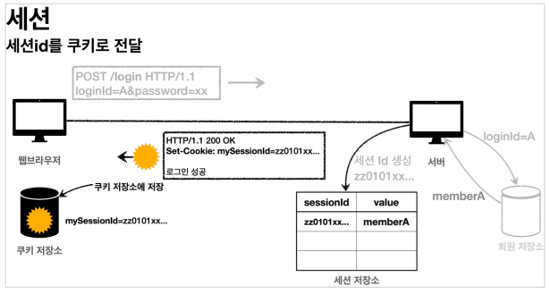

# 쿠키, 세션

## 쿠키와 세션 개념

### 쿠키(Cookie)

쿠키를 가지고 로그인 상태를 유지할 수 있습니다.

만료날짜 입력시 해당 날짜까지 유지되는 `영속 쿠키`와 만료 날짜를 생략하면 브라우저가 종료될 때까지 유지되는 `세션 쿠키`가 있습니다.

쿠키의 값은 임의로 변경할 수도 있고 훔쳐갈 수도 있습니다.

> 세션 쿠키와 서버 세션은 전혀 상관없는 다른 개념입니다.

### 세션(Session)

쿠키에 중요한 정보를 보관하는 방법은 보안적인 이슈가 있습니다. 

이를 해결하기 위해 중요한 정보를 모두 서버에 저장하고 클라이언트에는 임의의 식별자 값으로만 참조하는 방법을 사용합니다.

서버에 중요한 정보를 보관하고 연결을 유지하는 방법을 `세션`이라고 합니다.



생성된 세션 ID와 세션에 보관할 값을 서버의 세션 저장소에 보관하고 클라이언트에는 세션 ID만 쿠키로 보내줍니다.

중요한 점은 회원 관련된 정보는 클라이언트에 전달하지 않고 추정 불가능한 세션 ID만 전달하는 것입니다.

추가적으로 해커가 토큰을 털어가도 시간이 지나면 사용할 수 없도록 서버에서 세션의 만료시간을 짧게(예: 30분) 유지합니다. 만약 해킹이 의심되는 경우 서버에서 해당 세션을 강제로 만료시킬 수 있습니다.

> 세션이 특별한 것이 아니라 단지 쿠키를 사용하는데, 서버에서 데이터를 유지하는 방법을 말합니다.

> 세션에는 최소한의 데이터만 보관해야합니다. 세션에 너무 많은 데이터를 보관하면 서버 메모리 부하가 발생할 수 있습니다.

<br>

## 세션 사용 방식

### `HttpSession`

```
// 세션이 있으면 있는 세션 반환, 없으면 신규 세션 생성
HttpSession session = request.getSession(); // 기본값 true

// 세션이 있으면 있는 세션 반환, 없으면 null 반환
HttpSession session = request.getSession(false);

// 세션에 로그인 회원 정보 보관
session.setAttribute(SessionConst.LOGIN_MEMBER, loginMember);

// 세션 제거
session.invalidate();
```

### `@SessionAttributes`

`@SessionAttributes`는 세션을 편리하게 사용하는 방법입니다.

```java
@GetMapping("/")
public String homeLoginV3Spring(
        // 이미 로그인 된 사용자를 찾을 때는 이렇게 사용하면 됩니다. (이 기능은 세션을 생성하지 않습니다.)
        @SessionAttribute(name = SessionConst.LOGIN_MEMBER, required = false),
        Member loginMember,
        Model model
) {
    return "loginHome";
}
```

<br>

## TrackingModes

웹 브라우저가 쿠키를 지원하지 않으면 쿠키 대신 URL을 사용하여 세션을 유지할 수 있습니다.

이 방법을 사용하려면 URL에 계속 세션 ID를 포함해야 합니다.

서버 입장에서는 웹 브라우저가 쿠키를 지원하는지 하지 않는지 최초에는 판단하지 못하므로 쿠키 값도 전달하고 jessionid도 함께 전달합니다.

URL 전달 방식을 사용하지 않도록 설정하려면 `server.servlet.session.tracking-modes=cookie`를 설정하면 됩니다.

<br>

## 세션 타임 아웃

세션을 로그아웃으로만 없애면 로그아웃을 하지 않고 웹 브라우저를 종료하면 세션이 계속 남아있게 되고 보안 문제나 메모리 낭비 문제가 발생할 수 있습니다.

사용자가 서버에 최근에 요청한 시간을 기준으로 30분 정도를 유지해주는 방식으로 사용하면 30분마다 로그인해야하는 번거로움과 위 문제들을 해결할 수 있습니다.

`HttpSession`은 이 방식을 사용합니다.

`server.servlet.session.timeout=1800` 설정을 넣거나 특정 세션 단위로 시간을 설정하려면 `session.setMaxInactiveInterval(1800)`을 사용하면 됩니다.

마지막 접속 시간 이후 30분이 지나면 WAS 내부에서 해당 세션을 제거합니다.
