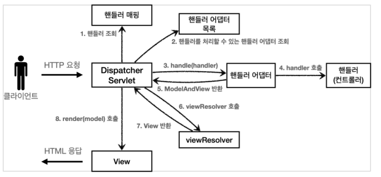

# 스프링 MVC와 비교

스프링 MVC도 프론트 컨트롤러 패턴으로 구현되어 있습니다.

## DispatcherServlet

`DispatcherServlet`이 프론트 컨트롤러로 사용됩니다.

스프링 부트는 `DispatcherServlet`을 서블릿으로 자동으로 등록하면서 모든 경로를 `DispatcherServlet`이 처리하도록 합니다.

### 1. 핸들러 조회

```
mappedHandler = getHandler(processedRequest);
if (mappedHandler == null || mappedHandler.getHandler() == null) {
    noHandlerFound(processedRequest, response);
    return;
}
```

### 2. 핸들러 어댑터 조회

```
HandlerAdapter ha = getHandlerAdapter(mappedHandler.getHandler());
```

### 3. 핸들러 어댑터 실행 -> 4. 핸들러 어댑터를 통해 핸들러(컨트롤러) 실행 -> 5. ModelAndView 반환

```
mv = ha.handle(processedRequest, response, mappedHandler.getHandler());
```

### 6. 뷰 리졸버를 통해 뷰 찾고 -> 7. View 반환

만약 JSP를 사용한다면 `InternalResourceViewResolver`를 사용합니다. (forward() 사용)

```
view = resolveViewName(mv.getViewName(), mv.getModel(), locale, request);
```

### 8. 뷰 렌더링

```
view.render(mv.getModel(), request, response);
```


