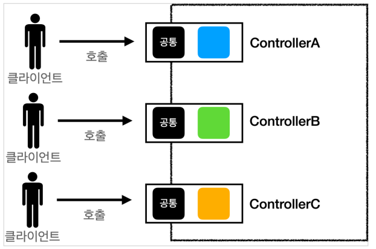
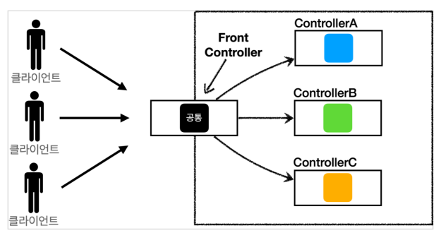
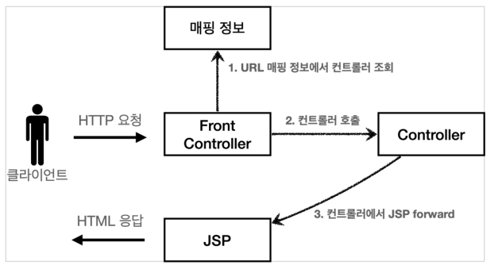
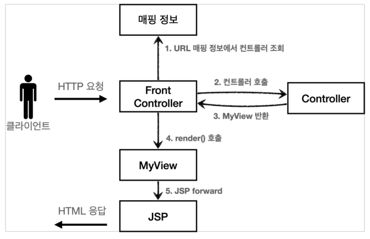
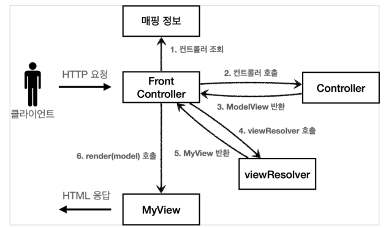
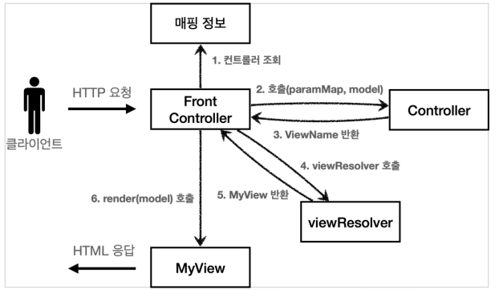
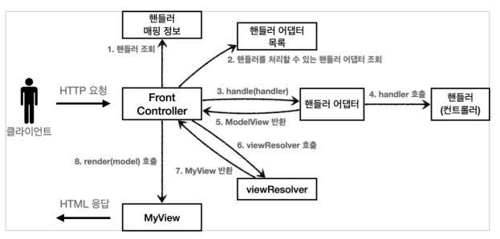

# 프론트 컨트롤러 패턴

## 프론트 컨트롤러 패턴 소개

### 도입 전과 도입 후

프론트 컨트롤러 서블릿 하나로 클라이언트의 요청을 받음으로써 공통 처리가 가능하고 나머지 컨트롤러가 서블릿을 사용하지 않아도 됩니다.

프론트 컨트롤러가 요청에 맞는 컨트롤러를 찾아서 호출해주는 방식입니다.

**스프링에서도 DispatcherServlet이 프론트 컨트롤러 패턴으로 구현되어 있습니다.**

 

## 프론트 컨트롤러 도입 - V1

서블릿과 비슷한 모양의 인터페이스를 도입해서 컨트롤러들이 이를 구현하도록 합니다.

프론트 컨트롤러 즉, 하나의 서블릿에서 모든 요청을 받고 Map에서 각 요청에 맞는 컨트롤러를 찾은 다음 이를 호출합니다.

`web/frontcontroller/v1` 패키지를 참고하세요.

 

## View 분리 - V2 

뷰를 처리하는 객체를 만들어서 뷰 로직을 분리합니다.

컨트롤러에서 뷰 이름만 반환하고 뷰 이름을 가지고 뷰를 찾아서 렌더링합니다.

`web/frontcontroller/v2` 패키지, `MyView`를 참고하세요.

 

## Model 추가 - V3

컨트롤러가 서블릿 기술을 전혀 사용하지 않도록 변경하고 뷰 이름을 논리적으로 반환하게 하여 중복을 제거할 수 있습니다.

### ModelView

지금까지는 컨트롤러에서 서블릿에 종속적인 `HttpServletRequest`을 사용하고 Model도 `request.setAttribute`를 통해 데이터를 저장하고 뷰에 전달했습니다.

서블릿의 종속성을 제거하기 위해 Model을 직접 만들고 안에 데이터와 뷰 이름을 저장합니다. (ModelView)

컨트롤러에서 데이터와 함께 논리적인 뷰 이름을 담은 ModelView를 반환하고 논리적인 뷰 이름을 viewResolver를 통해 물리적 뷰 경로로 변경합니다.

이를 MyView에 넣어서 반환하고 프론트 컨트롤러가 이를 렌더링합니다.

참고로 요청 정보는 프론트 컨트롤러에서 Map에 모아서 컨트롤러로 전달합니다.

`web/frontcontroller/v3` 패키지, `ModelView`를 참고하세요.

 

## 단순하고 실용적인 컨트롤러 - V4

항상 ModelView 객체를 생성하고 반환해야하는 부분이 번거롭습니다. 이를 위해 컨트롤러가 ModelView를 반환하지 않고 뷰 이름만 반환하도록 변경합니다.

프론트 컨트롤러에서 모델 객체를 생성 후 컨트롤러에 전달해서 그 안에 값을 저장하도록 하고 반환은 뷰 이름만 반환하도록 합니다.

`web/frontcontroller/v4` 패키지를 참고하세요.

 

## 유연한 컨트롤러 - V5

V3 방식과 V4 방식 모두를 사용하려면 어떻게 해야할까요?

V3와 V4는 완전히 다른 인터페이스를 사용하고 있습니다. 이를 해결하기 위해 어댑터 패턴을 사용해야 합니다.

핸들러 매핑 정보에서 핸들러를 조회하고 어댑터 목록에서 맞는 핸들러 어댑터도 조회합니다.

핸들러 어댑터를 호출하면 핸들러 어댑터가 컨트롤러를 호출하고 그 결과를 반환합니다.

`web/frontcontroller/v5` 패키지를 참고하세요.
