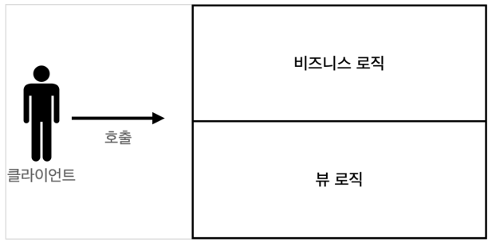
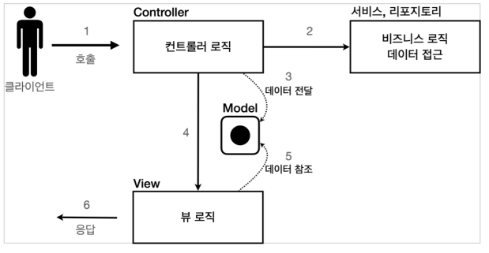

# 서블릿 ~ MVC 패턴

## 변천 과정

### 서블릿과 자바 코드만으로 HTML

```java
@WebServlet(name = "memberFormServlet", urlPatterns = "/servlet/members/new-form")
public class MemberFormServlet extends HttpServlet {
    
    @Override
    protected void service(HttpServletRequest request, HttpServletResponse response) throws ServletException, IOException {
        response.setContentType("text/html");
        response.setCharacterEncoding("utf-8");
        PrintWriter w = response.getWriter();
        w.write("<!DOCTYPE html>\n" +
        "<html>\n" +
        "<head>\n" +
        " <meta charset=\"UTF-8\">\n" +
        " <title>Title</title>\n" +
        "</head>\n" +
        "<body>\n" +
        "</body>\n" +
        "</html>\n");
    }
}
```

### 템플릿 엔진 사용

코드가 매우 복잡하고 비효율적이기 때문에 자바 코드로 HTML을 작성하는 것보다 HTML 문서에 동적으로 변경해야하는 부분만 삽입하는 것이 효율적이다.

템플릿 엔진을 사용하면 동적으로 변경해야하는 부분만 삽입할 수 있다. (JSP, Thymeleaf, ...)

```
<%@ page import="hello.servlet.domain.member.MemberRepository" %>
<%@ page import="hello.servlet.domain.member.Member" %>
<%@ page contentType="text/html;charset=UTF-8" language="java" %>
<%
    // request, response 사용 가능
    MemberRepository memberRepository = MemberRepository.getInstance();
    String username = request.getParameter("username");
    // 로직 ...
    
%>
<html>
<head>
 <meta charset="UTF-8">
</head>
<body>
    <ul>
     <li>id=<%=member.getId()%></li>
     <li>username=<%=member.getUsername()%></li>
     <li>age=<%=member.getAge()%></li>
    </ul>
</body>
</html>
```

request와 response가 사용이 가능한데 JSP도 결국 서블릿으로 변환되어 실행되기 때문입니다.

### 서블릿과 JSP 한계 - MVC 패턴

JSP에 JAVA코드, 데이터 조회 등 다양한 코드가 섞여있어 JSP가 너무 많은 역할을 합니다.

프로젝트가 커질수록 JSP가 복잡해지고 유지보수가 어려워집니다.

비즈니스 로직은 서블릿처럼 다른 곳에서 처리하고 JSP는 목적에 맞게 화면(View)을 그리는 일에 집중하는 MVC 패턴이 등장했습니다.



> **redirect vs forward**
> 
> redirect는 실제 클라이언트(웹 브라우저)에 응답이 나갔다가, 클라이언트가 redirect 경로로 다시 요청합니다.  
> forward는 서버 내부에서 일어나는 호출이기 때문에 클라이언트가 전혀 인지하지 못합니다.

### MVC 패턴

JSP로 처리하던 것을 컨트롤러(Controller)와 뷰(View)라는 영역으로 서로 역할을 나눈 것을 말합니다.

> **변경 주기가 다르면 분리하라**
>
> UI 일부 수정과 비즈니스 로직을 수정하는 일은 각각 다르게 발생할 가능성이 높고 서로에게 영향을 주지 않습니다.
> 변경의 라이프 사이클이 다른 부분을 하나의 코드로 관리하는 것은 유지보수성이 떨어집니다.

- 컨트롤러: HTTP 요청을 받아서 파라미터를 검증하고, 비즈니스 로직을 실행합니다. 그리고 뷰에 전달할 결과 데이터를 조회해서 모델에 담습니다.
- 모델: 뷰에 출력할 데이터를 담아둡니다. 
- 뷰: 모델에 담겨있는 데이터를 사용해서 화면을 그리는 일에 집중합니다. 여기서는 HTML을 생성하는 부분을 말합니다.

모델이 필요한 데이터를 담아 모델에 전달해줌으로써 뷰는 비즈니스 로직 등을 몰라도 되고 화면 렌더링에만 집중할 수 있습니다.



```java
@WebServlet(name = "mvcMemberSaveServlet", urlPatterns = "/servlet-mvc/members/save")
public class MvcMemberSaveServlet extends HttpServlet {
    @Override
    protected void service(HttpServletRequest request, HttpServletResponse response) throws ServletException, IOException {
        String username = request.getParameter("username");
        int age = Integer.parseInt(request.getParameter("age"));
        Member member = new Member(username, age);
        
        //Model에 데이터를 보관한다.
        request.setAttribute("member", member);
        
        String viewPath = "/WEB-INF/views/save-result.jsp";
        RequestDispatcher dispatcher = request.getRequestDispatcher(viewPath);
        dispatcher.forward(request, response);
    }
}
```

```
<%@ page contentType="text/html;charset=UTF-8" language="java" %>
<html>
<head>
 <meta charset="UTF-8">
</head>
<body>
성공
<ul>
    <li>id=${member.id}</li>
    <li>username=${member.username}</li>
    <li>age=${member.age}</li>
</ul>
<a href="/index.html">메인</a>
</body>
</html>
```

<br>

## MVC 패턴의 한계

### 포워드 중복

View로 이동하는 코드가 항상 중복됩니다. 메서드로 공통화 하더라도 항상 직접 호출해야 합니다.

```
RequestDispatcher dispatcher = request.getRequestDispatcher(viewPath);
dispatcher.forward(request, response);
```

### ViewPath 중복

View의 경로가 중복되고 다른 뷰로 변경한다면 모든 코드를 수정해야 합니다.

```
String viewPath = "/WEB-INF/views/save-result.jsp";
```

### 사용하지 않는 코드

`HttpServletRequest`, `HttpServletResponse`를 사용하지 않는 경우에도 파라미터로 받아야 합니다.

이 코드는 테스트 케이스를 작성할 때도 문제가 됩니다.

### 개선 방안

정리하면 공통 처리가 어렵다는 문제가 있습니다. 이 문제를 해결하려면 컨트롤러 호출 전에 먼저 공통 기능을 처리해야합니다. 

프론트 컨트롤러(Front Controller) 패턴을 사용하면 이 문제를 해결할 수 있습니다.

스프링 MVC의 핵심도 바로 이 프론트 컨트롤러입니다.

> 필터는 정해진 스펙대로 체인을 죽죽 넘기는 것이고 프론트 컨트롤러는 어떤 컨트롤러를 호출할지 결정하는 것이기 때문에 서로 역할이 다릅니다.
