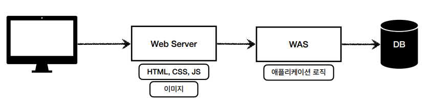
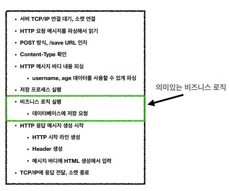
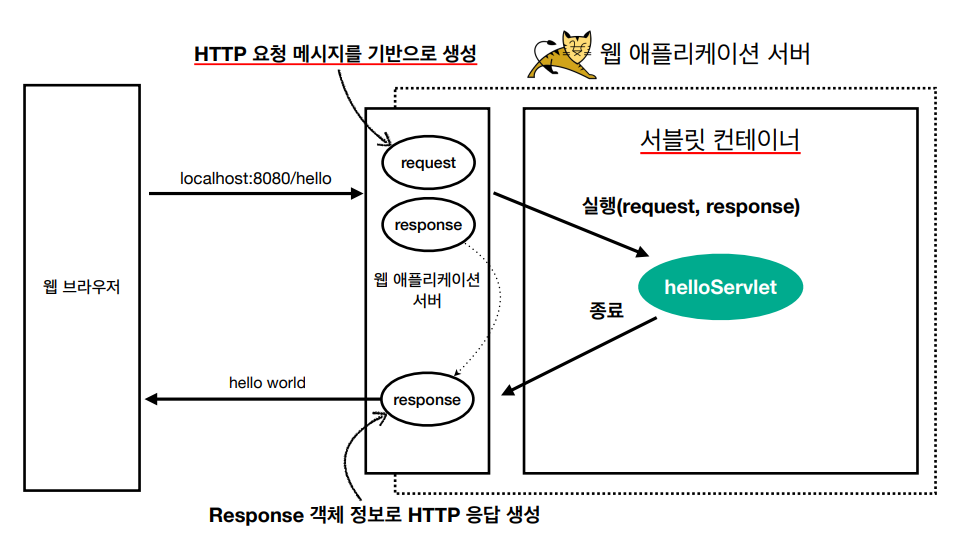
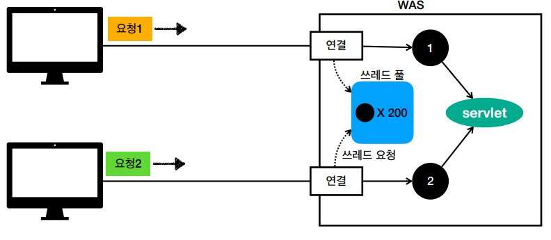

# 웹의 이해

## 웹 서버와 웹 애플리케이션 서버

### 웹 서버(Web Server)

- 정적 리소스(HTML, CSS, JS, 이미지, 영상 등)를 제공하는 서버
- Apache, Nginx 등

### 웹 애플리케이션 서버(Web Application Server, WAS)

- 웹 서버 기능 포함 + 프로그램 코드를 실행해서 애플리케이션 로직 수행 (동적 HTML, HTTP API(JSON))
- Tomcat, Jetty 등

### 웹 서버와 웹 애플리케이션 서버의 관계

- WAS가 애플리케이션 코드를 실행하는데 더 특화 되어 있습니다.
- WAS와 DB만으로 시스템이 구성 가능하나 너무 많은 역할을 담당하여 서버 과부하가 발생할 수 있으므로 웹 서버와 분리하여 구성하는 것이 일반적입니다.
- 정적 리소스는 웹 서버에서 처리하고, 애플리케이션 로직은 WAS에서 처리합니다.
- 효율적으로 리소스를 활용할 수 있습니다. (정적 리소스가 많은 경우 웹 서버만 증설하고 애플리케이션 로직이 많이 사용되면 WAS만 증설)
- 요즘은 CDN 이라는 정적 리소스를 캐싱할 수 있는 중간 서버를 놓기도 합니다.

 

## 서블릿 지원

톰캣 처럼 서블릿을 지원하는 WAS를 서블릿 컨테이너라고 합니다.

### 서블릿이 필요한 이유

클라이언트에서 HTML Form을 통해 요청을 보낸다고 가정하겠습니다.

이러한 일들을 서버에서 처리해야 하는데 비지니스 로직을 제외한 모든 것들을 서블릿이 다 지원해줌으로써 개발자는 비지니스 로직에만 집중할 수 있습니다.

### 요청 정보와 응답 정보

서블릿에서는 URL이 호출되면 서블릿 코드가 실행되는데 이때 HTTP 요청 정보와 응답 정보를 편리하게 사용할 수 있는 객체를 제공합니다.

- HttpServletRequest: HTTP 요청 정보를 편리하게 사용할 수 있는 객체
- HttpServletResponse: HTTP 응답 정보를 편리하게 생성할 수 있는 객체

 

## 쓰레드 풀

서블릿 컨테이너는 요청마다 쓰레드를 생성하는 것이 아니라, 쓰레드 풀을 생성하여 쓰레드를 재사용합니다.

### 쓰레드?

애플리케이션 코드를 하나하나 순차적으로 실행하는 것을 쓰레드라고 합니다.

쓰레드는 한번에 하나의 코드 라인만 수행합니다. 따라서 여러 요청을 동시에 처리하려면 쓰레드가 여러개 필요합니다.

### 튜닝 포인트

WAS의 주요 튜닝 포인트는 최대 쓰레드(max thread) 수 입니다.

이 값을 너무 낮게 설정했을 때 동시 요청이 많으면 서버 리소스는 여유롭지만, 클라이언트는 응답 지연이 발생합니다.

반대로 이 값을 너무 높게 설정했을 때 동시 요청이 많으면 CPU, 메모리 리소스 임계점 초과로 서버가 다운될 수 있습니다.

 

## HTTP 요청 데이터

### GET - 쿼리 파라미터

- url에 쿼리 파라미터를 포함해서 전달합니다. (`/url?username=hello&age=20`)
- 검색, 필터, 페이징 등에서 많이 사용하는 방식입니다.

### POST - HTML Form

- 메세지 바디에 쿼리 파라미터 형식으로 전달합니다. (`username=hello&age=20`)
- 회원 가입, 상품 주문 등에서 사용합니다.
- `application/x-www-form-urlencoded` 형식으로 전달합니다.

> GET URL 쿼리 파라미터 형식은 HTTP 메시지 바디를 사용하지 않기 때문에 content-type이 없습니다. 
> POST HTML Form 형식은 HTTP 메시지 바디에 데이터를 포함해서 보내기 때문에 바디에 포함된 데이터가 어떤 형식인지 content-type을 꼭 지정해야 합니다.

### HTTP message body

- HTTP API에서 주로 사용합니다.
- JSON, XML, TEXT

> `application/json` 형식은 스펙상 utf-8 형식을 사용하도록 정의되어 있습니다. 그래서 스펙에서 charset=utf-8과 같은 추가 파라미터를 지원하지 않습니다.
