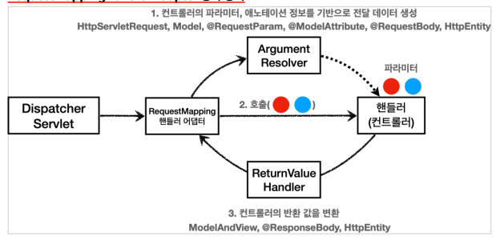
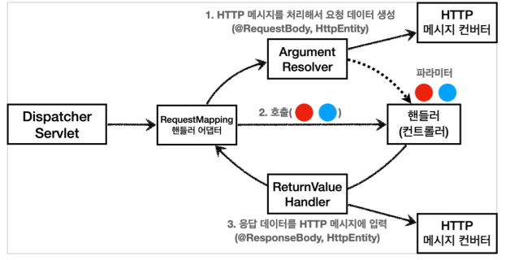
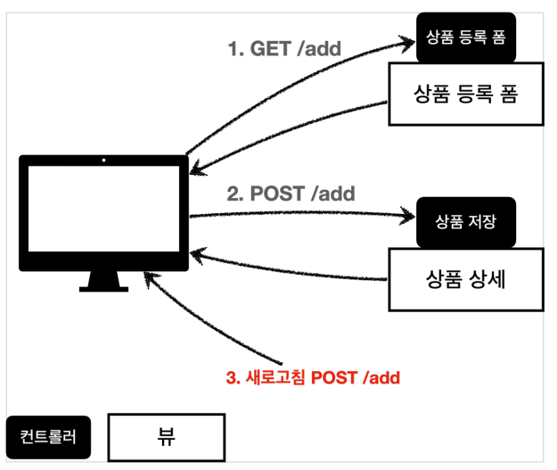
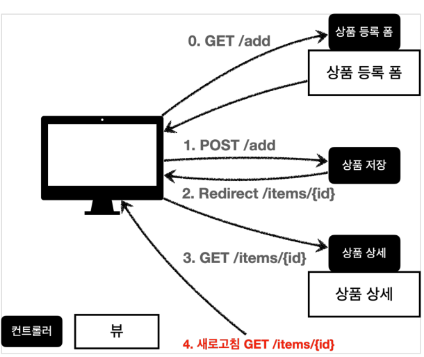

# 스프링 MVC 기본 기능

## 로깅

Logback, Log4J 등 다양한 로깅 라이브러리가 있고 이것들을 통합해서 인터페이스로 제공하는 것이 `SLF4J`입니다.

쉽게 말해 SLF4J는 인터페이스이고 그 구현체로 Logback 같은 라이브러리를 선택하면 됩니다. (스프링 부트는 기본적으로 Logback을 사용합니다.)

`private static final Logger log = LoggerFactory.getLogger(getClass());`, `@Slf4j`를 사용해서 로그를 사용할 수 있습니다.

<br>

## 요청, 응답 매핑

스프링 컨트롤러는 다양한 파라미터를 받을 수 있습니다.

`HttpServletRequest`, `HttpServletResponse`, `Locale`, `@RequestHeader MultiValueMap<String, String>`, `@CookieValue(value="")`

### @RequestMapping

`@RequestMapping`을 사용해서 URL을 매핑할 수 있습니다.

`@GetMapping`, `@PostMapping`으로 대체할 수 있습니다.

### @RequestParam

`@RequestParam`을 사용해서 파라미터를 받을 수 있습니다. 

String, int,Integer 등의 단순 타입이면 @RequestParam 도 생략 가능합니다. 대신 `@RequestParam` 애노테이션을 생략하면 스프링 MVC는 내부에서 required=false 를 적용합니다. (기본값 설정도 가능)

```java
@Controller
public class HelloController {
    @GetMapping("/hello1")
    public ModelAndView hello1(
            @RequestParam("name") String name,
            @RequestParam("age") int age,
            Model model
    ) {
        model.addAttribute("name", name);
        model.addAttribute("age", age);
        return "hello1";
    }
}
```

### @PathVariable

경로변수의 경우 `@PathVariable`을 사용해서 받을 수 있습니다.

@PathVariable의 이름과 파라미터의 이름이 같으면 생략할 수 있습니다.

```java
@GetMapping("/hello/{name}")
public String hello(@PathVariable("name") String name, Model model) {
    model.addAttribute("name", name);
    return "hello";
}

// 생략 버전
@GetMapping("/hello/{name}")
public String hello(@PathVariable String name, Model model) {
    model.addAttribute("name", name);
    return "hello";
}
```

### @ModelAttribute

`@ModelAttribute`를 사용하면 파라미터를 받아서 객체로 만들어줍니다.

`@ModelAttribute`로 받은 파라미터는 view 반환시 model에 자동으로 담아줍니다.

Model을 선언하여 추가하는 로직이 있더라도 `@ModelAttribute`로 받은 파라미터는 자동으로 담아줍니다.

```java
@ResponseBody
@RequestMapping("/model-attribute-v1")
public String modelAttributeV1(@ModelAttribute HelloData helloData) {
    log.info("username={}, age={}", helloData.getUsername(),
    helloData.getAge());
    return "ok";
}
```

`@ModelAttribute`는 생략이 가능합니다.

> 생략 가능 규칙
> 
> String, int 같은 단순 타입 = @RequestParam    
> 나머지 = @ModelAttribute (argument resolver로 지정된 타입은 생략 가능)  
> HttpServletRequest 같은 것들이 argument resolver로 지정되어 있습니다.

### @RequestBody, @ResponseBody

요청 파라미터와 다르게 HTTP 메세지 바디를 통해 데이터가 직접 전달되는 경우에는 `@ModelAttribute`, `@RequestParam`을 사용할 수 없습니다.

`@RequestBody`를 사용하면 HTTP 메세지 바디 정보를 조회할 수 있습니다.

`@RequestBody`, `@ResponseBody` 사용시 HTTP 메시지 컨버터가 HTTP 메시지 바디의 내용을 우리가 원하는 문자나 객체 등으로 변환해줍니다. (JSON도 변환 가능)

```java
@ResponseBody
@PostMapping("/request-body-string-v4")
public String requestBodyStringV4(@RequestBody String messageBody) {
    log.info("messageBody={}", messageBody);
    return "ok";
}
```

`@ResponseBody`를 사용하면 응답 결과를 HTTP 메세지 바디에 직접 담아서 전달할 수 있습니다. (view를 사용하지 않음)

<br>

## HTTP 메시지 컨버터

`@ResponseBody`를 사용하면 viewResolver 대신에 `HttpMessageConverter`가 동작합니다.

기본 문자 처리는 `StringHttpMessageConverter`, 기본 객체 처리는 `MappingJackson2HttpMessageConverter`가 동작합니다. (응답의 경우 Accept 헤더와 반환 타입 정보를 보고 변환)

Http 메시지 컨버터는 HTTP 요청, 응답 둘 다 사용됩니다.

### ArgumentResolver, ReturnValueHandler

`@RequestMapping`을 처리하는 핸들러 어댑터인 `RequestMappingHandlerAdapter`를 살펴 보겠습니다.



애노테이션 기반의 컨트롤러는 다양한 파라미터를 사용할 수 있습니다. (HttpServletRequest, Model, @RequestParam, @ModelAttribute, @RequestBody 등)

파라미터를 유연하게 처리할 수 있는 이유가 `ArgumentResolver` 때문입니다.

핸들러 어댑터가 바로 `ArgumentResolver`를 사용해서 컨트롤러가 필요로 하는 다양한 파라미터의 값(객체)을 생성해줍니다.

파라미터가 모두 준비되면 핸들러(컨트롤러)를 호출하면서 값을 넘겨줍니다.

`ReturnValueHandler`는 핸들러(컨트롤러)의 실행 결과를 변환해서 응답으로 보내줍니다. 뷰 이름을 String으로 반환해도 동작하는 이유가 바로 이것 때문입니다.

스프링은 여러 종류의 `ArgumentResolver`와 `ReturnValueHandler`를 제공하고 확장해서 사용할 수 있도록 설계되어 있습니다.

### 메시지 컨버터 사용 위치

`@RequestBody`를 처리하는 `ArgumentResolver`와 `@ResponseBody`를 처리하는 `ReturnValueHandler`가 바로 `HttpMessageConverter`를 사용합니다.



<br>

## 기타 기능

### 정적 리소스

- `/resources/static/` 위치에 `index.html` 파일을 두면 Welcome Page로 설정할 수 있습니다.
- 정적 리소스가 공개되는 `/resources/static` 폴더에 HTML을 넣어두면, 실제 서비스에서도 공개된다. 서비스를 운영한다면 공개 되면 안되는 정보는 절대 넣으면 안된다.
- view의 논리적 이름을 반환할 때 `ModelAndView`를 반환해도 되지만 그냥 `String`을 반환해도 됩니다. (ReturnValueHandler가 처리)

### PRG (Post/Redirect/Get)

상품을 등록하고 웹 브라우저의 새로고침을 누르면 상품이 중복으로 등록될 수 있습니다.

웹 브라우저의 새로 고침은 마지막에 서버에 전송한 데이터를 다시 전송하는 것이기 때문입니다.



새로 고침 문제를 해결하려면 상품 저장 후에 뷰 템플릿으로 이동하는 것이 아니라 상품 상세 화면으로 리다이렉트를 호출하면 됩니다.



```java
@PostMapping("/add")
public String addItemV5(Item item) {
    itemRepository.save(item);
    return "redirect:/basic/items/" + item.getId();
}
```

### RedirectAttributes

URL에 변수를 더해서 사용하는 것은 URL 인코딩이 안되서 위험하기 때문에 `RedirectAttributes`를 사용해서 URL에 변수를 더해서 사용합니다.

그리고 `RedirectAttributes`를 사용하여 추가적인 정보를 전달할 수 있습니다.

```java
@PostMapping("/add")
public String addItemV6(Item item, RedirectAttributes redirectAttributes) {
    Item savedItem = itemRepository.save(item);
    redirectAttributes.addAttribute("itemId", savedItem.getId());
    redirectAttributes.addAttribute("status", true);
    return "redirect:/basic/items/{itemId}";
}
```

`RedirectAttributes`를 사용하면 URL 인코딩도 해주고, PathVariable, QueryParameter도 사용할 수 있습니다.
